# 目录

1. [模块概述](#1-模块概述)
2. [整体业务流程](#2-整体业务流程)
3. [结算项](#3-结算项)
4. [费用单](#4-费用单)
5. [预付单](#5-预付单)
6. [对账单](#6-对账单)
7. [发票单](#7-发票单)
8. [红字发票单](#8-红字发票单)
9. [外部对接（EBS / BPM）](#9-外部对接ebs--bpm)
10. [价格调整机制](#10-价格调整机制)
11. [模型总览](#11-模型总览)
12. [代码结构](#12-代码结构)
13. [附录：全部 API / 定时任务 / MQ](#13-附录全部-api--定时任务--mq)

---

# 1. 模块概述

## 1.1 模块定位

erp-sett 是 TERP 系统中负责**采购结算全生命周期管理**的核心模块。它将采购履约过程中产生的交易明细转化为可对账、可开票、可支付的财务凭证。

> BC 的结算模块不执行任何实际的财务操作（不付款、不开票、不签章），本质是一个"单据管理中心"，负责维护单据状态、计算金额、管理关联关系，然后把需要外部执行的操作通过 `bc_settlement_out_order` 统一追踪，委托给 EBS/BPM/发票平台等专业系统，最后根据回调更新状态。

## 1.2 参与角色

- **采购商/BC**：采购部门、结算部门、财务部门
- **供应商**：发起对账、上传发票、签章确认

## 1.3 核心概念

- **结算项（Settlement Item）**：采购履约产生的待结账款条目，是最细粒度单元。每一笔采购履约（供应商发货到 BC 仓库、BC 退货给供应商）对应一条结算项
- **费用单（Expense Order）**：BC 与供应商之间独立于采购订单的各类费用，支持 15 种费用类型（F001-F015）
- **预付单（PrePayment）**：BC 在供应商实际交货前提前支付的款项，支持合同/订单/送货单/提前付款 4 种类型
- **对账单（Statement Order）**：汇总指定结算项的核对凭证，关联费用单和预付单，用于双方账目确认和签章
- **发票单（Invoice Order）**：税务凭证，基于已签章对账单生成，是结算流程的最后一环，触发 EBS 付款和发票入账
- **红字发票单（Red Invoice Order）**：冲销发票，用于更正/撤销已开蓝字发票，仅出库结算项可创建

## 1.4 子功能清单

| # | 子功能 | 核心表 | 核心 Action |
|---|--------|--------|-------------|
| 1 | 结算项管理 | `bc_settlement_item` | `BcSettlementItemAction` |
| 2 | 费用单管理 | `bc_expense_order` | `BcExpenseOrderAction` |
| 3 | 预付单管理 | `bc_pre_payment` | `BcPrePaymentAction` |
| 4 | 对账单管理 | `bc_statement_order` | `BcStatementOrderAction` |
| 5 | 发票单管理 | `bc_invoice_order` | `BcInvoiceOrderAction` |
| 6 | 红字发票单 | `bc_red_invoice_order` | `BcRedInvoiceOrderAction` |
| 7 | 外部对接（EBS/BPM） | `bc_settlement_out_order` | `BcSettlementOutOrderAction` |
| 8 | 价格调整机制 | `sett_price_adjust_log` | MQ Listener |

---

# 2. 整体业务流程

## 2.1 核心主流程

```
采购履约单据 → 结算项 → 对账单 → 发票单 → EBS 付款
```

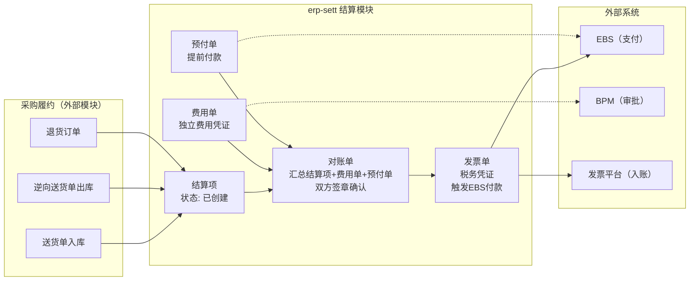
```mermaid
flowchart LR
    subgraph 采购履约["采购履约（外部模块）"]
        P1["送货单入库"]
        P2["逆向送货单出库"]
        P3["退货订单"]
    end

    subgraph 结算["erp-sett 结算模块"]
        SI["结算项<br/>状态: 已创建"]
        EXP["费用单<br/>独立费用凭证"]
        PRE["预付单<br/>提前付款"]
        STMT["对账单<br/>汇总结算项+费用单+预付单<br/>双方签章确认"]
        INV["发票单<br/>税务凭证<br/>触发EBS付款"]
    end

    subgraph 外部系统["外部系统"]
        EBS["EBS（支付）"]
        BPM["BPM（审批）"]
        TAX["发票平台（入账）"]
    end

    P1 --> SI
    P2 --> SI
    P3 --> SI
    SI --> STMT
    EXP --> STMT
    PRE --> STMT
    STMT --> INV
    INV --> EBS
    INV --> TAX
    EXP -.-> BPM
    PRE -.-> EBS
```

## 2.2 "占用-转移"金额模式（核心设计）

这是结算模块最重要的设计理念，贯穿对账单→发票单全流程：

| 阶段 | 关联记录状态 | 资金变化 |
|------|------------|---------|
| 对账单保存 | `DRAFT` | 无变化，仅记录关联关系 |
| 对账单提交审批 | `OCCUPY`（占用） | `可核销/可支付 → 核销中/支付中`（锁定资金） |
| 对账单驳回/撤回 | `DRAFT`（回滚） | `核销中/支付中 → 可核销/可支付`（释放资金） |
| 发票审批通过 | `USED`（确认） | `核销中/支付中 → 已核销/已支付`（真正转移） |

**设计意图**：对账单阶段只是"意向锁定"（防止被其他对账单重复使用），真正资金转移发生在发票审批通过时。中间发生任何异常（开票失败、金额错误等）都可安全回滚。

## 2.3 "占用"机制的意义

| 场景 | 如果签章后就转移 | 实际设计（发票审批时才转移） |
|------|----------------|--------------------------|
| 对账后供应商迟迟不开票 | 资金已锁定无法回收 | 撤回合规：占用可释放 |
| 对账金额有误需重对 | 需要反向操作 | 直接回滚占用即可 |
| 部分结算项需要调差 | 已转移的金额难以调整 | 调差后再转移 |

**核心理念**：对账单阶段是"意向锁定"，发票单阶段才是"事实确认"。这也符合财务合规要求——发票是税务确认的法定凭证。

## 2.4 金额占用与释放时序示例

以一次完整流程为例：结算项 = ￥10,000，关联预付单可核销 ￥3,000，关联负数费用单抵扣 ￥500

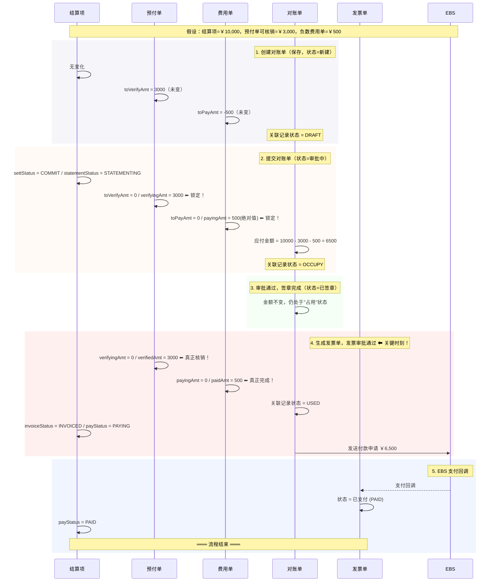
```mermaid
sequenceDiagram
    participant 结算项
    participant 预付单
    participant 费用单
    participant 对账单
    participant 发票单
    participant EBS

    Note over 结算项,EBS: 假设：结算项=￥10,000，预付单可核销=￥3,000，负数费用单=￥500

    rect rgb(245, 245, 250)
    Note over 对账单: 1. 创建对账单（保存，状态=新建）
    结算项->>结算项: 无变化
    预付单->>预付单: toVerifyAmt = 3000（未变）
    费用单->>费用单: toPayAmt = -500（未变）
    Note over 对账单: 关联记录状态 = DRAFT
    end

    rect rgb(255, 250, 245)
    Note over 对账单: 2. 提交对账单（状态=审批中）
    结算项->>结算项: settStatus = COMMIT / statementStatus = STATEMENTING
    预付单->>预付单: toVerifyAmt = 0 / verifyingAmt = 3000 ⬅ 锁定！
    费用单->>费用单: toPayAmt = 0 / payingAmt = 500(绝对值) ⬅ 锁定！
    对账单->>对账单: 应付金额 = 10000 - 3000 - 500 = 6500
    Note over 对账单: 关联记录状态 = OCCUPY
    end

    rect rgb(245, 255, 245)
    Note over 对账单: 3. 审批通过，签章完成（状态=已签章）
    对账单->>对账单: 金额不变，仍处于"占用"状态
    end

    rect rgb(255, 240, 240)
    Note over 发票单: 4. 生成发票单，发票审批通过 ⬅ 关键时刻！
    预付单->>预付单: verifyingAmt = 0 / verifiedAmt = 3000 ⬅ 真正核销！
    费用单->>费用单: payingAmt = 0 / paidAmt = 500 ⬅ 真正完成！
    对账单->>对账单: 关联记录状态 = USED
    结算项->>结算项: invoiceStatus = INVOICED / payStatus = PAYING
    对账单->>EBS: 发送付款申请 ￥6,500
    end

    rect rgb(240, 245, 255)
    Note over EBS: 5. EBS 支付回调
    EBS-->>发票单: 支付回调
    发票单->>发票单: 状态 = 已支付 (PAID)
    结算项->>结算项: payStatus = PAID
    Note over 结算项,发票单: ═══ 流程结束 ═══
    end
```

---

# 3. 结算项

## 3.1 业务场景概述

结算项是结算模块的**最细粒度单元**：每一笔采购履约（供应商发了一批货到 BC 的仓库、BC 退了一批货给供应商）对应一条结算项。

> 结算项 = 采购履约产生的待结账款条目

### 产生来源

| 场景 | 业务含义 | 方向 | 代码入口 |
|------|---------|------|---------|
| 送货单入库 | 供应商发货 → BC 入库验收 → BC 欠供应商钱 | IN（入库） | `BcSettlementItemAction.inboundCreate()` |
| 逆向送货单出库 | BC 退货 → 仓库出库 → 供应商欠 BC 钱 | OUT（出库） | `BcSettlementItemAction.outboundCreate()` |
| 退货订单直接生成 | 退货订单（不经仓库）直接产生结算 | OUT（出库） | `BcSettlementItemAction.returnCreate()` |

## 3.2 生命周期

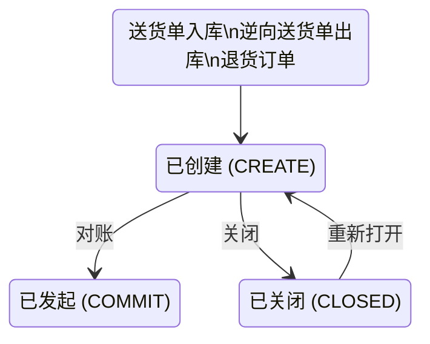
```mermaid
stateDiagram-v2
    state "送货单入库\n逆向送货单出库\n退货订单" as source
    CREATE: 已创建 (CREATE)
    COMMIT: 已发起 (COMMIT)
    CLOSED: 已关闭 (CLOSED)

    source --> CREATE
    CREATE --> COMMIT: 对账
    CREATE --> CLOSED: 关闭
    CLOSED --> CREATE: 重新打开
```

**其他状态字段**

| 状态字段 | 枚举值 | 含义 |
|---------|--------|------|
| `settStatus` | `CREATE`, `COMMIT`, `CLOSED` | 结算项生命周期 |
| `statementStatus` | `STATEMENTING`, `STATEMENTED` | 对账进度 |
| `invoiceStatus` | `INVOICING`, `INVOICED` | 开票进度 |
| `payStatus` | `PAYING`, `PAID` | 付款进度 |
| `redInvoiceStatus` | `RED_INVOICE_INVOICING`, `RED_INVOICE_SUCCESS`, `RED_INVOICE_FAILED` | 红字开票进度 |

## 3.3 关键操作

| 操作 | 允许条件 | 做什么 |
|------|---------|--------|
| **创建** | 上游采购履约模块触发 | 生成结算项 |
| **关闭** | `settStatus = CREATE` | `settStatus = CLOSED`：不参与对账 |
| **重新打开** | `settStatus = CLOSED` | `settStatus = CREATE`：重新参与对账 |
| **红字开票** | `inStockDirection = OUT && redInvoiceStatus != SUCCESS` | 生成红字发票单 |
| **标记销售发票** | `OUT && CREATE && redInvoiceStatus 为空或失败` | `saleInvoice = true`：影响后续 EBS 分组 |

## 3.4 创建流程详解

### 送货单入库 → 入库结算项

调用链：

```
BcSettlementItemAction.inboundCreate()
  → BcSettlementItemAppService.convertBatchIn()
  → BcSettlementItemAppService.createBcSettlementItem()
  → BcSettlementPriceService.batchHandleAdjustPrice()
```

逻辑流程：

> 1. 送货单 → 结算项
>    > 1. 以送货单的入库单集合为维度，结合送货单及送货单行生成结算项
>    > 2. 通过订单和合同信息补充信息
>    > 3. 补充税率、重新计算金额、设置仓库信息
> 2. 结算项落库：校验、默认值、落库，状态=已创建
> 3. 调整结算项价格（详见 [10. 价格调整机制](#10-价格调整机制)）

### 逆向送货单出库 → 出库结算项

调用链：

```
BcSettlementItemAction.outboundCreate()
  → BcSettlementItemAppService.convertBatchOut()
  → BcSettlementItemAppService.createBcSettlementItem()
```

逻辑流程：

> 1. 逆向送货单 → 结算项
>    > 1. 以逆向送货单的出库单集合为维度，结合逆向送货单及逆向送货单行生成结算项
>    > 2. 补充退货订单、税率、重新计算金额、设置仓库信息
> 2. 结算项落库：校验、默认值、落库，状态=已创建

### 退货订单直接生成 → 出库结算项

调用链：

```
BcSettlementItemAction.returnCreate()
  → BcSettlementItemAppService.convertBatchForReturn()
  → BcSettlementItemAppService.createBcSettlementItem()
```

逻辑流程：

> 1. 退货订单 → 结算项
>    > 1. 结合退货订单及退货订单行生成结算项
>    > 2. 补充计量单位、税率
> 2. 结算项落库：校验、默认值、落库，状态=已创建
> 3. 幂等校验：同一退货单已生成结算项则直接返回成功

## 3.5 数据模型

**表名**：`bc_settlement_item`

| 分类 | 字段 | 说明 |
|------|------|------|
| 状态 | `settStatus` | 结算项状态：CREATE / COMMIT / CLOSED |
| 状态 | `statementStatus` | 对账状态：STATEMENTING / STATEMENTED |
| 状态 | `invoiceStatus` | 开票状态：INVOICING / INVOICED |
| 状态 | `redInvoiceStatus` | 红字开票状态 |
| 状态 | `payStatus` | 付款状态：PAYING / PAID |
| 方向 | `inStockDirection` | IN（入库）/ OUT（出库） |
| 组织 | `purGroup`, `purOrg`, `purCom` | 采购组/采购组织/采购公司 |
| 物料 | `material`, `materialCode`, `materialName` | 物料信息 |
| 价格 | `tradeOrderInTaxPrc`, `tradeOrderExTaxPrc` | 下单时含税/未税单价 |
| 价格 | `adjustInTaxPrc`, `adjustExTaxPrc` | 调价后含税/未税单价 |
| 价格 | `statementInTaxPrc`, `statementExTaxPrc` | 对账时定价快照 |
| 金额 | `inTaxAmt`, `exTaxAmt`, `taxAmt` | 含税总额/未税总额/税额 |
| 关联 | `tradeOrder`, `deliveryOrder`, `reverseTradeOrder` | 关联上游单据 |
| 关联 | `statementOrder`, `invoiceOrder`, `redInvoiceOrder` | 关联下游单据 |
| 标志 | `saleInvoice` | 是否销售发票 |
| 编码 | `settItemCode` | 结算项编码 |

## 3.6 结算项 API

统一路径前缀：`/api/admin/bc/settlement-item/action`

| 路径 | Action Key | 说明 |
|------|-----------|------|
| `/save` | `BC_SETTLEMENT_ITEM_SAVE_ACTION` | 保存结算项 |
| `/inbound-create` | `BC_SETTLEMENT_ITEM_INBOUND_CREATE_ACTION` | 送货单入库创建 |
| `/outbound-create` | `BC_SETTLEMENT_ITEM_OUTBOUND_CREATE_ACTION` | 逆向送货单出库创建 |
| `/return-create` | `BC_SETTLEMENT_ITEM_RETURN_CREATE_ACTION` | 退货订单直接生成 |
| `/close` | `BC_SETTLEMENT_ITEM_CLOSE_ACTION` | 关闭结算项 |
| `/open` | `BC_SETTLEMENT_ITEM_OPEN_ACTION` | 重新打开结算项 |
| `/importUpdateSettlementItem` | `IMPORT_UPDATE_BC_SETTLEMENT_ITEM_ACTION` | 运维导入修改金额 |

---

# 4. 费用单

## 4.1 业务场景概述

费用单记录 BC 与供应商之间**独立于采购履约模块单据的各类费用**：不直接对应某笔采购交易，而是各种杂项费用的凭证。

### 典型场景

- 供应商做的模具，BC 付模具费（F007）
- 供应商产品质量问题，BC 对供应商罚款（F008）
- 供应商提供质保金（F009）
- BC 给供应商返利（F010）
- 打样阶段产生打样费（F006）

### 核心概念

费用单整体流程可分为**支付流**和**核销流**：

- **支付流**：费用单支付（正数费用单支付 + 负数费用单关联凭证），不受 `payType` 影响，只受正负数影响
- **核销流**：费用单核销（正数追回 + 负数退还 + 预付单核销 + 对账单核销），仅支持 `payType = COMMON`

## 4.2 关键属性

### 金额方向（`amtType`）

| 方向 | 含义 | 谁给谁钱 |
|------|------|---------|
| 正数 `POSITIVE` | BC 向供应商支付 | BC → 供应商 |
| 负数 `NEGATIVE` | 供应商向 BC 支付 | 供应商 → BC |

### 付款类型（`payType`）

| 类型 | 含义 | 限制 |
|------|------|------|
| 支付 `PAY` | 仅支付流程 | 费用金额必须为正数 |
| 抵扣 `OFFSET` | 仅支付流程 | 费用金额必须为负数 |
| 支付/抵扣 `COMMON` | 支付 + 核销流程 | 无金额方向限制 |

> `payType` 是费用单最重要的属性，决定了费用单能走哪些流程。PAY 和 OFFSET 执行支付操作后直接完结，只有 COMMON 才可以继续核销流程。

### 费用类型（`expenseType`，F001-F015）

| 编码 | 名称 | 编码 | 名称 |
|------|------|------|------|
| F001 | 库内返工费 | F009 | 质保金 |
| F002 | 备料款 | F010 | 返利 |
| F003 | 返修费 | F011 | 订单附加费（上机/小缸费） |
| F004 | 加工费 | F012 | 代发配件/运费 |
| F005 | 制版费 | F013 | 提前付款贴现 |
| F006 | 打样费 | F014 | 试产费 |
| F007 | 模具费 | F015 | 报废 |
| F008 | 罚款 | | |

### 来源（`orderSource`）

| 来源 | 说明 |
|------|------|
| `HAND`（手工创建） | 结算人员在系统中手动录入 |
| `BPM`（BPM流程） | BPM 系统同步过来 |
| `CONTRACT`（飞书合同） | 基于飞书合同创建 |
| `TRADE_ORDER`（SRM订单） | 关联 SRM 采购订单 |

## 4.3 三段式金额流转

费用单设计了 6 个金额字段追踪两条流转路径：

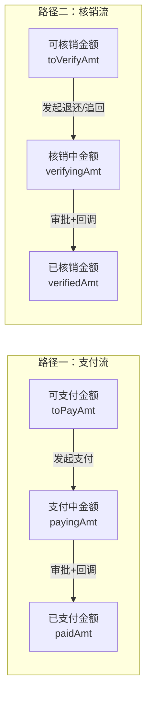
```mermaid
flowchart LR
    subgraph 支付流["路径一：支付流"]
        TO_PAY["可支付金额<br/>toPayAmt"] -->|"发起支付"| PAYING["支付中金额<br/>payingAmt"]
        PAYING -->|"审批+回调"| PAID["已支付金额<br/>paidAmt"]
    end

    subgraph 核销流["路径二：核销流"]
        TO_VERIFY["可核销金额<br/>toVerifyAmt"] -->|"发起退还/追回"| VERIFYING["核销中金额<br/>verifyingAmt"]
        VERIFYING -->|"审批+回调"| VERIFIED["已核销金额<br/>verifiedAmt"]
    end
```

两条路径互不干扰，一个费用单可以同时有支付和核销在进行（但各自同一时刻只能有一个在途流程）。

## 4.4 完整生命周期（按场景分路径）

### 路径 A：正数费用单的支付（BC 给供应商钱）

**适用条件**：`amtType = POSITIVE`

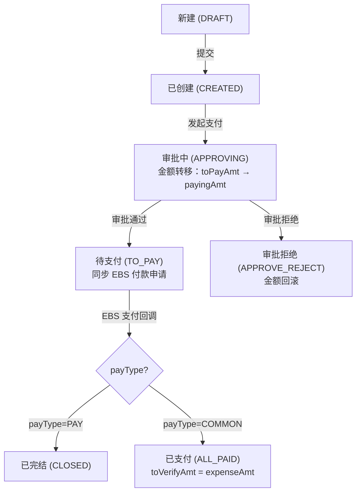
```mermaid
flowchart TD
    DRAFT["新建 (DRAFT)"]
    CREATED["已创建 (CREATED)"]
    APPROVING["审批中 (APPROVING)<br/>金额转移：toPayAmt → payingAmt"]
    TO_PAY["待支付 (TO_PAY)<br/>同步 EBS 付款申请"]
    CLOSED_OR_PAID{"payType?"}
    CLOSED["已完结 (CLOSED)"]
    PAID["已支付 (ALL_PAID)<br/>toVerifyAmt = expenseAmt"]
    REJECT["审批拒绝 (APPROVE_REJECT)<br/>金额回滚"]

    DRAFT -->|"提交"| CREATED
    CREATED -->|"发起支付"| APPROVING
    APPROVING -->|"审批通过"| TO_PAY
    APPROVING -->|"审批拒绝"| REJECT
    TO_PAY -->|"EBS 支付回调"| CLOSED_OR_PAID
    CLOSED_OR_PAID -->|"payType=PAY"| CLOSED
    CLOSED_OR_PAID -->|"payType=COMMON"| PAID
```

操作权限：

- 发起支付：无状态限制，但要求 `payingAmt == 0`（支付在途时不能再次发起）
- EBS 回调：仅 `TO_PAY` 状态

### 路径 B：负数费用单的"关联凭证"（供应商给 BC 钱）

**适用条件**：`amtType = NEGATIVE`

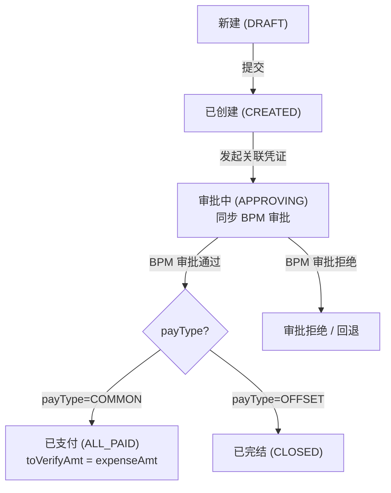
```mermaid
flowchart TD
    DRAFT["新建 (DRAFT)"]
    CREATED["已创建 (CREATED)"]
    APPROVING["审批中 (APPROVING)<br/>同步 BPM 审批"]
    PAYTYPE{"payType?"}
    ALL_PAID["已支付 (ALL_PAID)<br/>toVerifyAmt = expenseAmt"]
    CLOSED["已完结 (CLOSED)"]
    REJECT["审批拒绝 / 回退"]

    DRAFT -->|"提交"| CREATED
    CREATED -->|"发起关联凭证"| APPROVING
    APPROVING -->|"BPM 审批通过"| PAYTYPE
    PAYTYPE -->|"payType=COMMON"| ALL_PAID
    PAYTYPE -->|"payType=OFFSET"| CLOSED
    APPROVING -->|"BPM 审批拒绝"| REJECT
```

与路径 A 的关键区别：负数费用单不需要通过 EBS 实际支付，通过 BPM 审批即完成"支付"。

### 路径 C：退还（负数费用单，BC 退还供应商多付的钱）

**适用条件**：`amtType = NEGATIVE` + `payType = COMMON` + `status = ALL_PAID / PARTIAL_VERIFIED`

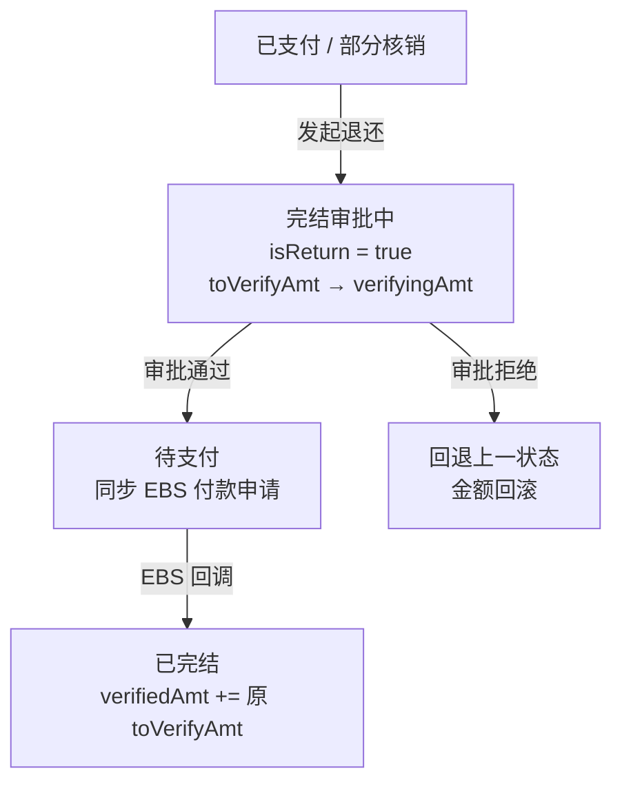
```mermaid
flowchart TD
    START["已支付 / 部分核销"]
    CLOSE_APPROVING["完结审批中<br/>isReturn = true<br/>toVerifyAmt → verifyingAmt"]
    TO_PAY["待支付<br/>同步 EBS 付款申请"]
    CLOSED["已完结<br/>verifiedAmt += 原 toVerifyAmt"]
    REJECT["回退上一状态<br/>金额回滚"]

    START -->|"发起退还"| CLOSE_APPROVING
    CLOSE_APPROVING -->|"审批通过"| TO_PAY
    CLOSE_APPROVING -->|"审批拒绝"| REJECT
    TO_PAY -->|"EBS 回调"| CLOSED
```

### 路径 D：追回（正数费用单，BC 追回多付给供应商的钱）

**适用条件**：`amtType = POSITIVE` + `payType = COMMON` + `status = ALL_PAID / PARTIAL_VERIFIED`

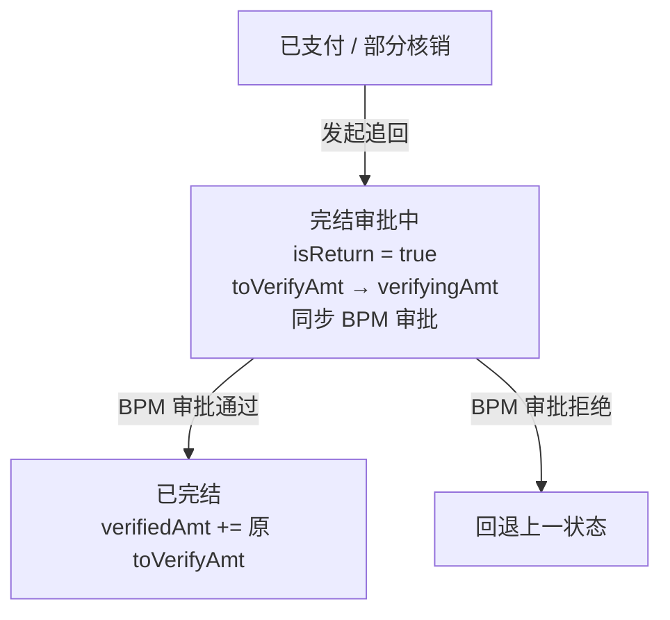
```mermaid
flowchart TD
    START["已支付 / 部分核销"]
    CLOSE_APPROVING["完结审批中<br/>isReturn = true<br/>toVerifyAmt → verifyingAmt<br/>同步 BPM 审批"]
    CLOSED["已完结<br/>verifiedAmt += 原 toVerifyAmt"]
    REJECT["回退上一状态"]

    START -->|"发起追回"| CLOSE_APPROVING
    CLOSE_APPROVING -->|"BPM 审批通过"| CLOSED
    CLOSE_APPROVING -->|"BPM 审批拒绝"| REJECT
```

**退还 vs 追回的区别**：

- **退还**（负数费用单）：BC 把供应商多给的钱"退回去"，走 EBS
- **追回**（正数费用单）：BC 把多付给供应商的钱"追回来"，走 BPM

### 路径 E：完结（不涉及资金变动）

**适用条件**：`payType = COMMON` + `status = ALL_PAID / PARTIAL_VERIFIED`

不处理金额是因为费用单中支付完就可以完结，只不过 `payType=COMMON` 的费用单可以用于核销，不核销也无所谓。

### 路径 F：红字开票（负数费用单）

**适用条件**：`amtType = NEGATIVE` + 状态为 `CREATED/TO_PAY/PARTIAL_PAID/ALL_PAID/PARTIAL_VERIFIED/CLOSED`

负数费用单可发起红字开票（开具红字发票冲销），走 BPM 审批。

## 4.5 费用单状态总览

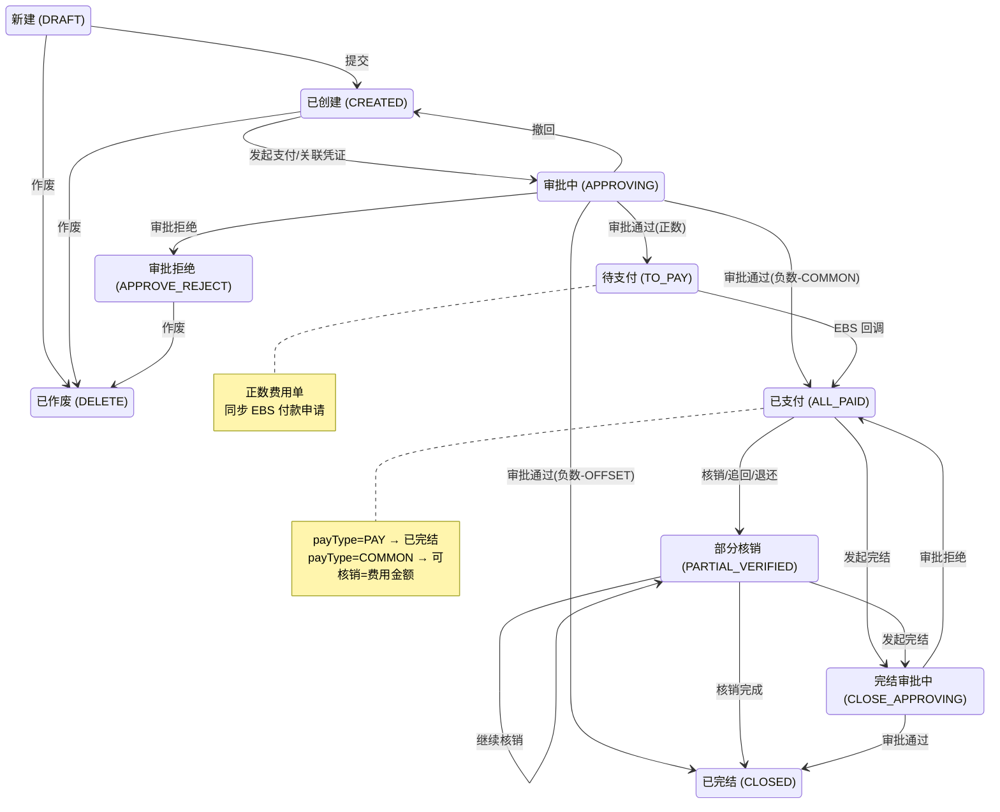
```mermaid
stateDiagram-v2
    DRAFT: 新建 (DRAFT)
    DELETE: 已作废 (DELETE)
    CREATED: 已创建 (CREATED)
    APPROVING: 审批中 (APPROVING)
    APPROVE_REJECT: 审批拒绝 (APPROVE_REJECT)
    TO_PAY: 待支付 (TO_PAY)
    ALL_PAID: 已支付 (ALL_PAID)
    PARTIAL_VERIFIED: 部分核销 (PARTIAL_VERIFIED)
    CLOSE_APPROVING: 完结审批中 (CLOSE_APPROVING)
    CLOSED: 已完结 (CLOSED)

    DRAFT --> CREATED: 提交
    DRAFT --> DELETE: 作废
    CREATED --> DELETE: 作废
    CREATED --> APPROVING: 发起支付/关联凭证
    APPROVING --> TO_PAY: 审批通过(正数)
    APPROVING --> ALL_PAID: 审批通过(负数-COMMON)
    APPROVING --> CLOSED: 审批通过(负数-OFFSET)
    APPROVING --> APPROVE_REJECT: 审批拒绝
    APPROVING --> CREATED: 撤回
    APPROVE_REJECT --> DELETE: 作废
    TO_PAY --> ALL_PAID: EBS 回调
    ALL_PAID --> PARTIAL_VERIFIED: 核销/追回/退还
    ALL_PAID --> CLOSE_APPROVING: 发起完结
    PARTIAL_VERIFIED --> PARTIAL_VERIFIED: 继续核销
    PARTIAL_VERIFIED --> CLOSED: 核销完成
    PARTIAL_VERIFIED --> CLOSE_APPROVING: 发起完结
    CLOSE_APPROVING --> CLOSED: 审批通过
    CLOSE_APPROVING --> ALL_PAID: 审批拒绝

    note right of TO_PAY: 正数费用单<br/>同步 EBS 付款申请
    note right of ALL_PAID: payType=PAY → 已完结<br/>payType=COMMON → 可核销=费用金额
```

**作废条件**：仅 `DRAFT / CREATED / APPROVE_REJECT`（且 `payingAmt == 0`）

## 4.6 数据模型

**表名**：`bc_expense_order`

| 分类 | 字段 | 说明 |
|------|------|------|
| 状态 | `status` | DRAFT → CREATED → APPROVING → TO_PAY / ALL_PAID / CLOSED |
| 状态 | `lastStatus` | 上一状态（用于驳回回滚） |
| 金额类型 | `amtType` | POSITIVE（BC付供应商）/ NEGATIVE（供应商付BC） |
| 付款类型 | `payType` | PAY（支付）/ OFFSET（抵扣）/ COMMON（支付/抵扣） |
| 费用类型 | `expenseType` | F001-F015 |
| 来源 | `orderSource` | HAND / BPM / CONTRACT / TRADE_ORDER |
| 支付金额 | `expenseAmt` | 费用金额（固定） |
| 支付金额 | `toPayAmt` | 可支付金额 |
| 支付金额 | `payingAmt` | 支付中金额（在途） |
| 支付金额 | `paidAmt` | 已支付金额 |
| 核销金额 | `toVerifyAmt` | 可核销金额 |
| 核销金额 | `verifyingAmt` | 核销中金额（在途） |
| 核销金额 | `verifiedAmt` | 已核销金额 |
| 标识 | `isPay` | 是否已发起支付 |
| 标识 | `isReturn` | 是否已发起退还/追回 |
| 标识 | `redInvoiceStatus` | 红字发票状态 |
| 标识 | `updateVoucherStatus` | 凭证关联状态 |
| 外部 | `syncType` | EBS / NCC |

## 4.7 费用单 API

统一路径前缀：`/api/admin/bc/expense-order/action`

| 路径 | Action Key | 说明 |
|------|-----------|------|
| `/save` | `BC_EXPENSE_ORDER_SAVE_ACTION` | 保存费用单 |
| `/query-one` | `BC_EXPENSE_ORDER_GET_BY_ID_ACTION` | 根据ID查询 |
| `/bmp-sync-create` | `BC_EXPENSE_ORDER_BMP_SYNC_CREATE_ACTION` | BPM同步创建 |
| `/update-payment` | `BC_EXPENSE_ORDER_UPDATE_PAYMENT_ACTION` | 发起支付 |
| `/pay-approve-pass` | `BC_EXPENSE_ORDER_PAY_APPROVE_PASS_ACTION` | 支付审批通过 |
| `/pay-approve-reject` | `BC_EXPENSE_ORDER_PAY_APPROVE_REJECT_ACTION` | 支付审批拒绝 |
| `/pay-approve-withdraw` | `BC_EXPENSE_ORDER_PAY_APPROVE_WITHDRAW_ACTION` | 支付审批撤回 |
| `/update-voucher` | `BC_EXPENSE_ORDER_UPDATE_VOUCHER_ACTION` | 关联凭证 |
| `/redInvoiceExpenseOrder` | `BC_RED_INVOICE_EXPENSE_ORDER_ACTION` | 提交红字发票单 |
| `/return` | `BC_EXPENSE_ORDER_RETURN_ACTION` | 退还 |
| `/recall` | `BC_EXPENSE_ORDER_RECALL_ACTION` | 追回 |
| `/close` | `BC_EXPENSE_ORDER_CLOSE_ACTION` | 完结 |
| `/close-approve-pass` | `BC_EXPENSE_ORDER_CLOSE_APPROVE_PASS_ACTION` | 完结审批通过 |
| `/close-approve-reject` | `BC_EXPENSE_ORDER_CLOSE_APPROVE_REJECT_ACTION` | 完结审批拒绝 |
| `/close-approve-withdraw` | `BC_EXPENSE_ORDER_CLOSE_APPROVE_WITHDRAW_ACTION` | 完结审批撤回 |
| `/cancel` | `BC_EXPENSE_ORDER_CANCEL_ACTION` | 作废 |
| `/pay-callback` | `BC_EXPENSE_ORDER_PAY_CALLBACK_ACTION` | 外部支付回调 |
| `/submitHandleRefund` | `BC_EXPENSE_ORDER_SUBMIT_HANDLE_REFUND_ACTION` | 提交处理退供信息 |
| `/expenseUploadInvoiceInInvoice` | `EXPENSE_UPLOAD_INVOICE_IN_INVOICE_ACTION` | 上传发票 |

---

# 5. 预付单

## 5.1 业务场景概述

预付单是 BC 在供应商实际交货**之前**提前支付给供应商的款项。

> 预付单 = "先给钱，后交货（再慢慢核销）"

### 典型场景

- 签订合同时约定预付 30%（合同类型）
- 下采购订单时预付 50%（订单类型）
- 送货前预付部分款项（送货单类型）
- 纯粹的提前付款（提前付款类型）

### 核心概念

- **本次预付金额（prePayAmt）**：本次要预付的金额
- **申请付款金额（applyPayAmt）**：实际向 EBS 申请的付款金额 = `prePayAmt + Σ(关联负数费用单.可支付金额)`，最小为 0
- **可核销金额（toVerifyAmt）**：预付单支付后可被后续对账单/核销使用的金额

> 预付单创建时可以关联**负数费用单**进行抵扣，实际支付给供应商的金额 = 预付金额 - 供应商欠 BC 的钱。

## 5.2 预付单类型与金额来源

| 类型 | 含义 | 金额来源 |
|------|------|---------|
| `CONTRACT`（合同） | 基于合同预付 | 手动填写 |
| `TRADE_ORDER`（订单） | 基于采购订单预付 | 物料行金额 = 订单含税单价 × 数量 × 预付比例 |
| `DELIVERY_ORDER`（送货单） | 基于送货单预付 | 物料行金额 = 送货单含税单价 × 数量 × 预付比例 |
| `PRE_PAYMENT`（提前付款） | 纯粹提前付款 | 手动填写 |

## 5.3 金额公式

```
本次预付金额(prePayAmt) = Σ(物料明细行.应付金额)  -- 订单/送货单类型
                        或 手动填写                -- 合同/提前付款

申请付款金额(applyPayAmt) = 本次预付金额 + Σ(关联负数费用单.可支付金额)
                           （最小为 0）
```

## 5.4 创建时的金额处理逻辑

创建预付单时，关联的费用单使用金额不能超过其可支付金额。

对于订单/送货单类型：

- 如果 `applyPayAmt > 0`（实际要付钱）：按提交的顺序依次使用费用单的可支付金额
- 如果 `applyPayAmt == 0`（费用单足以完全抵扣）：费用单的金额必须恰好覆盖本次预付金额

## 5.5 生命周期

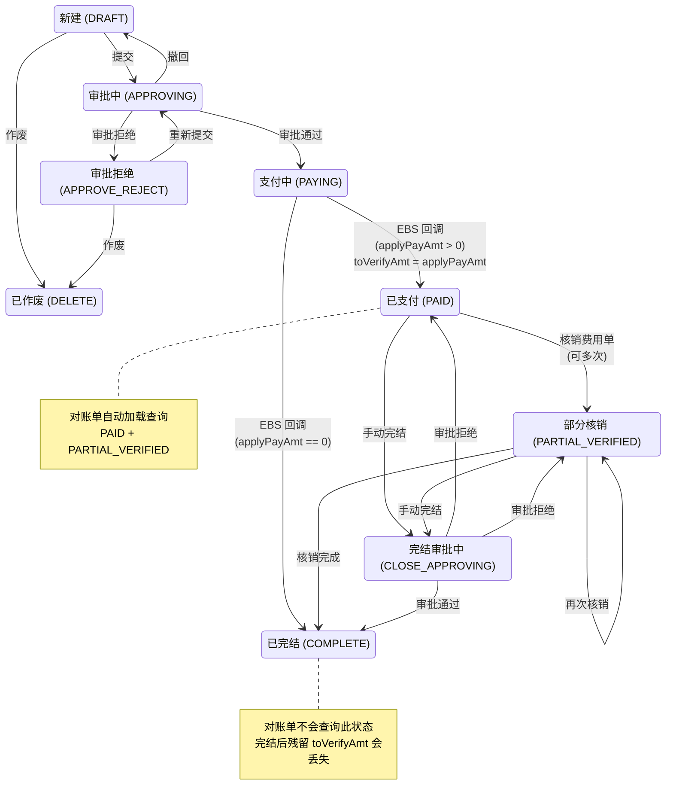
```mermaid
stateDiagram-v2
    DRAFT: 新建 (DRAFT)
    DELETE: 已作废 (DELETE)
    APPROVING: 审批中 (APPROVING)
    APPROVE_REJECT: 审批拒绝 (APPROVE_REJECT)
    PAYING: 支付中 (PAYING)
    PAID: 已支付 (PAID)
    PARTIAL_VERIFIED: 部分核销 (PARTIAL_VERIFIED)
    COMPLETE: 已完结 (COMPLETE)
    CLOSE_APPROVING: 完结审批中 (CLOSE_APPROVING)

    DRAFT --> APPROVING: 提交
    DRAFT --> DELETE: 作废
    APPROVE_REJECT --> APPROVING: 重新提交
    APPROVE_REJECT --> DELETE: 作废
    APPROVING --> PAYING: 审批通过
    APPROVING --> APPROVE_REJECT: 审批拒绝
    APPROVING --> DRAFT: 撤回
    PAYING --> COMPLETE: EBS 回调<br/>(applyPayAmt == 0)
    PAYING --> PAID: EBS 回调<br/>(applyPayAmt > 0)<br/>toVerifyAmt = applyPayAmt
    PAID --> PARTIAL_VERIFIED: 核销费用单<br/>(可多次)
    PAID --> CLOSE_APPROVING: 手动完结
    PARTIAL_VERIFIED --> PARTIAL_VERIFIED: 再次核销
    PARTIAL_VERIFIED --> COMPLETE: 核销完成
    PARTIAL_VERIFIED --> CLOSE_APPROVING: 手动完结
    CLOSE_APPROVING --> COMPLETE: 审批通过
    CLOSE_APPROVING --> PAID: 审批拒绝
    CLOSE_APPROVING --> PARTIAL_VERIFIED: 审批拒绝

    note right of PAID: 对账单自动加载查询<br/>PAID + PARTIAL_VERIFIED
    note right of COMPLETE: 对账单不会查询此状态<br/>完结后残留 toVerifyAmt 会丢失
```

## 5.6 操作详解

| 操作 | 允许状态 | 金额变动 | 外部同步 |
|------|---------|---------|---------|
| **编辑** | `DRAFT`, `APPROVE_REJECT` | 删除旧关联重新创建 | 无 |
| **提交** | `DRAFT`, `APPROVE_REJECT` | 费用单 toPayAmt → payingAmt | 无（进入审批） |
| **提交-审批通过** | `APPROVING` | 费用单 payingAmt → paidAmt | EBS 付款申请 |
| **提交-审批拒绝** | `APPROVING` | 费用单金额回滚 | 无 |
| **作废** | `DRAFT`, `APPROVE_REJECT` | 关联费用单 → DELETE，订单 relPrePay → false | 无 |
| **核销费用单** | `PAID`, `PARTIAL_VERIFIED` | 预付单 toVerifyAmt → verifyingAmt → verifiedAmt | EBS（无回调） |
| **完结** | `PAID`, `PARTIAL_VERIFIED`（`verifyingAmt==0`） | 无 | BPM/SRM 审批 |
| **EBS 回调** | `PAYING` | applyPayAmt==0 → 已完结；>0 → 已支付 | - |

## 5.7 核销费用单的批次机制

预付单核销费用单支持**多次核销**，每次核销使用 `batchNo`（批次号）区分：

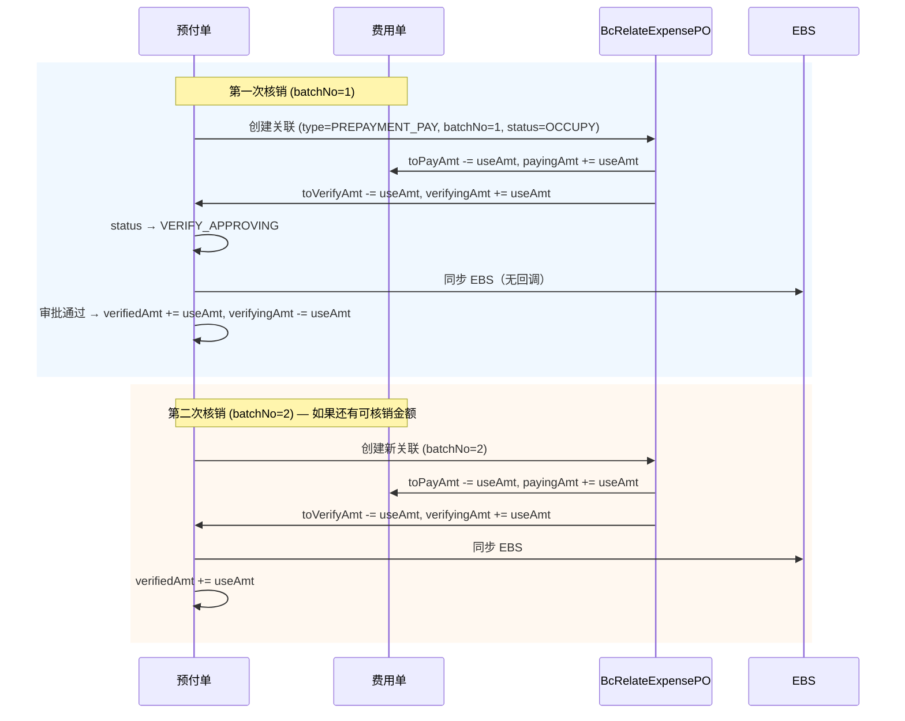
```mermaid
sequenceDiagram
    participant 预付单
    participant 费用单
    participant 关联记录 as BcRelateExpensePO
    participant EBS

    rect rgb(240, 248, 255)
    Note over 预付单,费用单: 第一次核销 (batchNo=1)
    预付单->>关联记录: 创建关联 (type=PREPAYMENT_PAY, batchNo=1, status=OCCUPY)
    关联记录->>费用单: toPayAmt -= useAmt, payingAmt += useAmt
    关联记录->>预付单: toVerifyAmt -= useAmt, verifyingAmt += useAmt
    预付单->>预付单: status → VERIFY_APPROVING
    预付单->>EBS: 同步 EBS（无回调）
    预付单->>预付单: 审批通过 → verifiedAmt += useAmt, verifyingAmt -= useAmt
    end

    rect rgb(255, 248, 240)
    Note over 预付单,费用单: 第二次核销 (batchNo=2) — 如果还有可核销金额
    预付单->>关联记录: 创建新关联 (batchNo=2)
    关联记录->>费用单: toPayAmt -= useAmt, payingAmt += useAmt
    关联记录->>预付单: toVerifyAmt -= useAmt, verifyingAmt += useAmt
    预付单->>EBS: 同步 EBS
    预付单->>预付单: verifiedAmt += useAmt
    end
```

## 5.8 可核销金额丢失风险

> - 预付单如果是 PAID 状态，可核销金额不为 0，如果直接完结，那这部分钱会在对账中丢失
> - 对账自动加载只查 PAID 和 PARTIAL_VERIFIED 状态的预付单，COMPLETE 状态不会出现在对账单中

## 5.9 数据模型

**表名**：`bc_pre_payment`

| 分类 | 字段 | 说明 |
|------|------|------|
| 状态 | `status` | DRAFT → APPROVING → PAYING → PAID / PARTIAL_VERIFIED / COMPLETE |
| 状态 | `lastStatus` | 上一状态（用于回滚） |
| 类型 | `prePaymentType` | CONTRACT / TRADE_ORDER / DELIVERY_ORDER / PRE_PAYMENT |
| 金额 | `prePayAmt` | 本次预付金额 |
| 金额 | `applyPayAmt` | 申请付款金额 |
| 核销金额 | `toVerifyAmt` | 可核销金额 |
| 核销金额 | `verifyingAmt` | 核销中金额 |
| 核销金额 | `verifiedAmt` | 已核销金额 |
| 批次 | `batchNo` | 核销批次号（每次核销递增） |
| 关联 | `relateTradeOrder`, `relateDeliveryOrder`, `relateContract` | 关联的上游单据 |
| 比例 | `tradePrepayPercent`, `beforeDeliveryPrepayPercent` | 预付比例 |

## 5.10 预付单 API

统一路径前缀：`/api/admin/bc/pre-payment/action`

| 路径 | Action Key | 说明 |
|------|-----------|------|
| `/save` | `BC_PRE_PAYMENT_SAVE_ACTION` | 保存预付单 |
| `/query-one` | `BC_PRE_PAYMENT_GET_BY_ID_ACTION` | 根据ID查询 |
| `/submit` | `BC_PRE_PAYMENT_SUBMIT_ACTION` | 提交 |
| `/approve-submit-complete` | `BC_PRE_PAYMENT_APPROVE_SUBMIT_COMPLETE_ACTION` | 提交审批通过 |
| `/reject-submit-complete` | `BC_PRE_PAYMENT_REJECT_SUBMIT_COMPLETE_ACTION` | 提交审批拒绝 |
| `/submit-approve-withdraw` | `BC_PRE_PAYMENT_SUBMIT_APPROVE_WITHDRAW_ACTION` | 提交审批撤回 |
| `/complete` | `BC_PRE_PAYMENT_COMPLETE_ACTION` | 完结 |
| `/approve-close-complete` | `BC_PRE_PAYMENT_APPROVE_CLOSE_COMPLETE_ACTION` | 完结审批通过 |
| `/reject-close-complete` | `BC_PRE_PAYMENT_REJECT_CLOSE_COMPLETE_ACTION` | 完结审批拒绝 |
| `/close-approve-withdraw` | `BC_PRE_PAYMENT_CLOSE_APPROVE_WITHDRAW_ACTION` | 完结审批撤回 |
| `/verify` | `BC_PRE_PAYMENT_VERIFY_ACTION` | 核销费用单 |
| `/approve-verify-complete` | `BC_PRE_PAYMENT_APPROVE_VERIFY_COMPLETE_ACTION` | 核销审批通过 |
| `/reject-verify-complete` | `BC_PRE_PAYMENT_REJECT_VERIFY_COMPLETE_ACTION` | 核销审批拒绝 |
| `/verify-approve-withdraw` | `BC_PRE_PAYMENT_VERIFY_APPROVE_WITHDRAW_ACTION` | 核销审批撤回 |
| `/cancel` | `BC_PRE_PAYMENT_CANCEL_ACTION` | 作废 |
| `/pay-callback` | `BC_PRE_PAYMENT_PAY_CALLBACK_ACTION` | 外部支付回调 |

---

# 6. 对账单

## 6.1 业务场景概述

对账单是 BC 与供应商之间的**账目核对凭证**——把若干笔结算项汇总在一起，关联费用单和预付单，形成一份"我们双方确认，这些账目是对的"的文档。

> 对账单 = "结算项的打包 + 预付单/费用单的冲抵 + 双方确认（签章）"

### 发起方

| 发起方 | 说明 | 额外步骤 |
|--------|------|---------|
| 采购方 `PURCHASER` | BC 内部发起对账 | 直接进入审批 |
| 供应商 `SUPPLIER` | 供应商发起对账 | 需要采购方**确认**后才进入审批 |

### 金额公式

```
对账单.对账含税金额 = Σ(结算项.含税总金额)
对账单.应付含税金额 = Σ(结算项.含税总金额) + 费用单使用金额(正) - 费用单使用金额(负) + 预付单使用金额
```

## 6.2 自动匹配逻辑（预览时）

创建对账单时，系统自动匹配符合条件的预付单和费用单：

### 预付单匹配

| 条件 | 说明 |
|------|------|
| 采购组织 + 供应商 + 币种 + 税率一致 | 基本一致性 |
| 预付单状态 = `PAID` 或 `PARTIAL_VERIFIED` | 已支付且还有可核销余额 |
| 预付单类型 = `CONTRACT` / `PRE_PAYMENT` | 直接使用可核销金额 |
| 预付单类型 = `TRADE_ORDER` / `DELIVERY_ORDER` | 按订单行/送货单行匹配结算项，`useAmt = min(订单含税单价 × 出入库数量 × 预付比例, 可核销金额)` |
| 仅入库（IN）结算项参与预付匹配 | 出库结算项不参与 |

### 费用单匹配

| 条件 | 说明 |
|------|------|
| 采购组织 + 供应商 + 币种 + 税率一致 | 基本一致性 |
| 费用单状态 = `CREATED` / `PARTIAL_PAID` + 付款类型 = `抵扣` | 对账单支付（`STATEMENT_PAY`） |
| 费用单状态 = `ALL_PAID` / `PARTIAL_VERIFIED` + 付款类型 = `抵扣` | 对账单核销（`STATEMENT_OFFSET`） |
| 可核销金额/可支付金额 ≠ 0 | 有可用余额 |

## 6.3 批量对账校验

**校验规则**：

1. 所有结算项必须存在
2. **采购组织、供应商、币种、税率**必须一致
3. 结算项状态必须为**已创建**
4. 维修工单结算项不能与其他类型混用

## 6.4 生命周期

### 采购方发起的对账单

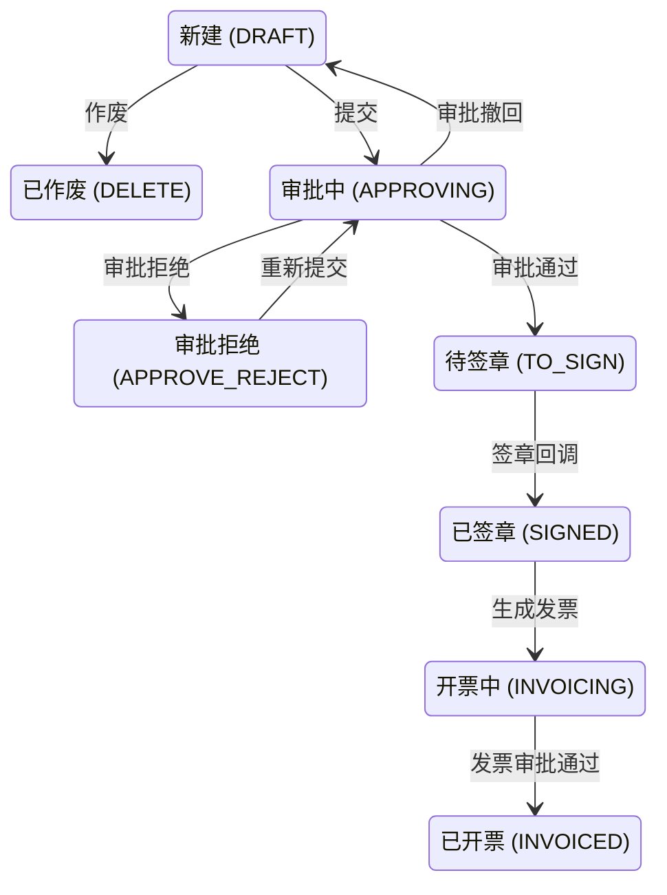
```mermaid
stateDiagram-v2
    DRAFT: 新建 (DRAFT)
    DELETE: 已作废 (DELETE)
    APPROVING: 审批中 (APPROVING)
    APPROVE_REJECT: 审批拒绝 (APPROVE_REJECT)
    TO_SIGN: 待签章 (TO_SIGN)
    SIGNED: 已签章 (SIGNED)
    INVOICING: 开票中 (INVOICING)
    INVOICED: 已开票 (INVOICED)

    DRAFT --> DELETE: 作废
    DRAFT --> APPROVING: 提交
    APPROVING --> TO_SIGN: 审批通过
    APPROVING --> APPROVE_REJECT: 审批拒绝
    APPROVING --> DRAFT: 审批撤回
    APPROVE_REJECT --> APPROVING: 重新提交
    TO_SIGN --> SIGNED: 签章回调
    SIGNED --> INVOICING: 生成发票
    INVOICING --> INVOICED: 发票审批通过
```

### 供应商发起的对账单（多了"确认"环节）

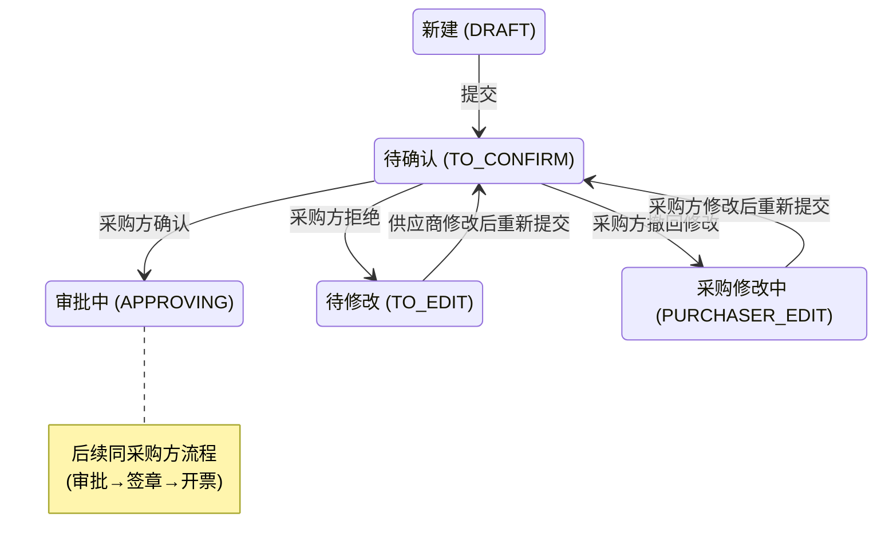
```mermaid
stateDiagram-v2
    DRAFT: 新建 (DRAFT)
    TO_CONFIRM: 待确认 (TO_CONFIRM)
    APPROVING: 审批中 (APPROVING)
    TO_EDIT: 待修改 (TO_EDIT)
    PURCHASER_EDIT: 采购修改中 (PURCHASER_EDIT)

    DRAFT --> TO_CONFIRM: 提交
    TO_CONFIRM --> APPROVING: 采购方确认
    TO_CONFIRM --> TO_EDIT: 采购方拒绝
    TO_CONFIRM --> PURCHASER_EDIT: 采购方撤回修改
    TO_EDIT --> TO_CONFIRM: 供应商修改后重新提交
    PURCHASER_EDIT --> TO_CONFIRM: 采购方修改后重新提交

    note right of APPROVING: 后续同采购方流程<br/>(审批→签章→开票)
```

## 6.5 操作总览

| 操作 | 允许状态 | 做什么 |
|------|---------|--------|
| **保存** | 新建时无限制；更新仅 `DRAFT/TO_EDIT/PURCHASER_EDIT/APPROVE_REJECT` | 创建/更新对账单及三条关联记录 |
| **提交** | `DRAFT/TO_EDIT/PURCHASER_EDIT/APPROVE_REJECT` | 进入审批，占用金额 |
| **作废** | `DRAFT/TO_EDIT/PURCHASER_EDIT/APPROVE_REJECT` | 设置为已作废 |
| **撤回** | `TO_SIGN/SIGNED` | 回滚金额，作废对账单 |
| **审批通过** | `APPROVING` | 进入待签章，结算项对账状态=已对账 |
| **审批拒绝** | `APPROVING` | 回滚金额 |
| **审批撤回** | `APPROVING` | 回到新建 |
| **确认通过**（供应商发起） | `TO_CONFIRM` | 进入审批中 |
| **确认拒绝**（供应商发起） | `TO_CONFIRM` | 进入待修改 |
| **签章回调** | `TO_SIGN` | 变为已签章/签章拒绝/签章撤回 |

## 6.6 数据模型

**表名**：`bc_statement_order`

| 分类 | 字段 | 说明 |
|------|------|------|
| 状态 | `statementStatus` | 新建→审批中→待签章→已签章→开票中→已开票 |
| 来源 | `createSource` | PURCHASER（采购方）/ SUPPLIER（供应商） |
| 金额 | `statementIntaxAmt/ExtaxAmt/TaxAmt` | 对账金额（三组） |
| 金额 | `invoiceIntaxAmt/ExtaxAmt/TaxAmt` | 开票金额（三组） |
| 金额 | `payIntaxAmt/ExtaxAmt/TaxAmt` | 应付金额（三组） |
| 金额 | `prePaymentVerifyAmt` | 预付核销金额 |
| 签章 | `signType` | 线上 / 线下 |
| 签章 | `signingStatus` | 进行中/已通过/已拒绝/已撤回 |
| 关联 | `invoiceOrder` | 关联发票单 ID |
| 标志 | `repairOrderTag` | 维修工单对账单标记 |

## 6.7 对账单 API

统一路径前缀：`/api/admin/bc/statement-order/action`

| 路径 | Action Key | 说明 |
|------|-----------|------|
| `/batch-reconciliation-validate` | `BC_STATEMENT_ORDER_BATCH_RECONCILIATION_VALIDATE_ACTION` | 批量对账校验 |
| `/preview` | `BC_STATEMENT_ORDER_PREVIEW_ACTION` | 批量结算项对账预览 |
| `/save` | `BC_STATEMENT_ORDER_SAVE_ACTION` | 保存 |
| `/submit` | `BC_STATEMENT_ORDER_SUBMIT_ACTION` | 提交 |
| `/cancel` | `BC_STATEMENT_ORDER_CANCEL_ACTION` | 作废 |
| `/approve-pass` | `BC_STATEMENT_ORDER_APPROVE_PASS_ACTION` | 审批通过 |
| `/approve-reject` | `BC_STATEMENT_ORDER_APPROVE_REJECT_ACTION` | 审批拒绝 |
| `/approve-withdraw` | `BC_STATEMENT_ORDER_APPROVE_WITHDRAW_ACTION` | 审批撤回 |
| `/initiateSigning` | `BC_STATEMENT_ORDER_INITIATE_SIGNING_ACTION` | 手动发起签署 |
| `/sign-callback` | `BC_STATEMENT_ORDER_SIGN_CALLBACK_ACTION` | 签署任务回调 |
| `/queryBcStatementDetailById` | `QUERY_BC_STATEMENT_DETAIL_BY_ID_ACTION` | 查询详情（签署回调用） |
| `/confirm-pass` | `BC_STATEMENT_ORDER_CONFIRM_PASS_ACTION` | 确认时通过（供应商发起） |
| `/confirm-reject` | `BC_STATEMENT_ORDER_SUPPLIER_EDIT_AFTER_REJECT_ACTION` | 确认时拒绝 |
| `/confirm-edit` | `BC_STATEMENT_ORDER_PURCHASER_EDIT_AFTER_CONFIRM_ACTION` | 确认时撤回修改 |
| `/withdraw` | `BC_STATEMENT_ORDER_WITHDRAW_ACTION` | 撤回 |
| `/updateSignedAttachment` | `BC_STATEMENT_UPDATE_SIGNED_ATTACHMENT_ACTION` | 更新签署文件 |

---

# 7. 发票单

## 7.1 业务场景概述

发票单是税务凭证——基于已签章的对账单生成，是结算流程的**最后一环**。

> 发票单 = "对账单的税务化 + 真正触发付款"

### 核心概念

- **发票单（Invoice Order）**：汇总一个或多个已签章对账单，上传发票并核验，审批通过后触发 EBS 付款申请和发票平台入账
- **付款记录（Invoice Order Pay）**：发票单的付款计划，审批前可调差修改
- **发票记录（Invoice Record）**：发票 OCR 识别结果

## 7.2 生命周期

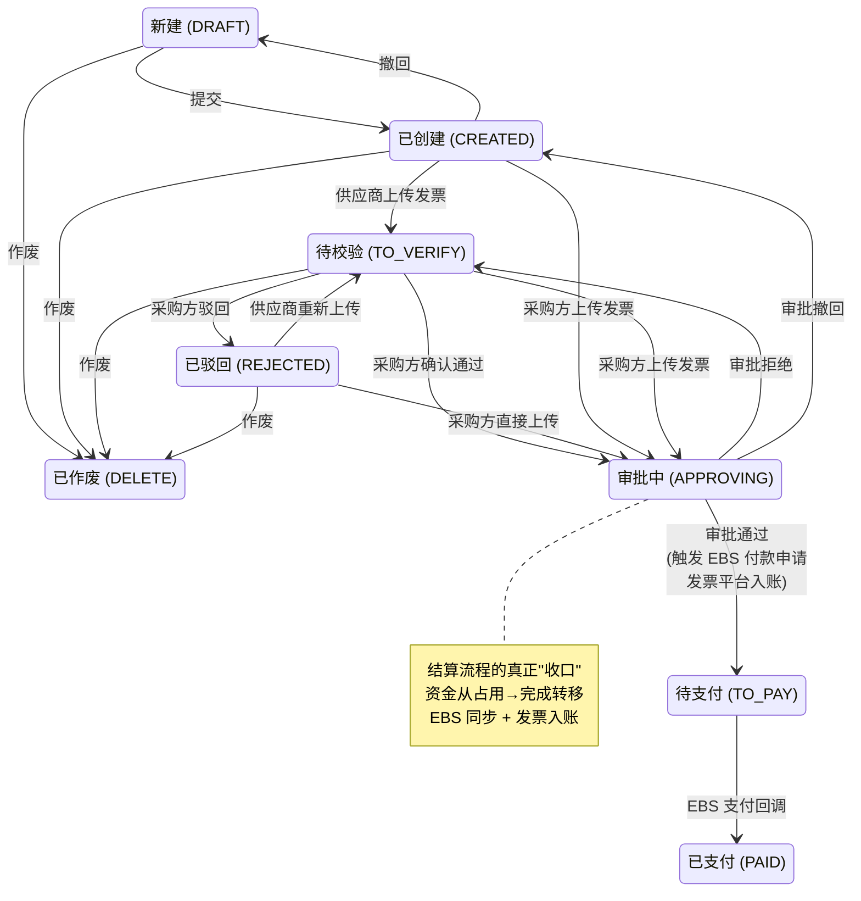
```mermaid
stateDiagram-v2
    DRAFT: 新建 (DRAFT)
    DELETE: 已作废 (DELETE)
    CREATED: 已创建 (CREATED)
    TO_VERIFY: 待校验 (TO_VERIFY)
    REJECTED: 已驳回 (REJECTED)
    APPROVING: 审批中 (APPROVING)
    TO_PAY: 待支付 (TO_PAY)
    PAID: 已支付 (PAID)

    DRAFT --> CREATED: 提交
    DRAFT --> DELETE: 作废
    CREATED --> DRAFT: 撤回
    CREATED --> DELETE: 作废
    CREATED --> TO_VERIFY: 供应商上传发票
    TO_VERIFY --> APPROVING: 采购方确认通过
    TO_VERIFY --> REJECTED: 采购方驳回
    TO_VERIFY --> DELETE: 作废
    REJECTED --> TO_VERIFY: 供应商重新上传
    REJECTED --> APPROVING: 采购方直接上传
    REJECTED --> DELETE: 作废
    CREATED --> APPROVING: 采购方上传发票
    TO_VERIFY --> APPROVING: 采购方上传发票
    APPROVING --> TO_PAY: 审批通过<br/>(触发 EBS 付款申请<br/>发票平台入账)
    APPROVING --> TO_VERIFY: 审批拒绝
    APPROVING --> CREATED: 审批撤回
    TO_PAY --> PAID: EBS 支付回调

    note right of APPROVING: 结算流程的真正"收口"<br/>资金从占用→完成转移<br/>EBS 同步 + 发票入账
```

## 7.3 三种发票上传路径

| 路径 | 允许状态 | 触发方 | 去向 |
|------|---------|--------|------|
| **供应商上传** | `CREATED`, `REJECTED` | 供应商 | 待校验 → 等待采购方审核 |
| **采购方上传** | `CREATED`, `TO_VERIFY`, `REJECTED` | 采购方 | 审批中 → 直接进入审批 |
| **采购方编辑** | `TO_VERIFY` | 采购方 | 待校验 → 仅修改不触发审批 |

## 7.4 发票核验规则

上传发票时，系统对发票 OCR 识别结果进行校验：

```
校验一：结算项累计不含税金额 == 发票单.开票未税金额
校验二：发票记录.发票金额合计 == 发票单.开票含税金额
  （采购蓝票/红票 做加法，销售蓝票 做减法）
校验三：发票记录.税额合计 == 发票单.开票税额
```

## 7.5 调差（Adjust Difference）

在发票单已开票但审批前，允许微调结算项的税额或含税金额：

```
调差入参：关联结算项.含税金额(新), 关联结算项.税额(新)
  → 重新计算未税金额
  → 更新关联结算项表的金额快照
  → 计算差额，更新发票单的三个差额字段
  → 同步更新付款记录的申请金额
```

## 7.6 审批通过：结算流程的真正"收口"

`approvePassInvoiceOrder` **是结算模块最关键的方法**，使用 Redisson 分布式锁（`INVOICE_ORDER_APPROVE_PASS_{id}`）保护，触发以下所有操作：

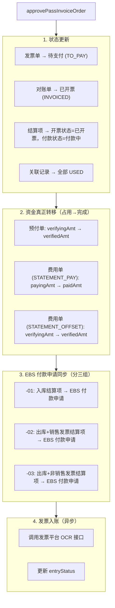
```mermaid
flowchart TD
    subgraph 1["1. 状态更新"]
        A1["发票单 → 待支付 (TO_PAY)"]
        A2["对账单 → 已开票 (INVOICED)"]
        A3["结算项 → 开票状态=已开票，付款状态=付款中"]
        A4["关联记录 → 全部 USED"]
    end

    subgraph 2["2. 资金真正转移（占用→完成）"]
        B1["预付单: verifyingAmt → verifiedAmt"]
        B2["费用单 (STATEMENT_PAY): payingAmt → paidAmt"]
        B3["费用单 (STATEMENT_OFFSET): verifyingAmt → verifiedAmt"]
    end

    subgraph 3["3. EBS 付款申请同步（分三组）"]
        C1["-01: 入库结算项 → EBS 付款申请"]
        C2["-02: 出库+销售发票结算项 → EBS 付款申请"]
        C3["-03: 出库+非销售发票结算项 → EBS 付款申请"]
    end

    subgraph 4["4. 发票入账（异步）"]
        D1["调用发票平台 OCR 接口"]
        D2["更新 entryStatus"]
    end

    APPROVE["approvePassInvoiceOrder"] --> 1
    1 --> 2
    2 --> 3
    3 --> 4
```

### EBS 同步的三组分组逻辑

| 组 | outId 后缀 | 结算项类型 | 说明 |
|----|-----------|-----------|------|
| -01 | `{code}-01` | 入库（IN）结算项 | 正常采购付款 |
| -02 | `{code}-02` | 出库（OUT）+ 销售发票 | 退货+销售发票场景 |
| -03 | `{code}-03` | 出库（OUT）+ 非销售发票 | 退货+非销售发票场景 |

三组全部完成后发票单同步状态才标记为成功。

## 7.7 操作总览

| 操作 | 允许状态 | 做什么 |
|------|---------|--------|
| **保存** | 新建；更新仅 `DRAFT` | 创建/更新，创建付款记录 |
| **提交** | `DRAFT` | 进入已创建，对账单→开票中，结算项→开票中 |
| **作废** | `DRAFT/CREATED/TO_VERIFY/REJECTED` | 回滚对账单/结算项状态 |
| **撤回** | `CREATED` | 回到新建，回滚对账单/结算项 |
| **供应商上传** | `CREATED/REJECTED` | 进入待校验 |
| **采购方上传** | `CREATED/TO_VERIFY/REJECTED` | 进入审批中，核验金额 |
| **采购方编辑** | `TO_VERIFY` | 仅更新不上报 |
| **调差** | 审批前 | 调整结算项金额 |
| **审批通过** | `APPROVING` | **触发全部资金转移 + EBS同步 + 入账** |
| **审批拒绝** | `APPROVING` | 回退到待校验 |
| **支付回调** | `TO_PAY` | 进入已支付，结算项付款状态=已支付 |

## 7.8 数据模型

**表名**：`bc_invoice_order`

| 分类 | 字段 | 说明 |
|------|------|------|
| 状态 | `invoiceOrdeStatus` | DRAFT→CREATED→TO_VERIFY/APPROVING→TO_PAY→PAID |
| 金额 | `statementIntaxAmt/ExtaxAmt/TaxAmt` | 对账金额汇总（快照） |
| 金额 | `invoiceIntaxAmt/ExtaxAmt/TaxAmt` | 开票金额 |
| 金额 | `invoiceDiffIntaxAmt/ExtaxAmt/TaxAmt` | 发票差额（发票-对账） |
| 金额 | `payIntaxAmt/ExtaxAmt/TaxAmt` | 应付金额 |
| 汇总 | `invoiceAmtTotal` | 发票含税总额 |
| 汇总 | `invoiceTaxAmtTotal` | 发票税额合计 |
| 入账 | `entryStatus` | 发票平台入账状态 |

**子表**：

| 表名 | 说明 |
|------|------|
| `bc_invoice_record` | 发票单开票记录表（OCR 识别结果） |
| `bc_invoice_order_pay` | 发票单付款记录表（付款计划） |

## 7.9 发票单 API

统一路径前缀：`/api/admin/bc/invoice-order/action`

| 路径 | Action Key | 说明 |
|------|-----------|------|
| `/batch-validate` | `BC_INVOICE_ORDER_BATCH_VALIDATE_ACTION` | 批量对账单校验 |
| `/single-validate` | `BC_INVOICE_ORDER_SINGLE_VALIDATE_ACTION` | 单个对账单校验 |
| `/batch-preview` | `BC_INVOICE_ORDER_BATCH_PREVIEW_ACTION` | 批量对账单预览 |
| `/single-preview` | `BC_INVOICE_ORDER_SINGLE_PREVIEW_ACTION` | 单个对账单预览 |
| `/save` | `BC_INVOICE_ORDER_SAVE_ACTION` | 保存 |
| `/submit` | `BC_INVOICE_ORDER_SUBMIT_ACTION` | 提交 |
| `/cancel` | `BC_INVOICE_ORDER_CANCEL_ACTION` | 作废 |
| `/approve-pass` | `BC_INVOICE_ORDER_APPROVE_PASS_ACTION` | 审批通过（分布式锁保护） |
| `/approve-node-pass` | `BC_INVOICE_ORDER_APPROVE_NODE_PASS_ACTION` | 节点审批通过 |
| `/approve-reject` | `BC_INVOICE_ORDER_APPROVE_REJECT_ACTION` | 审批拒绝 |
| `/approve-withdraw` | `BC_INVOICE_ORDER_APPROVE_WITHDRAW_ACTION` | 审批撤回 |
| `/withdraw` | `BC_INVOICE_ORDER_WITHDRAW_ACTION` | 撤回 |
| `/upload-invoice` | `BC_INVOICE_ORDER_UPLOAD_INVOICE_ACTION` | 采购方上传发票 |
| `/upload-invoice-edit` | `BC_INVOICE_ORDER_UPLOAD_INVOICE_EDIT_ACTION` | 采购方编辑发票 |
| `/supplier-upload-invoice` | `BC_INVOICE_ORDER_SUPPLIER_UPLOAD_INVOICE_ACTION` | 供应商上传发票 |
| `/adjust-difference` | `BC_INVOICE_ORDER_ADJUST_DIFFERENCE_ACTION` | 调差 |
| `/batch-upload-bill` | `BC_INVOICE_ORDER_BATCH_UPLOAD_BILL_ACTION` | 批量上传发票（OCR） |
| `/pay-callback` | `BC_INVOICE_ORDER_PAY_CALLBACK_ACTION` | EBS 支付回调 |
| `/export-invoice` | `BC_EXPORT_INVOICE_ORDER_ACTION` | 导出详情 |

---

# 8. 红字发票单

## 8.1 业务场景概述

红字发票是中国税务体系中的**冲销发票**。当需要撤销或更正已开的蓝字发票时（如退货、开票金额错误），使用红字发票进行冲销。

> 红字发票 = 发票的"负数版本"，用来冲抵原来的发票

### 约束条件

- **仅出库结算项**可以创建红字发票
- 结算项的 `redInvoiceStatus` 不能是 `RED_INVOICE_SUCCESS`（已成功的不重复开）

## 8.2 生命周期

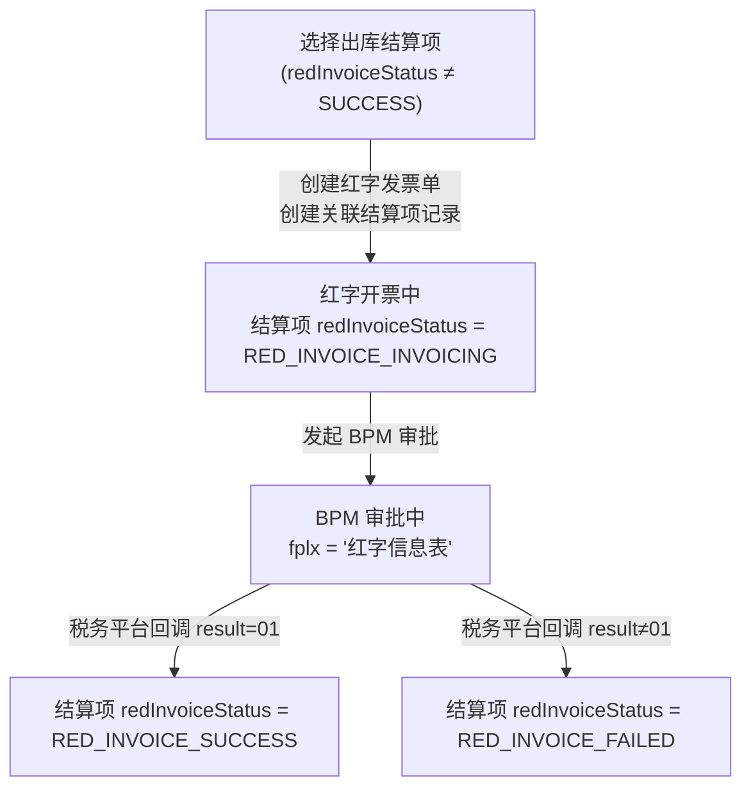
```mermaid
flowchart TD
    SETTLEMENT["选择出库结算项<br/>(redInvoiceStatus ≠ SUCCESS)"]
    CREATING["红字开票中<br/>结算项 redInvoiceStatus = RED_INVOICE_INVOICING"]
    BPM["BPM 审批中<br/>fplx = '红字信息表'"]
    SUCCESS["结算项 redInvoiceStatus = RED_INVOICE_SUCCESS"]
    FAILED["结算项 redInvoiceStatus = RED_INVOICE_FAILED"]

    SETTLEMENT -->|"创建红字发票单<br/>创建关联结算项记录"| CREATING
    CREATING -->|"发起 BPM 审批"| BPM
    BPM -->|"税务平台回调 result=01"| SUCCESS
    BPM -->|"税务平台回调 result≠01"| FAILED
```

## 8.3 创建逻辑

**代码位置**：`BcRedInvoiceOrderAppService.createRedInvoiceOrder()`

> 1. 校验：结算项存在、方向为出库、红字状态合规
> 2. 创建 `BcRedInvoiceOrderPO`
> 3. 创建 `BcRelateSettlementItemPO` 关联记录
> 4. 更新结算项红字开票状态 → `RED_INVOICE_INVOICING`
> 5. 创建 BPM 工作流外部对接记录（`fplx = '红字信息表'`）

## 8.4 回调处理

### BPM 回调

- 通过/拒绝 → 更新 `BcSettlementOutOrder` 状态

### 税务平台回调

- `result = "01"`（成功）→ 结算项 `redInvoiceStatus = RED_INVOICE_SUCCESS`
- 其他 → 结算项 `redInvoiceStatus = RED_INVOICE_FAILED`

## 8.5 数据模型

**表名**：`bc_red_invoice_order`

关联表：

- `bc_relate_settlement_item`：红字发票单 ↔ 结算项
- `bc_settlement_out_order`：外部对接记录（BPM 工作流）

## 8.6 红字发票单 API

统一路径前缀：`/api/admin/bc/red-invoice-order/action`

| 路径 | Action Key | 说明 |
|------|-----------|------|
| `/create` | `BC_RED_INVOICE_ORDER_CREATE_ACTION` | 创建红字发票单 |
| `/callback` | `BC_RED_INVOICE_ORDER_CALLBACK_ACTION` | 税务平台回调 |
| `/get-by-union-id` | `BC_RED_INVOICE_ORDER_GET_BY_UNION_ID_ACTION` | 根据连接ID查询 |

---

# 9. 外部对接（EBS / BPM）

## 9.1 业务场景概述

结算模块不直接以单据维度对接外部系统，而是使用**统一的对接记录表** `bc_settlement_out_order` 集中管理所有外部对接，支持状态追踪、重试和补偿。

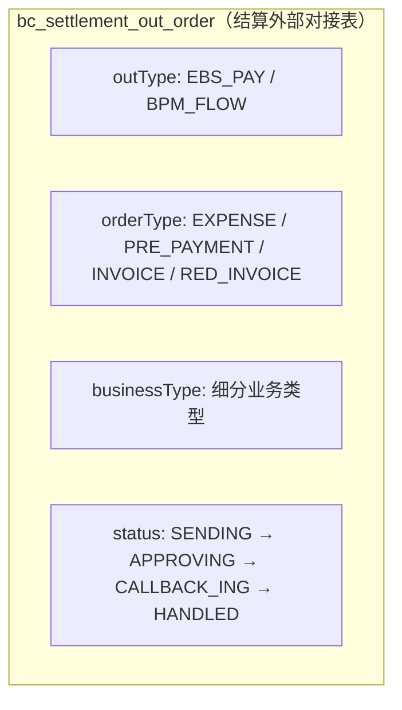
```mermaid
flowchart TD
    subgraph 对外对接表["bc_settlement_out_order（结算外部对接表）"]
        OUT["outType: EBS_PAY / BPM_FLOW"]
        ORDER["orderType: EXPENSE / PRE_PAYMENT / INVOICE / RED_INVOICE"]
        BIZ["businessType: 细分业务类型"]
        STATUS["status: SENDING → APPROVING → CALLBACK_ING → HANDLED"]
    end
```

**优势**：

- 集中管理所有外部对接记录
- 状态可追溯
- 支持重试和补偿

### 对接的外部系统

| 系统 | 方向 | 用途 |
|------|------|------|
| **EBS** | 双向 | 付款申请、支付回调、发票回调 |
| **BPM** | 双向 | 审批流、凭证审批、红字发票审批 |
| **发票平台** | 单向（出站） | 发票入账 OCR |

## 9.2 EBS 对接

### 同步方向：erp-sett → EBS

| 场景 | 触发时机 | 同步方法 |
|------|---------|---------|
| 费用单支付 | 支付审批通过后 | `syncExpenseOrderToEbs()` |
| 预付单支付 | 提交审批通过后 | `syncPrePaymentToEbs()` |
| 预付单核销 | 核销审批通过后 | `syncPrePaymentToEbs()`（无回调） |
| 发票单付款 | 发票审批通过后 | `syncInvoiceOrderToEbs()`（分三组） |
| 费用单退还 | 完结审批通过后 | `syncExpenseOrderToEbs()` |

### 同步方向：EBS → erp-sett（回调）

**入口**：`tsrm-pds.EbsSyncController.payResultSync()` → `ErpSettlementFacade.ebsCallback()` → `BC_SETTLEMENT_OUT_ORDER_EBS_CALLBACK_ACTION`

**回调处理**（`BcSettlementOutOrderCallbackService.handleEbsCallback()`）：

| orderType | 处理逻辑 |
|-----------|---------|
| EXPENSE | 调用 `BcExpenseOrderAppService.payCallback()` — 费用单状态变为已支付/已完结 |
| PRE_PAYMENT | 调用 `BcPrePaymentAppService.payCallback()` — 预付单状态变为已支付/已完结 |
| INVOICE | 等待三组（-01/-02/-03）全部完成后回调发票单 |

## 9.3 BPM 对接

### 同步方向：erp-sett → BPM

| 场景 | businessType | BPM 参数 |
|------|-------------|---------|
| 负数费用单关联凭证 | `EXPENSE_PAY` | fplx=收据 |
| 正数费用单追回 | `EXPENSE_RETURN` | fplx=收据 |
| 负数费用单红字发票 | `EXPENSE_RED` | fplx=红字信息表 |
| 预付单完结（有凭证附件） | `PRE_PAYMENT_COMPLETE` | fplx=收据 |
| 红字发票审批 | `RED_INVOICE` | fplx=红字信息表 |

### 同步方向：BPM → erp-sett（回调）

**入口**：`tsrm-pds.BpmSyncController.approveResultSync()` → `ErpSettlementFacade.bpmCallback()` → `BC_SETTLEMENT_OUT_ORDER_BPM_CALLBACK_ACTION`

**回调处理**（`BcSettlementOutOrderCallbackService.handleBpmBusinessLogic()`）：

| orderType + businessType | 通过 | 拒绝 |
|--------------------------|------|------|
| EXPENSE + EXPENSE_PAY | `approveUpdateVoucher()` | `rejectUpdateVoucher()` |
| EXPENSE + EXPENSE_RETURN | `approveRecall()` | `rejectRecall()` |
| EXPENSE + EXPENSE_RED | `redInvoiceExpenseOrderPass()` | `redInvoiceExpenseOrderFail()` |
| PRE_PAYMENT + COMPLETE | 预付单状态 = COMPLETE | 预付单状态回滚 |
| RED_INVOICE | 红字发票回调处理 | 红字发票回调处理 |

## 9.4 EBS 文件重试定时任务

**Job Key**：`BC_HANDLE_EBS_FILE_RETRY_JOB`

- 查询 `ebs_file_retry_log` 中失败且重试次数 < 5 的记录
- 重新下载 EBS 文件并关联到对应单据（预付单/费用单/发票单的 `ebsFile` 字段）
- 按单据类型（YFD=预付单 / FYD=费用单 / FPD=发票单）分组处理
- 更新重试日志状态

## 9.5 跨模块交互

### 入站依赖（其他模块 → erp-sett）

| 来源模块 | 接口方式 | 用途 |
|----------|---------|------|
| **tsrm-pds** | `@TService("ERP_FIN")` | BPM 同步费用单、BPM 审批回调、EBS 支付回调、EBS 发票回调 |
| **tsrm-price** | RocketMQ | 调价函生效/失效通知，触发结算项价格重新计算 |
| **terp-contract** | `@TService("ERP_FIN")` | 对账单签章回调、查询对账单详情 |
| **erp-dn** | 直接 Repo 调用 | QC 回调查询结算项、批量任务补偿创建结算项 |

**tsrm-pds 的 ErpSettlementFacade**：

```java
@TService("ERP_FIN")
public interface ErpSettlementFacade {
    @Action("BC_EXPENSE_ORDER_BMP_SYNC_CREATE_ACTION")
    BcExpenseOrderBmpSyncCreateResp saveExpense(BcExpenseOrderBmpSyncCreateReq req);

    @Action("BC_SETTLEMENT_OUT_ORDER_BPM_CALLBACK_ACTION")
    Boolean bpmCallback(BpmApproveResultDTO resultDTO);

    @Action("BC_SETTLEMENT_OUT_ORDER_EBS_CALLBACK_ACTION")
    Boolean ebsCallback(BcSettlementEbsCallbackReq req);

    @Action("BC_SETTLEMENT_OUT_ORDER_EBS_INVOICE_CALLBACK_ACTION")
    Boolean ebsInvoiceCallback(BcSettlementEbsCallbackReq req);
}
```

### 出站依赖（erp-sett → 其他模块）

| 目标模块 | 接口方式 | 用途 |
|----------|---------|------|
| **tsrm-price** | `@TService("CON")` | 批量查询价格协议 |
| **terp-contract** | `@TService("CON")` | 创建/作废电子签章任务 |
| **erp-gen** | `@TService("ERP_GEN")` | 查询汇率、组织架构、计量单位 |
| **tsrm-partner** | `@TService("TSRM")` | 查询供应商账户信息 |

## 9.6 外部对接表 API

统一路径前缀：`/api/admin/bc/settlement-out-order/action`

| 路径 | Action Key | 说明 |
|------|-----------|------|
| `/query-one` | `BC_SETTLEMENT_OUT_ORDER_GET_BY_ID_ACTION` | 根据 ID 查询 |
| `/query-by-business` | `BC_SETTLEMENT_OUT_ORDER_GET_BY_BUSINESS_ACTION` | 根据业务查询 |
| `/ebs-callback` | `BC_SETTLEMENT_OUT_ORDER_EBS_CALLBACK_ACTION` | EBS 支付回调 |
| `/ebs-invoice-callback-batch` | `BC_SETTLEMENT_OUT_ORDER_EBS_INVOICE_CALLBACK_BATCH_ACTION` | EBS 发票批量回调 |
| `/bpm-callback` | `BC_SETTLEMENT_OUT_ORDER_BPM_CALLBACK_ACTION` | BPM 审批回调 |
| `/push-ebs` | `BC_SETTLEMENT_OUT_ORDER_PUSH_EBS_ACTION` | 手动推送 EBS |
| `/invoice_entry` | `BC_SETTLEMENT_OUT_ORDER_INVOICE_ENTRY_ACTION` | 发票入账 |
| `/handleEbsFileRetry` | `BC_HANDLE_EBS_FILE_RETRY_ACTION` | EBS 文件重试 |

---

# 10. 价格调整机制

## 10.1 业务场景概述

价格调整机制确保结算项在生成后、对账前能反映最新的价格协议。结算模块与 `tsrm-price`（价格模块）协作，通过**同步调用**和**MQ 消息**两种方式触发价格调整。

### 核心概念

- **调价函**：`tsrm-price` 模块管理的价格协议文档，生效/失效时通过 MQ 通知结算模块
- **降级保护**：高优先级价格不会被低优先级覆盖
- **调价日志**：每次调价写入 `sett_price_adjust_log` 表，便于审计追溯

## 10.2 调价的两个入口

### 入口一：结算项创建时调价

**仅在入库结算项创建时调用**（出库和退货已注释）。

调用链：

```
BcSettlementItemAction.inboundCreate()
  → BcSettlementItemAppService.createBcSettlementItem()
  → BcSettlementPriceService.batchHandleAdjustPrice()
```

### 入口二：调价函 MQ 消息

```
tsrm-price 发送 MQ (topic: GID_T_SRM, tag: BC_ADJUST_VALID)
  → BcSettlementAdjustPriceListener.adjustPrice()
```

## 10.3 创建时调价：查询优先级

**查询优先级**（`BcSettlementPriceService.findPriceResult()`）：

| 优先级 | 查询 Key | 说明 |
|--------|---------|------|
| Level 3（最高） | `supplier/company/material/businessType/batchCode` | 批次号特定价格 |
| Level 2 | `supplier/company/material/businessType/tradeOrderId` | 订单特定价格 |
| Level 1 | `supplier/company/material/businessType` | 通用价格 |

**降级保护**：高优先级价格不会被低优先级覆盖。

**调价范围**：仅处理订单类型为**大货订单**或**超收补单**的结算项。

## 10.4 MQ 调价：消息类型

| 类型 | 行为 |
|------|------|
| `VALID`（生效） | 使用新价格更新结算项 |
| `INVALID`（失效） | 回退至订单原始价格 |

## 10.5 MQ 调价：生效类型与查询条件

| 生效类型 | 查询条件 |
|---------|---------|
| `RELATE_TRADE`（按指定订单） | 供应商 + 采购公司 + 币种 + 物料 + 订单ID |
| `RELATE_BATCH`（按批次号） | 供应商 + 采购公司 + 币种 + 物料 + 批次号 |
| `BY_TRADE_DATE`（按订单下单日期） | 先查符合条件的采购订单 → 再查结算项 |
| `BY_STOCK_DATE`（按入库日期） | 结算项入库日期在有效期内（仅入库方向） |
| `BY_SHIPPING_DATE`（按发货日期） | 结算项发货日期在有效期内 |

**优先级规则**：

- Level 1（订单/批次号）→ 覆盖所有已有调价
- Level 2（三种日期）→ 仅覆盖 Level 2 或无调价的结算项
- **仅处理大货订单/超收补单类型的结算项**

## 10.6 与价格模块的交互

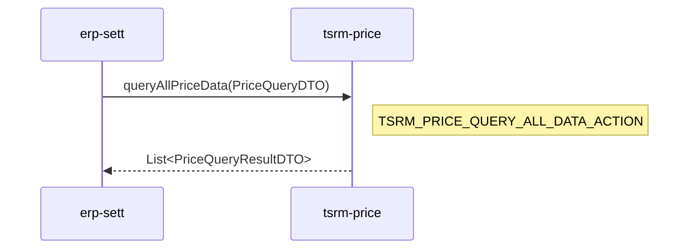
```mermaid
sequenceDiagram
    participant sett as erp-sett
    participant price as tsrm-price

    sett->>price: queryAllPriceData(PriceQueryDTO)
    Note right of price: TSRM_PRICE_QUERY_ALL_DATA_ACTION
    price-->>sett: List<PriceQueryResultDTO>
```

调用方：`BcSettlementPriceServiceClient`（`@TService("CON")`）

## 10.7 结算项价格字段

| 字段 | 说明 |
|------|------|
| `tradeOrderInTaxPrc` | 下单时含税单价（原始价格） |
| `tradeOrderExTaxPrc` | 下单时未税单价（原始价格） |
| `adjustInTaxPrc` | 调价后含税单价 |
| `adjustExTaxPrc` | 调价后未税单价 |
| `statementInTaxPrc` | 对账时含税单价快照 |
| `statementExTaxPrc` | 对账时未税单价快照 |

> 对账含税单价 = max(调价含税单价, 订单含税单价)

## 10.8 相关 MQ 消息

| Topic | Tag | 消费方 | 触发时机 |
|-------|-----|--------|---------|
| `GID_T_SRM` | `BC_ADJUST_VALID` | `BcSettlementAdjustPriceListener` | 调价函生效/失效 |

---

# 11. 模型总览

## 11.1 核心数据表

| 表名 | 说明 | 核心状态字段 |
|------|------|-------------|
| `bc_settlement_item` | 结算项 | `settStatus`, `statementStatus`, `invoiceStatus`, `payStatus`, `redInvoiceStatus` |
| `bc_expense_order` | 费用单 | `status`, `amtType`, `payType`, `expenseType` |
| `bc_pre_payment` | 预付单 | `status`, `prePaymentType` |
| `bc_statement_order` | 对账单 | `statementStatus`, `signingStatus`, `createSource` |
| `bc_invoice_order` | 发票单 | `invoiceOrdeStatus`, `entryStatus` |
| `bc_invoice_record` | 发票开票记录 | OCR 识别结果 |
| `bc_invoice_order_pay` | 发票付款记录 | 付款计划 |
| `bc_red_invoice_order` | 红字发票单 | - |
| `bc_settlement_out_order` | 结算外部对接表 | `status`, `outType`, `orderType`, `businessType` |
| `bc_settlement_material_line` | 结算物料明细 | 预付单关联的物料行 |
| `bc_settlement_approve_pass_record` | 结算审批通过记录 | - |
| `sett_price_adjust_log` | 价格调整日志 | 审计追踪 |
| `ebs_file_retry_log` | EBS 文件下载重试日志 | 重试次数/成功标记 |

## 11.2 关联中间表

| 表名 | 连接关系 | 状态流转 |
|------|---------|---------|
| `bc_relate_expense` | 费用单 ↔ 对账单/预付单/发票单 | DRAFT → OCCUPY → USED / DELETE |
| `bc_relate_pre_payment` | 预付单 ↔ 对账单/发票单 | DRAFT → OCCUPY → USED / DELETE |
| `bc_relate_settlement_item` | 结算项 ↔ 对账单/发票单/红字发票单 | DRAFT → USED / DELETE |
| `bc_relate_statement_order` | 对账单 ↔ 发票单 | 仅关联，无状态 |

## 11.3 表间 ER 关系

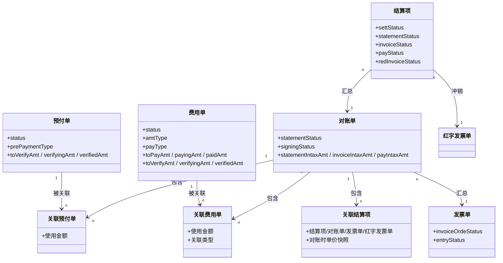
```mermaid
classDiagram
    class 结算项 {
        +settStatus
        +statementStatus
        +invoiceStatus
        +payStatus
        +redInvoiceStatus
    }
    class 费用单 {
        +status
        +amtType
        +payType
        +toPayAmt / payingAmt / paidAmt
        +toVerifyAmt / verifyingAmt / verifiedAmt
    }
    class 预付单 {
        +status
        +prePaymentType
        +toVerifyAmt / verifyingAmt / verifiedAmt
    }
    class 对账单 {
        +statementStatus
        +signingStatus
        +statementIntaxAmt / invoiceIntaxAmt / payIntaxAmt
    }
    class 发票单 {
        +invoiceOrdeStatus
        +entryStatus
    }
    class 红字发票单 {
    }
    class 关联结算项 {
        +结算项/对账单/发票单/红字发票单
        +对账时单价快照
    }
    class 关联费用单 {
        +使用金额
        +关联类型
    }
    class 关联预付单 {
        +使用金额
    }

    结算项 "n" --> "1" 对账单 : 汇总
    对账单 "n" --> "1" 发票单 : 汇总
    结算项 "n" --> "1" 红字发票单 : 冲销
    费用单 "1" --> "n" 关联费用单 : 被关联
    预付单 "1" --> "n" 关联预付单 : 被关联
    对账单 "1" --> "n" 关联结算项 : 包含
    对账单 "1" --> "n" 关联费用单 : 包含
    对账单 "1" --> "n" 关联预付单 : 包含
```

## 11.4 主流程状态变迁

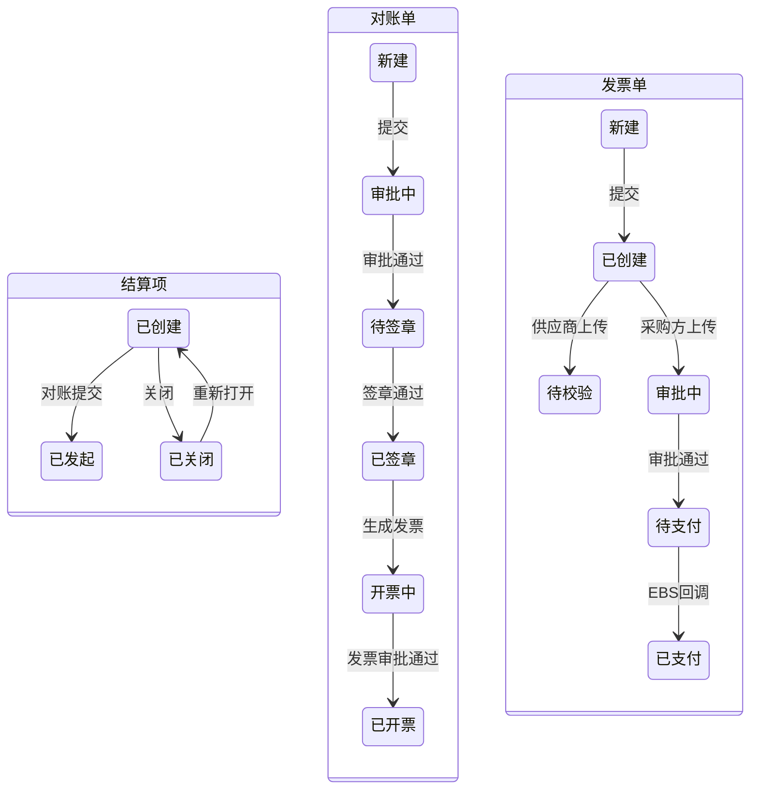
```mermaid
stateDiagram-v2
    state "结算项" as SI {
        CREATE_SI: 已创建
        COMMIT_SI: 已发起
        CLOSED_SI: 已关闭
        CREATE_SI --> COMMIT_SI: 对账提交
        CREATE_SI --> CLOSED_SI: 关闭
        CLOSED_SI --> CREATE_SI: 重新打开
    }

    state "对账单" as STMT {
        DRAFT_ST: 新建
        APPROVING_ST: 审批中
        TO_SIGN_ST: 待签章
        SIGNED_ST: 已签章
        INVOICING_ST: 开票中
        INVOICED_ST: 已开票
        DRAFT_ST --> APPROVING_ST: 提交
        APPROVING_ST --> TO_SIGN_ST: 审批通过
        TO_SIGN_ST --> SIGNED_ST: 签章通过
        SIGNED_ST --> INVOICING_ST: 生成发票
        INVOICING_ST --> INVOICED_ST: 发票审批通过
    }

    state "发票单" as INV {
        DRAFT_INV: 新建
        CREATED_INV: 已创建
        TO_VERIFY_INV: 待校验
        APPROVING_INV: 审批中
        TO_PAY_INV: 待支付
        PAID_INV: 已支付
        DRAFT_INV --> CREATED_INV: 提交
        CREATED_INV --> TO_VERIFY_INV: 供应商上传
        CREATED_INV --> APPROVING_INV: 采购方上传
        APPROVING_INV --> TO_PAY_INV: 审批通过
        TO_PAY_INV --> PAID_INV: EBS回调
    }
```

---

# 12. 代码结构

## 12.1 六层 DDD 子模块

```
erp-sett/
├── erp-sett-spi/            # 接口定义层：DTO、PO、VO、枚举、Req/Resp
├── erp-sett-domain/         # 领域层：SettDocDomainService、BcSettleExportService
├── erp-sett-infrastructure/ # 基础设施层：Repo（62个）、Gateway（5个外部客户端）
├── erp-sett-app/            # 应用层：AppService（38个）、MQ监听器、定时任务
├── erp-sett-adapter/        # 适配器层：@Action REST 端点（19个Action类）
└── erp-sett-starter/        # 启动层：SettApplication
```

## 12.2 核心类统计

| 类别 | 数量 | 说明 |
|------|------|------|
| Action 类（adapter） | 19 | REST 端点，@Action 注解 |
| 应用服务（app） | 38 | 业务编排、事务边界 |
| 领域服务（domain） | 6 | 核心业务逻辑 |
| 仓库（infrastructure） | 62 | MyBatis-Plus 数据访问 |
| Gateway 客户端 | 5 | 外部 RPC 调用 |
| 数据库表 | 33+ | PO 类映射 |

## 12.3 BC 业务 Action 清单

| Action 类 | 路径前缀 | 职责 |
|-----------|---------|------|
| `BcSettlementItemAction` | `/api/admin/bc/settlement-item/action` | 结算项 CRUD、创建、关闭/打开 |
| `BcExpenseOrderAction` | `/api/admin/bc/expense-order/action` | 费用单全生命周期 |
| `BcPrePaymentAction` | `/api/admin/bc/pre-payment/action` | 预付单全生命周期 |
| `BcStatementOrderAction` | `/api/admin/bc/statement-order/action` | 对账单全生命周期 |
| `BcInvoiceOrderAction` | `/api/admin/bc/invoice-order/action` | 发票单全生命周期 |
| `BcRedInvoiceOrderAction` | `/api/admin/bc/red-invoice-order/action` | 红字发票单创建/回调 |
| `BcSettlementOutOrderAction` | `/api/admin/bc/settlement-out-order/action` | EBS/BPM 外部对接 |

## 12.4 跨模块依赖全景

```mermaid
flowchart TD
    subgraph 结算["erp-sett"]
        SETT["结算核心逻辑"]
    end

    subgraph 外部["外部模块"]
        PDS["tsrm-pds<br/>@TService(ERP_FIN)<br/>BPM同步/EBS回调"]
        PRICE["tsrm-price<br/>RocketMQ<br/>调价函通知"]
        CONTRACT["terp-contract<br/>@TService(CON)<br/>电子签章"]
        DN["erp-dn<br/>Repo调用<br/>QC回调"]
        GEN["erp-gen<br/>@TService(ERP_GEN)<br/>主数据/汇率"]
        PARTNER["tsrm-partner<br/>@TService(TSRM)<br/>供应商账户"]
    end

    SETT --> PRICE
    SETT --> CONTRACT
    SETT --> GEN
    SETT --> PARTNER
    PDS --> SETT
    DN --> SETT
```

---

# 13. 附录：全部 API / 定时任务 / MQ

## 13.1 全部 API 汇总

### 结算项 — `/api/admin/bc/settlement-item/action`

| 路径 | Action Key | 说明 |
|------|-----------|------|
| `/save` | `BC_SETTLEMENT_ITEM_SAVE_ACTION` | 保存结算项 |
| `/inbound-create` | `BC_SETTLEMENT_ITEM_INBOUND_CREATE_ACTION` | 送货单入库创建 |
| `/outbound-create` | `BC_SETTLEMENT_ITEM_OUTBOUND_CREATE_ACTION` | 逆向送货单出库创建 |
| `/return-create` | `BC_SETTLEMENT_ITEM_RETURN_CREATE_ACTION` | 退货订单直接生成 |
| `/close` | `BC_SETTLEMENT_ITEM_CLOSE_ACTION` | 关闭结算项 |
| `/open` | `BC_SETTLEMENT_ITEM_OPEN_ACTION` | 重新打开结算项 |
| `/importUpdateSettlementItem` | `IMPORT_UPDATE_BC_SETTLEMENT_ITEM_ACTION` | 运维导入修改金额 |

### 费用单 — `/api/admin/bc/expense-order/action`

| 路径 | Action Key | 说明 |
|------|-----------|------|
| `/save` | `BC_EXPENSE_ORDER_SAVE_ACTION` | 保存费用单 |
| `/query-one` | `BC_EXPENSE_ORDER_GET_BY_ID_ACTION` | 根据ID查询 |
| `/validate-page-params` | `BC_EXPENSE_ORDER_VALIDATE_PAGE_PARAMS_ACTION` | 校验分页查询参数 |
| `/bmp-sync-create` | `BC_EXPENSE_ORDER_BMP_SYNC_CREATE_ACTION` | BPM同步创建 |
| `/update-payment` | `BC_EXPENSE_ORDER_UPDATE_PAYMENT_ACTION` | 发起支付 |
| `/pay-approve-pass` | `BC_EXPENSE_ORDER_PAY_APPROVE_PASS_ACTION` | 支付审批通过 |
| `/pay-approve-reject` | `BC_EXPENSE_ORDER_PAY_APPROVE_REJECT_ACTION` | 支付审批拒绝 |
| `/pay-approve-withdraw` | `BC_EXPENSE_ORDER_PAY_APPROVE_WITHDRAW_ACTION` | 支付审批撤回 |
| `/update-voucher` | `BC_EXPENSE_ORDER_UPDATE_VOUCHER_ACTION` | 关联凭证 |
| `/redInvoiceExpenseOrder` | `BC_RED_INVOICE_EXPENSE_ORDER_ACTION` | 提交红字发票单 |
| `/return` | `BC_EXPENSE_ORDER_RETURN_ACTION` | 退还 |
| `/recall` | `BC_EXPENSE_ORDER_RECALL_ACTION` | 追回 |
| `/close` | `BC_EXPENSE_ORDER_CLOSE_ACTION` | 完结 |
| `/close-approve-pass` | `BC_EXPENSE_ORDER_CLOSE_APPROVE_PASS_ACTION` | 完结审批通过 |
| `/close-approve-reject` | `BC_EXPENSE_ORDER_CLOSE_APPROVE_REJECT_ACTION` | 完结审批拒绝 |
| `/close-approve-withdraw` | `BC_EXPENSE_ORDER_CLOSE_APPROVE_WITHDRAW_ACTION` | 完结审批撤回 |
| `/cancel` | `BC_EXPENSE_ORDER_CANCEL_ACTION` | 作废 |
| `/pay-callback` | `BC_EXPENSE_ORDER_PAY_CALLBACK_ACTION` | 外部支付回调 |
| `/submitHandleRefund` | `BC_EXPENSE_ORDER_SUBMIT_HANDLE_REFUND_ACTION` | 提交处理退供信息 |
| `/expenseUploadInvoiceInInvoice` | `EXPENSE_UPLOAD_INVOICE_IN_INVOICE_ACTION` | 上传发票 |

### 预付单 — `/api/admin/bc/pre-payment/action`

| 路径 | Action Key | 说明 |
|------|-----------|------|
| `/save` | `BC_PRE_PAYMENT_SAVE_ACTION` | 保存预付单 |
| `/query-one` | `BC_PRE_PAYMENT_GET_BY_ID_ACTION` | 根据ID查询 |
| `/submit` | `BC_PRE_PAYMENT_SUBMIT_ACTION` | 提交 |
| `/approve-submit-complete` | `BC_PRE_PAYMENT_APPROVE_SUBMIT_COMPLETE_ACTION` | 提交审批通过 |
| `/reject-submit-complete` | `BC_PRE_PAYMENT_REJECT_SUBMIT_COMPLETE_ACTION` | 提交审批拒绝 |
| `/submit-approve-withdraw` | `BC_PRE_PAYMENT_SUBMIT_APPROVE_WITHDRAW_ACTION` | 提交审批撤回 |
| `/complete` | `BC_PRE_PAYMENT_COMPLETE_ACTION` | 完结 |
| `/approve-close-complete` | `BC_PRE_PAYMENT_APPROVE_CLOSE_COMPLETE_ACTION` | 完结审批通过 |
| `/reject-close-complete` | `BC_PRE_PAYMENT_REJECT_CLOSE_COMPLETE_ACTION` | 完结审批拒绝 |
| `/close-approve-withdraw` | `BC_PRE_PAYMENT_CLOSE_APPROVE_WITHDRAW_ACTION` | 完结审批撤回 |
| `/verify` | `BC_PRE_PAYMENT_VERIFY_ACTION` | 核销费用单 |
| `/approve-verify-complete` | `BC_PRE_PAYMENT_APPROVE_VERIFY_COMPLETE_ACTION` | 核销审批通过 |
| `/reject-verify-complete` | `BC_PRE_PAYMENT_REJECT_VERIFY_COMPLETE_ACTION` | 核销审批拒绝 |
| `/verify-approve-withdraw` | `BC_PRE_PAYMENT_VERIFY_APPROVE_WITHDRAW_ACTION` | 核销审批撤回 |
| `/cancel` | `BC_PRE_PAYMENT_CANCEL_ACTION` | 作废 |
| `/pay-callback` | `BC_PRE_PAYMENT_PAY_CALLBACK_ACTION` | 外部支付回调 |

### 对账单 — `/api/admin/bc/statement-order/action`

| 路径 | Action Key | 说明 |
|------|-----------|------|
| `/batch-reconciliation-validate` | `BC_STATEMENT_ORDER_BATCH_RECONCILIATION_VALIDATE_ACTION` | 批量对账校验 |
| `/preview` | `BC_STATEMENT_ORDER_PREVIEW_ACTION` | 批量结算项对账预览 |
| `/save` | `BC_STATEMENT_ORDER_SAVE_ACTION` | 保存 |
| `/submit` | `BC_STATEMENT_ORDER_SUBMIT_ACTION` | 提交 |
| `/cancel` | `BC_STATEMENT_ORDER_CANCEL_ACTION` | 作废 |
| `/approve-pass` | `BC_STATEMENT_ORDER_APPROVE_PASS_ACTION` | 审批通过 |
| `/approve-reject` | `BC_STATEMENT_ORDER_APPROVE_REJECT_ACTION` | 审批拒绝 |
| `/approve-withdraw` | `BC_STATEMENT_ORDER_APPROVE_WITHDRAW_ACTION` | 审批撤回 |
| `/initiateSigning` | `BC_STATEMENT_ORDER_INITIATE_SIGNING_ACTION` | 手动发起签署 |
| `/sign-callback` | `BC_STATEMENT_ORDER_SIGN_CALLBACK_ACTION` | 签署任务回调 |
| `/queryBcStatementDetailById` | `QUERY_BC_STATEMENT_DETAIL_BY_ID_ACTION` | 查询详情（签署回调用） |
| `/confirm-pass` | `BC_STATEMENT_ORDER_CONFIRM_PASS_ACTION` | 确认时通过（供应商发起） |
| `/confirm-reject` | `BC_STATEMENT_ORDER_SUPPLIER_EDIT_AFTER_REJECT_ACTION` | 确认时拒绝 |
| `/confirm-edit` | `BC_STATEMENT_ORDER_PURCHASER_EDIT_AFTER_CONFIRM_ACTION` | 确认时撤回修改 |
| `/withdraw` | `BC_STATEMENT_ORDER_WITHDRAW_ACTION` | 撤回 |
| `/updateSignedAttachment` | `BC_STATEMENT_UPDATE_SIGNED_ATTACHMENT_ACTION` | 更新签署文件 |

### 发票单 — `/api/admin/bc/invoice-order/action`

| 路径 | Action Key | 说明 |
|------|-----------|------|
| `/batch-validate` | `BC_INVOICE_ORDER_BATCH_VALIDATE_ACTION` | 批量对账单校验 |
| `/single-validate` | `BC_INVOICE_ORDER_SINGLE_VALIDATE_ACTION` | 单个对账单校验 |
| `/batch-preview` | `BC_INVOICE_ORDER_BATCH_PREVIEW_ACTION` | 批量对账单预览 |
| `/single-preview` | `BC_INVOICE_ORDER_SINGLE_PREVIEW_ACTION` | 单个对账单预览 |
| `/save` | `BC_INVOICE_ORDER_SAVE_ACTION` | 保存 |
| `/submit` | `BC_INVOICE_ORDER_SUBMIT_ACTION` | 提交 |
| `/cancel` | `BC_INVOICE_ORDER_CANCEL_ACTION` | 作废 |
| `/approve-pass` | `BC_INVOICE_ORDER_APPROVE_PASS_ACTION` | 审批通过（分布式锁保护） |
| `/approve-node-pass` | `BC_INVOICE_ORDER_APPROVE_NODE_PASS_ACTION` | 节点审批通过 |
| `/approve-reject` | `BC_INVOICE_ORDER_APPROVE_REJECT_ACTION` | 审批拒绝 |
| `/approve-withdraw` | `BC_INVOICE_ORDER_APPROVE_WITHDRAW_ACTION` | 审批撤回 |
| `/withdraw` | `BC_INVOICE_ORDER_WITHDRAW_ACTION` | 撤回 |
| `/upload-invoice` | `BC_INVOICE_ORDER_UPLOAD_INVOICE_ACTION` | 采购方上传发票 |
| `/upload-invoice-edit` | `BC_INVOICE_ORDER_UPLOAD_INVOICE_EDIT_ACTION` | 采购方编辑发票 |
| `/supplier-upload-invoice` | `BC_INVOICE_ORDER_SUPPLIER_UPLOAD_INVOICE_ACTION` | 供应商上传发票 |
| `/adjust-difference` | `BC_INVOICE_ORDER_ADJUST_DIFFERENCE_ACTION` | 调差 |
| `/batch-upload-bill` | `BC_INVOICE_ORDER_BATCH_UPLOAD_BILL_ACTION` | 批量上传发票（OCR） |
| `/pay-callback` | `BC_INVOICE_ORDER_PAY_CALLBACK_ACTION` | EBS 支付回调 |
| `/export-invoice` | `BC_EXPORT_INVOICE_ORDER_ACTION` | 导出详情 |

### 红字发票单 — `/api/admin/bc/red-invoice-order/action`

| 路径 | Action Key | 说明 |
|------|-----------|------|
| `/create` | `BC_RED_INVOICE_ORDER_CREATE_ACTION` | 创建红字发票单 |
| `/callback` | `BC_RED_INVOICE_ORDER_CALLBACK_ACTION` | 税务平台回调 |
| `/get-by-union-id` | `BC_RED_INVOICE_ORDER_GET_BY_UNION_ID_ACTION` | 根据连接ID查询 |

### 外部对接 — `/api/admin/bc/settlement-out-order/action`

| 路径 | Action Key | 说明 |
|------|-----------|------|
| `/query-one` | `BC_SETTLEMENT_OUT_ORDER_GET_BY_ID_ACTION` | 根据 ID 查询 |
| `/query-by-business` | `BC_SETTLEMENT_OUT_ORDER_GET_BY_BUSINESS_ACTION` | 根据业务查询 |
| `/ebs-callback` | `BC_SETTLEMENT_OUT_ORDER_EBS_CALLBACK_ACTION` | EBS 支付回调 |
| `/ebs-invoice-callback-batch` | `BC_SETTLEMENT_OUT_ORDER_EBS_INVOICE_CALLBACK_BATCH_ACTION` | EBS 发票批量回调 |
| `/bpm-callback` | `BC_SETTLEMENT_OUT_ORDER_BPM_CALLBACK_ACTION` | BPM 审批回调 |
| `/push-ebs` | `BC_SETTLEMENT_OUT_ORDER_PUSH_EBS_ACTION` | 手动推送 EBS |
| `/invoice_entry` | `BC_SETTLEMENT_OUT_ORDER_INVOICE_ENTRY_ACTION` | 发票入账 |
| `/handleEbsFileRetry` | `BC_HANDLE_EBS_FILE_RETRY_ACTION` | EBS 文件重试 |

## 13.2 定时任务

| Job Key | 路径 | 说明 |
|---------|------|------|
| `BC_HANDLE_EBS_FILE_RETRY_JOB` | `/handleEbsFileRetry` | 处理 EBS 文件下载重试（最多5次） |

## 13.3 MQ 消息

| Topic | Tag | 消费方 | 功能 |
|-------|-----|--------|------|
| `GID_T_SRM` | `BC_ADJUST_VALID` | `BcSettlementAdjustPriceListener` | 调价函生效/失效通知 |

---

> 本文档由 Claude Code doc-generator 生成于 2026-06-15
> 基于：erp-sett 模块完整代码分析 + doc/结算.md + doc/erp-sett-业务流程分析.md + doc/erp-sett-详细文档.md
