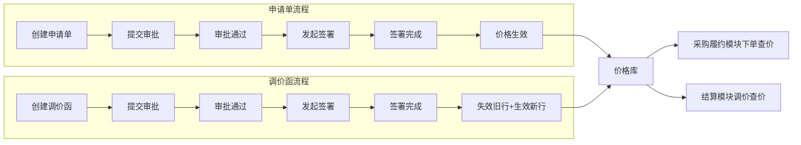
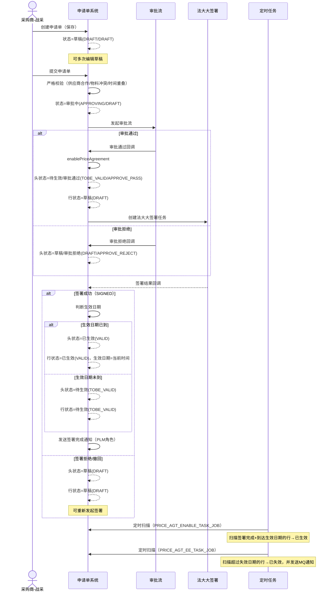
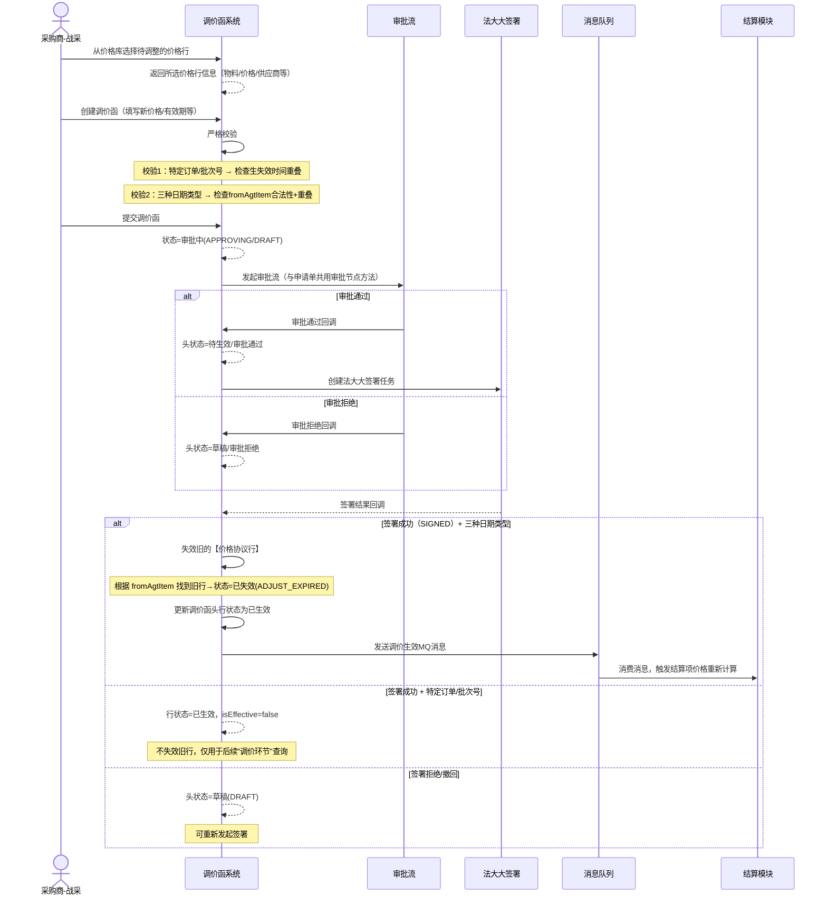
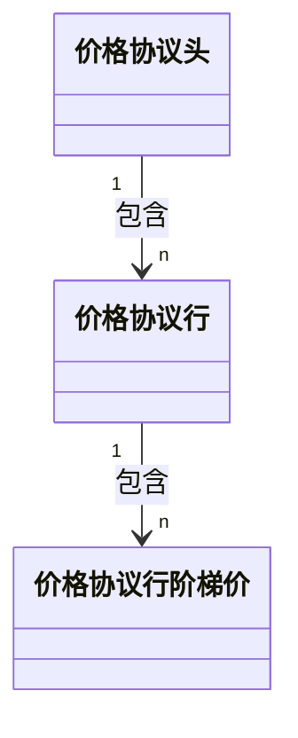
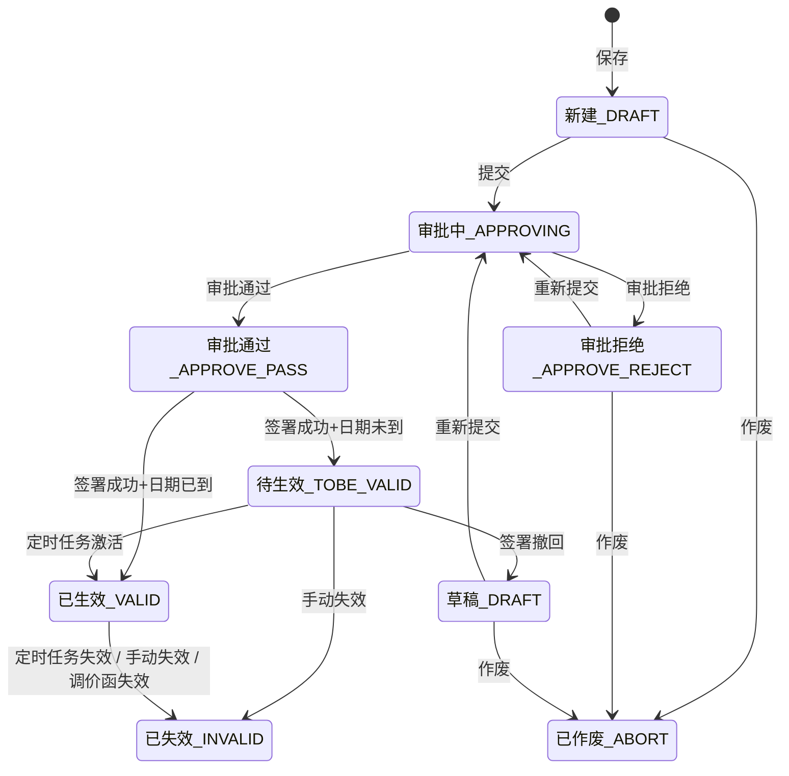
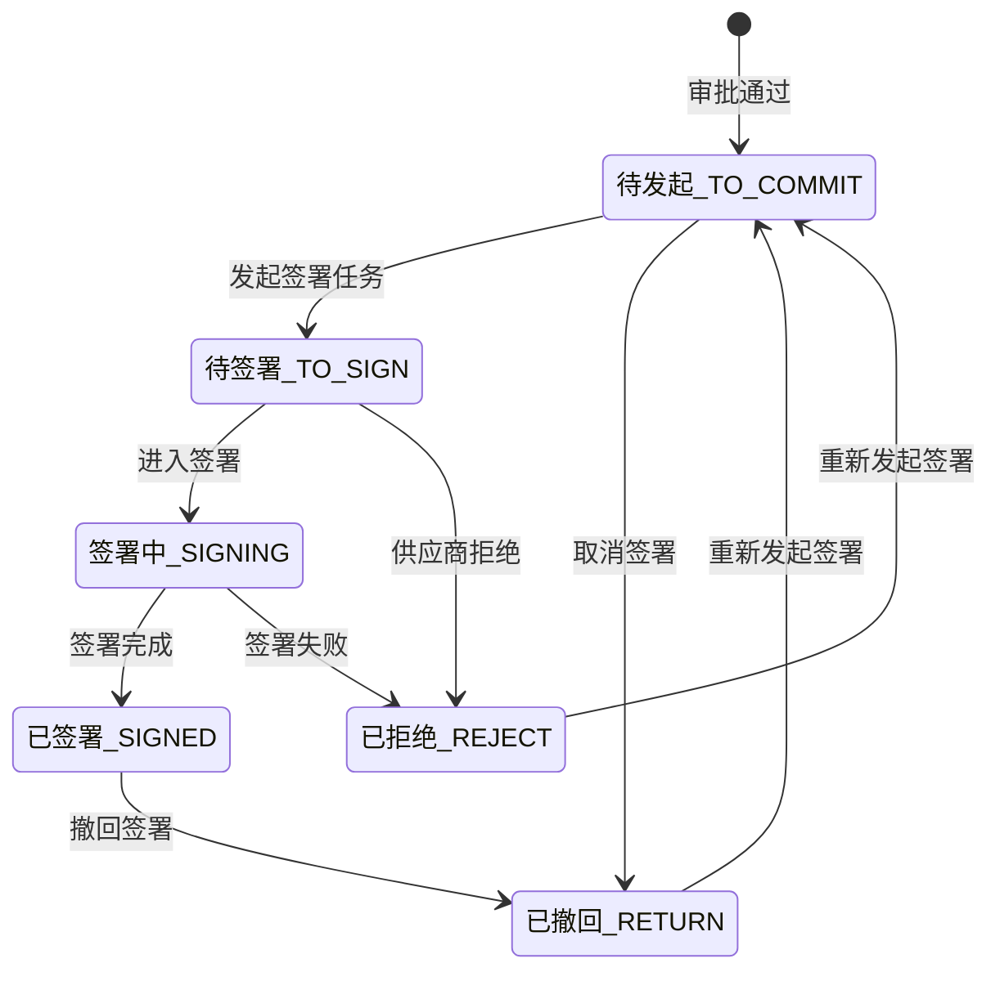

# 1. 业务场景概述

## 1.1 模块定位

* 价格协议模块（tsrm-price）是 TSRM（供应商关系管理）系统中的核心模块之一，负责管理 **采购商（BC/白贝壳）与供应商之间交易物料的价格**
* 该模块为下游的采购履约（订单下单）和结算（对账/开票）提供价格基准

## 1.2 核心概念

* 价格申请单 or 价格调价函

  > * 价格申请单：采购商和供应商关于物料`首次`创建的价格
  > * 价格调价函：针对【价格申请单】的价格进行`调整`
  > * 价格协议：采购商和供应商关于物料的价格，包含【价格申请单】和【价格调价函】

## 1.3 参与角色

* 价格协议模块均由采购商（BC/白贝壳）负责，主要涉及采购履约和结算
* 采购商-战采（战略采购）：管理价格协议
* 采购商-采购：负责在采购履约模块中使用价格协议（查询价格）
* 采购商-结算：负责在结算模块中使用价格协议（调价）

## 1.4 补充

* 价格协议：供应商向采购商售卖某种物料的价格，可增加限定（如 场景、采购组 等）

  > * 根据不同场景可划分不同价格：采购、返修、折价回收
  > * 采购商（买方）的角色可细化：比如 其下指定采购公司/采购组织/采购组
  > * 采购对象可不是物料：如 路桥采购对象是基于物料创建的商品

# 2. 业务场景与流程

## 2.1 整体业务流程



## 2.2 价格申请单流程



## 2.3 价格调价函流程



## 2.4 调价函-生效类型

**关键区别**：特定订单/批次号类型生成的价格协议 `isEffective=false`，不会被正常价格查询（订单下单时）匹配到，也不会被新价格协议失效。它们专门用于"调价环节"——即送货单入库生成结算项时，查询是否有针对该订单/批次的特殊调价。

| 生效类型 | 枚举值 | 是否失效旧行 | isEffective | 使用场景 |
|---------|--------|-------------|-------------|---------|
| 按特定订单 | `RELATE_TRADE` | 否 | false | 仅对该订单的结算项调价 |
| 按特定批次号 | `RELATE_BATCH` | 否 | false | 仅对该批次的结算项调价 |
| 按订单下单日期 | `BY_TRADE_DATE` | 是 | true | 下单日期在有效期内的结算项均调价 |
| 按入库日期 | `BY_STOCK_DATE` | 是 | true | 入库日期在有效期内的结算项均调价 |
| 按发货日期 | `BY_SHIPPING_DATE` | 是 | true | 发货日期在有效期内的结算项均调价 |

## 2.5 采购履约查价

### 2.5.1 订单下单查价

```
查询条件：供应商ID + 采购公司ID + 物料ID + 业务类型
         + 当前时间 ∈ [生效日期, 失效日期]
         + 状态 = 已生效(VALID)
         + isEffective = true （排除特定订单/批次号类型）

结果校验：必须且仅有 1 条（多条或0条均报错）
一品多供：排除当前供应商后，查询是否存在其他供应商价格更低
```

### 2.5.2 结算项调价查价

此环节仅在 **调价函** 中查询，按优先级从上到下选择：

| 优先级 | 查询类型 | 索引Key | 条件 |
|--------|---------|---------|------|
| 最高 | 按特定批次号 | `batchQueryKey` | 已生效 + 当前时间在有效期内 |
| 高 | 按特定订单 | `orderQueryKey` | 已生效 + 当前时间在有效期内 |
| 低 | 三种日期（原逻辑） | `queryKey` | 已生效 + 当前时间在有效期内 + 生效类型=三种日期 |
| 低 | 三种日期（新逻辑） | `queryKey` | 已生效 + 下单/入库/发货日期在有效期内 + 携带结算项ID |

## 2.6 结算模块消费调价MQ

```
调价函签署生效 → 发送MQ消息（BC_ADJUST_VALID）
                    ↓
结算模块监听（BcSettlementAdjustPriceListener）
                    ↓
查询需要调价的结算项（按生效类型分组查询）
                    ↓
过滤结算项（仅处理大货订单/超收补单类型）
                    ↓
执行调价：生效调价使用新价格 / 失效调价回退至下单时价格
```

# 3. 模型设计

## 3.1 数据表关系



## 3.2 核心数据表

* 价格申请单和价格调价函使用同一套数据表，使用单据类型字段作区分

| 表名 | 说明 |
|------|------|
| `con_pri_aggrement_head_tr` | 价格协议头：记录单据维度的基础信息、状态、签署信息 |
| `con_pri_agreement_item_tr` | 价格协议行：记录物料维度的价格信息 |
| `con_pri_agt_tired_link_tr` | 阶梯价格明细：记录数量区间对应的价格 |

## 3.3 特殊字段

### 3.3.1 快速查询索引

价格协议行设计了三个查询索引字段，用于支撑不同场景的高效查询：冗余字段的设计避免了复杂的多条件组合查询，将核心维度拼接为字符串后直接进行等值匹配，提升了查询性能

| 索引字段 | 格式 | 适用单据 | 使用场景 |
|------|---------|---------|---------|
| `queryKey` | `/供应商ID/采购公司ID/物料ID/业务类型` | 所有 | 价格库通用查询、三种日期调价查询 |
| `orderQueryKey` | `/供应商ID/采购公司ID/物料ID/业务类型/订单ID` | 调价函 | 按特定订单调价查询 |
| `batchQueryKey` | `/供应商ID/采购公司ID/物料ID/业务类型/批次号` | 调价函 | 按特定批次号调价查询 |

### 3.3.2 枚举值

* 价格协议头

  > ```
  > 单据类型：申请单、调价函
  > 价格来源：手工创建、询报价
  > 单据状态：新建、已作废、审批中、审批通过、审批拒绝、已失效
  > 签署方式：线上、线下
  > 签署状态：待发起、待签署、签署中、已签署、已拒绝、已撤回
  > 生效类型：按特定订单、按特定批次号、按订单下单日期、按入库日期、按发货日期
  > 协议状态：已生效、已失效、待生效、草稿
  > ```

* 价格协议行

  > ```
  > 单据类型：申请单、调价函
  > 价格类型：一口价、阶梯价
  > 状态：已生效、已失效、待生效、草稿、已作废
  > 失效原因：协议到期、手动失效、调价函失效
  > 业务类型：采购、返修、折价回收
  > 生效类型：按特定订单、按特定批次号、按订单下单日期、按入库日期、按发货日期
  > ```

### 3.3.2 日期

* 价格协议头

  > ```
  > 生效日期：用户手填
  > 失效日期：用户手填
  > 签署生效日期：生效日期（签署回调时立即生效则取当时时间，否则通过定时任务生效时取当时时间）

* 价格协议行

  > ```
  > 有效期开始：头的生效日期（转为当天0点）
  > 有效期结束：头的失效日期（转为当天0点）
  > 生效日期：生效日期（签署回调时立即生效则取当时时间，否则通过定时任务生效时取当时时间）
  > 失效日期：调价失效时间、手动失效时间
  > ```

### 3.3.3 isEffective

* 特殊标识：特定订单/批次号类型的调价函生成的价格协议行 `isEffective=false`，针对特定订单/批次号的**临时调价**

* isEffective=true

  > * 订单下单的价格查询接口的查询条件
  > * 系统只展示 `isEffective=true` 的价格协议给用户
  > * ……（大部分场景都会限制）

* isEffective=false

  > * 仅用于调价操作
  > * 不会被新的价格协议自动失效
  > * 手动失效后不再参与调价

### 3.3.4 其他

* 组织维度（头行均存）：采购组、采购组织、采购公司、供应商
* 复制于协议行id：指向旧的价格协议行

# 4. 状态流转

## 4.1 价格协议头状态机



## 4.2 签署状态机



# 5. 功能实现详解

## 5.1 模块代码结构

```
tsrm-price/
├── tsrm-price-spi/              # 对外接口与模型定义
│   └── src/main/java/.../spi/
│       ├── service/              # PriceAgreementService、PriceAgreementAdjustService 等接口
│       ├── model/agreement/      # DTO + PO 模型
│       ├── convert/agreement/    # MapStruct 转换器（8个）
│       └── dict/agreement/       # 枚举/字典（16个）
├── tsrm-price-domain/           # 核心业务逻辑
│   └── src/main/java/.../domain/service/agreement/
│       ├── PriceAgreementServiceImpl.java     # 申请单服务（~3484行）
│       ├── PriceAgreementAdjustServiceImpl.java # 调价函服务（~1792行）
│       ├── AdjustPriceImportServiceImpl.java  # 导入服务（~1481行）
│       ├── BcPriceCommonService.java          # 通知服务
│       └── TieredPriceMatcher.java            # 阶梯价匹配工具
├── tsrm-price-infrastructure/   # 数据访问与外部集成
│   └── src/main/java/.../infrastructure/repo/agreement/
│       ├── PriceAgreementRepo.java            # MyBatis-Plus Mapper + 自定义XML查询
│       ├── PriceAgreementItemRepo.java
│       ├── PriceAgreementTiredRepo.java
│       ├── PriceAgreementCompanyRepo.java
│       └── gateway/ContractGatewayImpl.java   # 法大大签署服务调用
├── tsrm-price-app/              # 应用层
│   └── src/main/java/.../app/
│       ├── mq/SourcingRelPriceMsgConsumer.java   # 询报价失效消息消费
│       └── scheduler/PriceAgreementJob.java      # 定时任务
├── tsrm-price-adapter/          # 适配器层
│   └── src/main/java/.../adapter/agreement/
│       └── PriceAgreementAction.java             # ~30个Trantor Action/REST端点
└── tsrm-price-starter/          # 启动模块
```

## 5.2 核心功能

### 5.2.1 注意

* 价格申请单和价格调价函都是同一套模型，相关功能也是同一套代码（内部逻辑作区分）

### 5.2.2 保存&提交

#### 保存

* 对应Action: `TSRM_PRICE_AGT_CRTUPD_ONE_ACTION`

* 代码位置: `PriceAgreementServiceImpl.saveApplyOrder()`

* 业务逻辑

  > 1. 基础校验：保存&提交均需要
  >
  >    > ```
  >    > 生效日期、失效日期、合同信息、价格协议行、物料限制
  >    > ```
  >
  > 2. 申请单特殊校验：仅提交需要
  >
  >    > ```
  >    > - 必填字段
  >    > - 物料是否属于采购公司：物料的采购主体=价格协议的适用公司
  >    > - 供应商和采购组织之间存在相关物料类目的合作关系
  >    > - 价格协议行避免重复：物料+业务类型
  >    > - 判断是否冲突：根据queryKey查询是否存在已生效/待生效/草稿的价格协议行，然后根据日期判断是否重叠
  >    > - 根据供应商/采购公司/单据类型查询是否存在审批中的价格协议头，再根据物料查询审批中的价格协议行：存在不报错只输出日志
  >    > ```
  >
  > 3. 调价函特殊校验：仅提交需要
  >
  >    > 代码位置：`PriceAgreementAdjustServiceImpl.submitValidate()`
  >    >
  >    > ```
  >    > ================= 第一组（特定订单 + 特定批次号）=================
  >    > - 特定订单：
  >    >   1.根据供应商和订单查询审批中/通过/拒绝的价格协议头（生失效日期存在重叠）
  >    >   2.再根据queryKey查询是否存在已生效/草稿/待生效的价格协议行
  >    >   3.冲突存在 → 报错"相同生效日期的订单下已存在物料调价数据"
  >    > - 特定批次号：同特定订单，只不过查询价格协议头时使用批次号，而非订单
  >    > 
  >    > ================= 第二组（三种日期类型）=================
  >    > 1.每行的 fromAgtItem 不能为空（必须指向已有价格协议行）
  >    > 2.根据 fromAgtItem 查询原价格协议行，状态必须为已生效或待生效
  >    > 3.检查是否存在有效期重叠的待生效调价函
  >    > ```
  >
  > 4. 计算折扣率
  >
  >    > ```
  >    > - 一口价：折扣率 = grossPrice / purPrice × 100
  >    > - 阶梯价：折扣率 = 第一段阶梯grossPrice / purPrice × 100
  >    > ```
  >
  > 5. 新增/更新价格协议头
  >
  >    > ```
  >    > - 新增场景：生成ID和编码，状态=草稿
  >    > - 编辑场景：仅草稿/审批拒绝状态可编辑
  >    > - 提交场景（submitFlag=true）：状态=审批中
  >    > ```
  >
  > 6. 新增/更新价格协议行
  >
  >    > ```
  >    > - 根据行号判断旧行是否在本次提交数据中，不在则删除
  >    > - 填充头信息到行、状态=草稿
  >    > - 生成queryKey、orderQueryKey、batchQueryKey
  >    > - 新增阶梯价（先删再增）
  >    > - 新增适用库存组织（先删再增）
  >    > ```
  >
  > 7. 新增/更新付款规则明细：发送MQ消息通知合同模块同步付款规则快照

#### 提交

* 对应Action: `TSRM_PRICE_AGT_SUBMIT_ONE_ACTION`

* 代码位置: `PriceAgreementServiceImpl.submit()`

* 业务逻辑

  > ```
  > 1.调用保存逻辑（saveApplyOrder）：传入submitFlag=true、价格协议头状态=APPROVING
  > 2.发起审批：价格申请审批/调价函审批逻辑相同
  > ```

### 5.2.3 提交审批

#### 审批通过

* 对应Action: `TSRM_PRICE_APPROVE_ACTION`

* 代码位置: `PriceAgreementServiceImpl.approvePriceAgr()`

* 业务逻辑

  > 1. 查询协议详情
  >
  > 2. 批量启用价格协议
  >
  >    > ```
  >    > - 头状态：TOBE_VALID + TO_SIGN + APPROVE_PASS
  >    > - 行状态：DRAFT（签署完成后根据签署结果更新）
  >    > ```
  >
  > 3. 调用签署任务（contractGateway.startSignTask）
  >
  >    > ```
  >    > - 业务类型：PRICE_LIBRARY
  >    > - 调用法大大创建签署任务
  >    > ```

#### 审批拒绝

* 对应Action: `TSRM_PRICE_REJECT_ACTION`

* 代码位置: `PriceAgreementServiceImpl.rejectPriceAgr()`

* 业务逻辑

  > ```
  > 更新协议头：状态=DRAFT，单据状态=APPROVE_REJECT
  > ```

### 5.2.4 签署回调

* 对应Action: `TSRM_PRICE_SING_CALLBACk_ACTION`（非Mock）/ `TSRM_PRICE_SING_SUCCESS_ACTION`（Mock）

* 重新签署Action：TSRM_PRICE_START_SIGN_ACTION

* 代码位置: `PriceAgreementServiceImpl.signCallback()` → `updateBySignStatus()`

* 业务逻辑

  > ```
  > ==================== 价格申请单 ====================
  > 1.更新协议头
  > - 签署状态：已签署/已拒绝/已撤回
  > - 状态：已生效/待生效/草稿
  > - 签署日期：当前时间（签署成功）
  > 2.更新所有协议行
  > - 状态：已生效/待生效/草稿
  > - 生效日期：当前时间（签署成功+已生效）
  > 3.发送签署完成通知给PLM角色
  > 
  > ==================== 价格调价函 ====================
  > PriceAgreementAdjustServiceImpl.signCallBack：
  > 1.根据fromAgtItem失效旧的价格协议行（仅三种日期类型）
  > 2.更新调价函头行状态
  > 3.签署成功时更新行价格（changePrice → grossPrice）
  > 4.特定订单/批次号类型：isEffective = false
  > 5.重新生成queryKey
  > 6.发送调价生效MQ消息（通知结算模块）
  > 7.发送签署完成通知给PLM角色
  > ```

### 5.2.5 其他

#### 作废

* 对应Action: `TSRM_PRICE_ABORT_ACTION`

* 代码位置: `PriceAgreementServiceImpl.abortPriceAgr()`

* 业务逻辑

  > ```
  > - 仅支持单据状态 = 新建/审批拒绝
  > - 更新头状态 → ABORT
  > - 更新所有行状态 → ABORT
  > ```

#### 删除

* 对应Action：TSRM_PRICE_REMOVE_BYID_ACTION

* 代码位置：priceAgreementService.remove()

* 业务逻辑

  > ```
  > - 仅支持协议状态 = 草稿
  > - 删除价格协议头及其行数据
  > ```

#### 复制

* 对应Action: `TSRM_PRICE_AGT_COPY_ACTION`

* 代码位置: `PriceAgreementServiceImpl.copy()`

* 业务逻辑

  > ```
  > - 查询原协议完整数据
  > - 清空ID、版本号、状态（置为DRAFT）
  > - 行数据同样清空ID、行号、状态
  > ```

##  5.4 定时任务

所有定时任务在 `PriceAgreementJob` 类中，通过配置项 `tsrm.price.job.enabled=true` 控制启用

| 任务Key | 端点 | 功能 | 逻辑 |
|---------|------|------|------|
| `PRICE_AGT_EE_TASK_JOB` | `/trig` | 失效过期协议 | 1. 查询失效日期 < 当前时间 + 状态=VALID的行<br/>2. 批量更新行状态=INVALID，原因=EXPIRED<br/>3. 统计各头下的行数，全失效则更新头状态=INVALID<br/>4. 发送失效MQ消息给结算 |
| `PRICE_AGT_ENABLE_TASK_JOB` | `/enable` | 启用待生效协议 | 1. 查询生效日期 < 当前时间 + 状态=TOBE_VALID + 签署状态=SIGNED的行<br/>2. 更新行状态=VALID<br/>3. 失效旧行（调价函场景）<br/>4. 更新头状态<br/>5. 发送生效MQ消息给结算 |
| `PRICE_NOTICE_TASK_JOB` | `/notice` | 到期提醒通知 | 1. 查询30天内到期的VALID行<br/>2. 按剩余天数分组统计<br/>3. 发送汇总通知给PLM/战采角色 |

## 5.5 价格查询功能

### 5.5.1 订单下单查价

* 对应Action: `TSRM_PRICE_MATCH_PRC_FOR_ORDER_ACTION` / `TSRM_BATCH_PRICE_MATCH_PRC_FOR_ORDER_ACTION`（批量）

* 代码位置: `PriceAgreementServiceImpl.queryPriceAgreementForOrder()`

* 业务逻辑

  > 1. 校验必填参数：供应商、采购公司、物料、业务类型
  >
  > 2. 查询价格协议行
  >
  >    > ```
  >    > - material = 物料ID
  >    > - status = VALID
  >    > - isEffective = true
  >    > - supplierVend = 供应商ID
  >    > - purCompanyId = 采购公司ID
  >    > - businessType = 业务类型
  >    > - effectiveDate <= 当前时间 <= expiryDate
  >    > ```
  >
  > 3. 校验结果：必须且仅有1条（多条或0条均报错）
  >
  > 4. 封装结果：价格、阶梯价信息
  > 5. 一品多供场景：查询其他供应商的同物料价格（更低价格提示）

### 5.5.2 结算项调价查价

* 对应Action: `TSRM_PRICE_QUERY_ALL_DATA_ACTION`

* 代码位置: `PriceAgreementAdjustServiceImpl.queryAllPriceData()`

* 业务逻辑

  > ```
  > - 批次号查询（最高优先级）：
  > 条件：batchQueryKey + 已生效 + 当前时间在有效期内
  > 优先级：最近生效 > 第一个
  > - 特定订单查询：
  > 条件：orderQueryKey + 已生效 + 当前时间在有效期内
  > 优先级：最近生效 > 第一个
  > - 三种日期查询（原逻辑，不含结算项ID）：
  > 条件：queryKey + 已生效 + 当前时间在有效期内 + 生效类型=三种日期
  > 优先级：最近生效 > 第一个
  > - 三种日期查询（新逻辑，含结算项ID）：
  > 条件：queryKey + 已生效 + 下单/入库/发货日期在有效期内
  > 优先级：最近生效 > 第一个
  > - 选择优先级最高的价格协议：
  > 批次号/特定订单 > 三种日期
  > ```

## 5.6 其他功能

| 功能 | Action | 说明 |
|------|--------|------|
| 价格计算 | `CON_PRICE_AGREEMENT_CALC_ACTION` | 根据协议行+数量计算价格，支持一口价和阶梯价 |
| 批量计算 | `CON_PRICE_AGREEMENT_BATCH_CALC_ACTION` | 批量价格计算 |
| 调整前价格查询 | `TSRM_ADJUST_BY_PRICE_ACTION` | 从价格库选择待调整的价格行，用于创建调价函 |
| 供应商查询 | `TSRM_QUERY_SUPPLIER_INFO_ACTION` | 查询合作供应商列表 |
| 批次价格查询 | `TSRM_QUERY_PRICE_BY_BATCH_ACTION` | 按批次号查询关联的价格数据 |
| 撤销审批 | `TSRM_PRICE_WITHDRAW_ACTION` | 撤回审批中的单据 |
| 重新签署 | `TSRM_PRICE_START_SIGN_ACTION` | 签署失败后重新发起签署任务 |
| 导入 | `CON_AGREEMENT_LIST_IMPORT_ACTION` | Trantor列表导入价格协议行数据 |

# 6. 附录

## 6.1 价格协议 API

统一路径前缀：/api/tsrm/price/agreement/operation

| 路径 | Action Key | 说明 |
|------|-----------|------|
| `/apply-order/save` | `TSRM_PRICE_AGT_CRTUPD_ONE_ACTION` | 创建/更新申请单 |
| `/submission` | `TSRM_PRICE_AGT_SUBMIT_ONE_ACTION` | 提交申请单 |
| `/approve` | `TSRM_PRICE_APPROVE_ACTION` | 审批通过 |
| `/reject` | `TSRM_PRICE_REJECT_ACTION` | 审批拒绝 |
| `/withdraw` | `TSRM_PRICE_WITHDRAW_ACTION` | 撤回审批 |
| `/abort` | `TSRM_PRICE_ABORT_ACTION` | 作废 |
| `/expire` | `TSRM_PRICE_ITEM_EXPIRE_ACTION` | 失效价格行 |
| `/adjust/expire` | `TSRM_ADJUST_EXPIRE_ACTION` | 失效调价函 |
| `/sign/callback` | `TSRM_PRICE_SING_CALLBACk_ACTION` | 签署回调 |
| `/sign/success` | `TSRM_PRICE_SING_SUCCESS_ACTION` | Mock签署成功 |
| `/sign/reject` | `TSRM_PRICE_SIGN_REJECT_ACTION` | 签署拒绝 |
| `/start/sign/task` | `TSRM_PRICE_START_SIGN_ACTION` | 重新发起签署 |
| `/search` | `TSRM_PRICE_AGT_SEARCH_ACTION` | 分页搜索 |
| `/id` | `TSRM_PRICE_AGT_FIND_ONE_ACTION` | 查询详情 |
| `/copy` | `TSRM_PRICE_AGT_COPY_ACTION` | 复制 |
| `/remove` | `TSRM_PRICE_REMOVE_BYID_ACTION` | 删除 |
| `/pricing` | `TSRM_PRICE_AGT_CRTUPD_ACTION` | 批量创建/更新 |
| `/item` | `TSRM_PRICE_AGTITEM_UPDATE_ACTION` | 更新协议行 |
| `/tiered` | `TSRM_PRICE_TIERED_UPDATE_ACTION` | 更新阶梯价 |
| `/queryPriceInfoForOrder` | `TSRM_PRICE_MATCH_PRC_FOR_ORDER_ACTION` | 订单下单查价 |
| `/batchQueryPriceInfoForOrder` | `TSRM_BATCH_PRICE_MATCH_PRC_FOR_ORDER_ACTION` | 批量订单查价 |
| `/query/all` | `TSRM_PRICE_QUERY_ALL_DATA_ACTION` | 结算项调价查价 |
| `/adjust/by/price` | `TSRM_ADJUST_BY_PRICE_ACTION` | 根据价格库创建调价函 |
| `/priceAdjustSettlement` | `PRICE_ADJUST_SETTLEMENT_ACTION` | 手动发送调价MQ |

## 6.2 定时任务

统一路径前缀：/api/admin/tsrm/price/agreement/job

| 路径 | Job Key | 说明 |
|------|---------|------|
| `/trig` | `PRICE_AGT_EE_TASK_JOB` | 过期协议失效 |
| `/enable` | `PRICE_AGT_ENABLE_TASK_JOB` | 待生效协议启用 |
| `/notice` | `PRICE_NOTICE_TASK_JOB` | 到期提醒通知 |
