# 总体

## 模块描述

* 模块定位

  > * 结算模块是系统中负责**采购结算全生命周期管理**的核心模块，将采购履约过程中产生的交易明细转化为可对账、可开票、可支付的财务凭证
  > * 该项目的结算模块不执行任何实际的财务操作（不付款、不开票、不签署），本质是一个**单据管理中心**，负责维护单据状态、计算金额、管理关联关系，然后把需要外部执行的操作通过 `bc_settlement_out_order` 统一追踪，委托给 EBS/BPM/发票平台 等专业系统，最后根据回调更新状态

* 核心流程：采购履约产生的交易单据 -> 结算项 -> 对账单 -> 发票

* 参与角色

  > - 采购商/BC：采购部门、结算部门、财务部门
  > - 供应商

* 核心概念

  > - 结算项：采购履约产生的待结账款条目，是最细粒度单元。每一笔采购履约（供应商发货到 BC 仓库、BC 退货给供应商）对应一条结算项
  >
  > - 费用单：BC 与供应商之间独立于采购订单的各类费用，支持 15 种费用类型（F001-F015）
  >
  > - 预付单：BC 在供应商实际交货前提前支付的款项，支持合同/订单/送货单/提前付款 4 种类型
  >
  > - 对账单：汇总指定结算项的核对凭证，关联费用单和预付单，用于双方账目确认和签署
  >
  > - 发票单：税务凭证，基于已签署的对账单生成，是结算流程的最后一环，触发 EBS 付款和发票入账
  >
  > - 红字发票单：冲销发票，用于更正/撤销已开蓝字发票，仅出库结算项可创建
  >
  >   > * 红字发票是中国税务体系中的**冲销发票**：当需要撤销或更正已开的蓝字发票时（如退货、开票金额错误），使用红字发票进行冲销
  >   >
  >   >   > 红字发票 = 发票的"负数版本"，用来冲抵原来的发票

## 数据表总览：TODO

* 核心数据表

  > | 表名                   | 说明       |
  > | ---------------------- | ---------- |
  > | `bc_settlement_item`   | 结算项     |
  > | `bc_expense_order`     | 费用单     |
  > | `bc_pre_payment`       | 预付单     |
  > | `bc_statement_order`   | 对账单     |
  > | `bc_invoice_order`     | 发票单     |
  > | `bc_red_invoice_order` | 红字发票单 |
  >

* 关联数据表

  > * bc_relate_expense：关联费用单表
  >
  >   > 费用单 和 预付单&对账单 的关联关系
  >   
  > * bc_relate_pre_payment：关联预付单表
  >
  >   > 预付单 和 对账单&发票单 的关联关系
  >
  > * bc_relate_settlement_item：关联结算项表
  >
  >   > 结算项 和 对账单&发票单&红字发票单 的关联关系
  >
  > * bc_relate_statement_order：关联对账单表
  >
  >   > 对账单 和 发票单 的关联关系
  >

* 其他

  > * bc_invoice_record：发票开票记录
  >
  >   > 费用单和发票单上传发票后的记录
  >
  > * bc_invoice_order_pay：发票付款记录
  >
  > * bc_settlement_out_order：结算外部对接表
  >
  > * bc_settlement_material_line：结算物料明细
  >
  >   > 需要对账结算的交易物料信息：物料、价格、数量、订单行/送货单行
  >
  > * bc_settlement_approve_pass_record：结算审批通过记录

# 结算项

## 业务场景

* 结算项是结算模块的**最细粒度单元**：每一笔采购履约（供应商发了一批货到 BC 的仓库、BC 退了一批货给供应商）对应一条结算项

  > 结算项 = 采购履约产生的待结账款条目

* 产生场景

  > | 产生场景       | 业务含义                         | 方向                        |
  > | -------------- | -------------------------------- | --------------------------- |
  > | 送货单入库     | 供应商发货 → BC 入库验收         | IN（入库）：BC 欠供应商钱   |
  > | 逆向送货单出库 | BC 退货 → 仓库出库               | OUT（出库）：供应商欠 BC 钱 |
  > | 退货订单       | 退货订单（不经仓库）直接产生结算 | OUT（出库）：供应商欠 BC 钱 |

* 调价机制

  > * 创建结算项节点：查询结算项对应最新价格，进行调价
  >
  > * 价格协议生效节点：查询影响的结算项，进行调价
  >
  > * 价格协议失效节点：查询影响的结算项，进行价格回滚
  >

## 数据模型

**bc_settlement_item**

| 字段                                                | 说明                                                         |
| --------------------------------------------------- | ------------------------------------------------------------ |
| `settStatus`                                        | 结算项状态：CREATE / COMMIT / CLOSED                         |
| `statementStatus`                                   | 对账状态：STATEMENTING / STATEMENTED                         |
| `invoiceStatus`                                     | 开票状态：INVOICING / INVOICED                               |
| `redInvoiceStatus`                                  | 红字开票状态：RED_INVOICE_INVOICING / RED_INVOICE_SUCCESS / RED_INVOICE_FAILED |
| `payStatus`                                         | 付款状态：PAYING / PAID                                      |
| `inStockDirection`                                  | IN（入库）/ OUT（出库）                                      |
| `purGroup`, `purOrg`, `purCom`                      | 采购组/采购组织/采购公司                                     |
| `material`, `materialCode`, `materialName`          | 物料信息                                                     |
| `tradeOrderInTaxPrc`, `tradeOrderExTaxPrc`          | 下单时含税/未税单价                                          |
| `adjustInTaxPrc`, `adjustExTaxPrc`                  | 调价后含税/未税单价                                          |
| `statementInTaxPrc`, `statementExTaxPrc`            | 对账时含税/未税单价                                          |
| `inTaxAmt`, `exTaxAmt`, `taxAmt`                    | 总金额：含税/未税/税额                                       |
| `tradeOrder`, `deliveryOrder`, `reverseTradeOrder`  | 关联上游单据                                                 |
| `statementOrder`, `invoiceOrder`, `redInvoiceOrder` | 关联下游单据                                                 |
| `saleInvoice`                                       | 是否销售发票                                                 |
| `settItemCode`                                      | 结算项编码                                                   |

**bc_red_invoice_order**

| 字段                     | 说明                       |
| ------------------------ | -------------------------- |
| relateSettlementItemList | 一对多关联【关联结算项表】 |

## 操作总览

| 操作         | 触发                                | 描述                                      |
| ------------ | ----------------------------------- | ----------------------------------------- |
| 创建         | 上游采购履约模块触发                | 生成结算项                                |
| 关闭         | 结算项状态=已创建                   | 结算项状态=已关闭：不参与对账             |
| 重新打开     | 结算项状态=已关闭                   | 结算项状态=已创建：重新参与对账           |
| 红字开票     | 未红字开票的出库结算项              | 生成红字发票单                            |
| 标记销售发票 | 出库 & 已创建 & 未红字开票 的结算项 | 是否销售发票=true：影响后续同步 EBS 分组  |
| 取消销售发票 | 出库 & 已创建 & 未红字开票 的结算项 | 是否销售发票=false：影响后续同步 EBS 分组 |
| 对账         | 结算项状态=已创建                   | 创建对账单                                |

## 生命周期

### 结算项状态

控制结算项**是否参与对账**的主状态，独立于其他状态维度

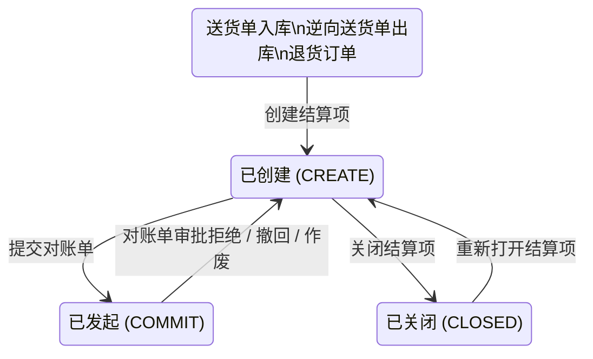

### 对账状态

追踪结算项在**对账单生命周期**中的位置，与对账单状态联动

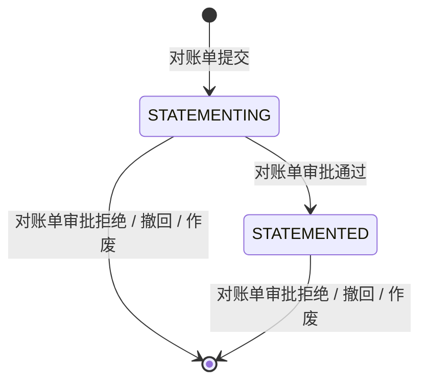

### 开票状态

追踪结算项在**发票单生命周期**中的位置，与发票单状态联动

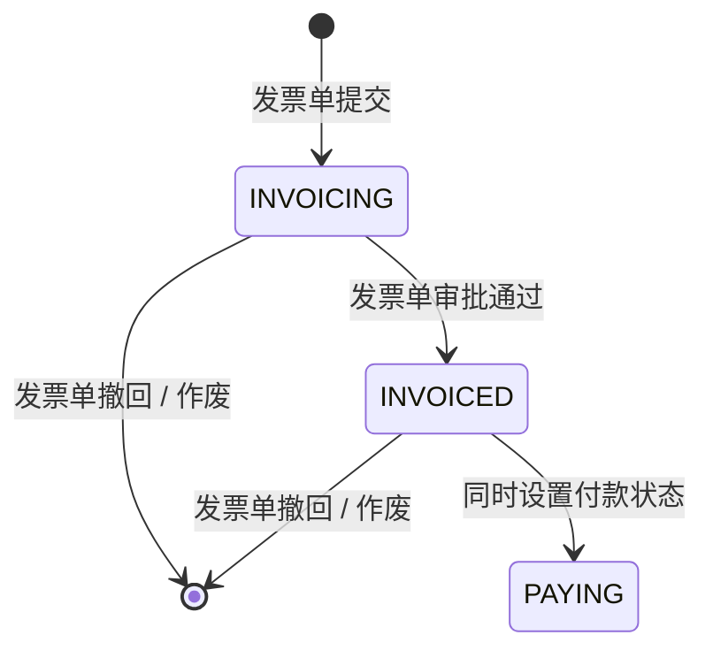

### 付款状态

追踪结算项在**付款生命周期**中的位置，由发票单审批通过触发，由外部支付回调完成

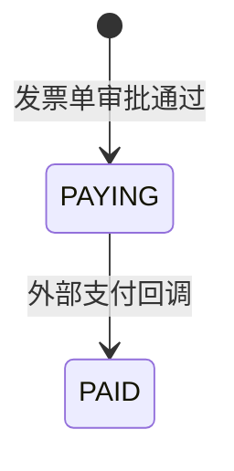

### 红字开票状态

仅**出库结算项**（`inStockDirection = OUT`）可触发红字开票，红字开票通过 BPM 流程异步执行，回调更新结果

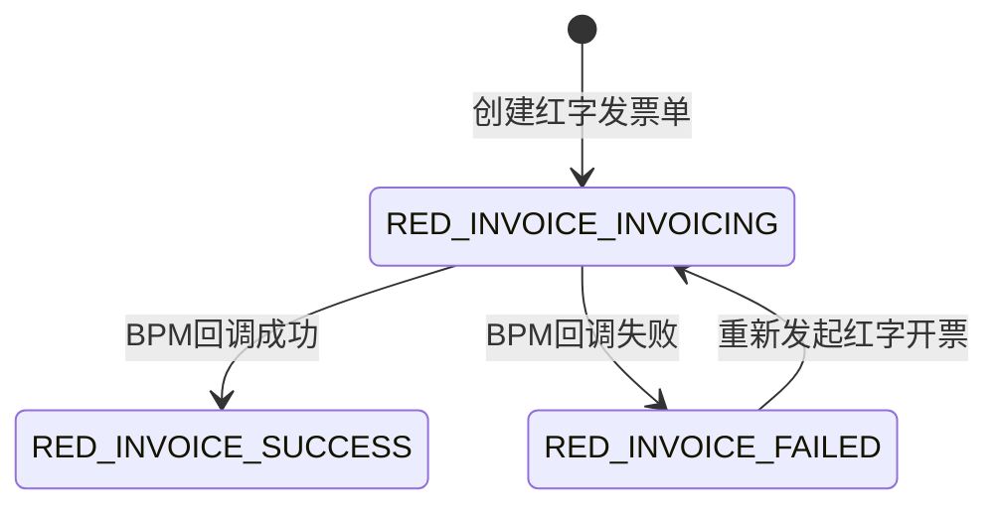

## 具体实现

### 创建-送货单入库

* 调用链

  > ```
  > BcSettlementItemAction.inboundCreate()
  > → BcSettlementItemAppService.convertBatchIn()
  > → BcSettlementItemAppService.createBcSettlementItem()
  > → BcSettlementPriceService.batchHandleAdjustPrice()
  > ```

* 实现逻辑

  > 1. 送货单（入库单）-> 结算项
  >
  >    > 1. 以送货单的入库单集合为维度，结合送货单及送货单行生成结算项
  >    > 2. 通过订单和合同信息补充信息
  >    > 3. 补充税率、重新计算金额、设置仓库信息
  >
  > 2. 结算项落库：校验、默认值、落库，状态=已创建
  >
  > 3. 调整结算项价格

### 创建-逆向送货单出库

* 调用链

  > ```
  > BcSettlementItemAction.outboundCreate()
  > → BcSettlementItemAppService.convertBatchOut()
  > → BcSettlementItemAppService.createBcSettlementItem()
  > ```

* 实现逻辑

  > 1. 逆向送货单（出库单）-> 结算项
  >
  >    > 1. 以逆向送货单的出库单集合为维度，结合逆向送货单及逆向送货单行生成结算项
  >    > 2. 补充退货订单、税率、重新计算金额、设置仓库信息
  >
  > 2. 结算项落库：校验、默认值、落库，状态=已创建

### 创建-退货订单直接生成

* 调用链

  > ```
  > BcSettlementItemAction.returnCreate()
  > → BcSettlementItemAppService.convertBatchForReturn()
  > → BcSettlementItemAppService.createBcSettlementItem()
  > ```

* 实现逻辑

  > 1. 退货订单 -> 结算项
  >
  >    > 1. 结合退货订单及退货订单行生成结算项
  >    > 2. 补充计量单位、税率
  >
  > 2. 结算项落库：校验、默认值、落库，状态=已创建
  >
  > 3. 幂等校验：同一退货单已生成结算项则直接返回成功

### 红字开票

* 实现逻辑

  > ```
  > ================ 触发：BC_RED_INVOICE_ORDER_CREATE_ACTION ================
  > 1、校验
  > 2、查询【结算项表】详情
  > 3、组装并新增【红字开票单】和【关联结算项表】
  > 4、更新【结算项表】红字开票状态=红字开票中
  > 5、新增【结算外部对接记录表】，并同步至BPM
  > 
  > ================ BPM回调：BC_RED_INVOICE_ORDER_CALLBACK_ACTION ================
  > 根据返回结果更新【结算项表】的红字开票状态：成功/失败
  > ```

### 其他

* 关闭&重新打开

  > ```
  > ================ 关闭 ================
  > 按钮显示条件：已创建
  > 1、校验
  > 2、更新【结算项表】：状态=已关闭
  > 
  > ================ 重新打开 ================
  > 按钮显示条件：已关闭
  > 1、校验
  > 2、更新【结算项表】：状态=已创建
  > ```

* 销售发票

  > ```
  > ================ 触发：settlement_item_trigger_sale_inovice ================
  > 1、查询【结算项表】详情
  > 2、校验
  > 3、更新【结算项表】是否销售发票=true
  > 
  > ================ 取消：settlement_item_cancel_sale_inovice_copy ================
  > 1、查询【结算项表】详情
  > 2、校验
  > 3、更新【结算项表】是否销售发票=false
  > ```

# 费用单

## 业务场景

* 费用单记录 BC 与供应商之间**独立于采购履约模块单据的各类费用**：不直接对应某笔采购交易，而是各种杂项费用的凭证

  > * 典型场景举例
  >
  >   > ```
  >   > 供应商做的模具，BC 付模具费（F007）
  >   > 供应商产品质量问题，BC 对供应商罚款（F008）
  >   > 供应商提供质保金（F009）
  >   > BC 给供应商返利（F010）
  >   > 打样阶段产生打样费（F006）
  >   > ```

* 费用单整体流程可分为 支付流 和 核销流

  > - 支付流：费用单支付不受 payType 影响
  >
  >   > 正数费用单支付、负数费用单关联凭证、预付单关联（创建节点&核销节点）、对账单关联（创建节点）
  >   >
  >
  > - 核销流：仅支持 payType=COMMON 的费用单进行核销
  >
  >   > 正数费用单追回、负数费用单退还、费用单完结、对账单关联（创建节点）
  >
  >
  > > 核心：支付流是金额从可支付金额->已支付金额；核销流是金额从可核销金额->已核销金额

## 数据模型

**bc_expense_order**

| 字段                                                | 说明                                                         |
| --------------------------------------------------- | ------------------------------------------------------------ |
| `status`                                            | 费用单状态：DRAFT / CREATED / APPROVING / TO_PAY / ALL_PAID / PARTIAL_PAID / CLOSE_APPROVING / CLOSED / APPROVE_REJECT / DELETE |
| `expenseType`                                       | 费用类型：F001-F015                                          |
| `amtType`, `payType`                                | 金额类型（POSITIVE / NEGATIVE），付款类型（PAY / OFFSET / COMMON） |
| `orderSource`                                       | 来源：SRM订单 / 飞书合同                                     |
| `supplier`, `supplierCode`, `supplierBank`          | 供应商、收款账户                                             |
| `currency`, `taxRateId`, `taxRate`                  | 币种、税率                                                   |
| `purGroup`, `purOrg`, `purCom`                      | 采购组/采购组织/所属公司                                     |
| `expenseAmt`                                        | 费用金额（原始金额）                                         |
| `toPayAmt`, `payingAmt`, `paidAmt`                  | 支付金额：可支付 → 支付中 → 已支付                           |
| `toVerifyAmt`, `verifyingAmt`, `verifiedAmt`        | 核销金额：可核销 → 核销中 → 已核销（仅 COMMON 类型）         |
| `applyPayAmt`, `applyPayExTaxAmt`, `applyPayTaxAmt` | 申请付款金额：含税/未税/税额                                 |
| `relateTradeOrder`, `relateContract`                | 关联订单/合同                                                |
| `isPay`, `isReturn`, `lastStatus`                   | 支付标记 / 退还标记 / 上一状态（回退用）                     |
| `redInvoiceStatus`                                  | 红票开票状态：RED_INVOICE_INVOICING / RED_INVOICE_SUCCESS / RED_INVOICE_FAILED |
| `updateVoucherStatus`                               | 关联凭证状态：SUCCESS / FAIL                                 |
| `syncStatus`, `ebsStatus`, `entryStatus`            | 同步状态 / EBS状态 / 发票入账状态                            |

## 操作总览

| 操作             | 触发                                                     | 描述                                                         |
| ---------------- | -------------------------------------------------------- | ------------------------------------------------------------ |
| 创建             | —                                                        | 保存→新建（DRAFT），提交→已创建（CREATED）                   |
| 支付             | 正数 + CREATED\|PARTIAL_PAID                             | CREATED\|PARTIAL_PAID → APPROVING → TO_PAY → ALL_PAID\|CLOSED（EBS回调） |
| 关联凭证         | 负数 + CREATED\|PARTIAL_PAID + 未红字开票 + 未关联凭证   | CREATED\|PARTIAL_PAID → APPROVING → ALL_PAID\|CLOSED（BPM回调） |
| 退还             | 负数 + COMMON + ALL_PAID\|PARTIAL_VERIFIED               | ALL_PAID\|PARTIAL_VERIFIED → CLOSE_APPROVING → TO_PAY → CLOSED（EBS回调） |
| 追回             | 正数 + COMMON + ALL_PAID\|PARTIAL_VERIFIED               | ALL_PAID\|PARTIAL_VERIFIED → CLOSE_APPROVING → CLOSED（BPM回调） |
| 完结             | COMMON + ALL_PAID\|PARTIAL_VERIFIED                      | ALL_PAID\|PARTIAL_VERIFIED → CLOSE_APPROVING → CLOSED        |
| 作废             | DRAFT\|CREATED\|APPROVE_REJECT                           | → DELETE                                                     |
| 红字开票         | 负数 + 未红字开票 + 未关联凭证                           | BPM审批 → 红字开票状态=SUCCESS/FAIL                          |
| 预付单创建关联   | 负数 + CREATED\|PARTIAL_PAID                             | 预付单审批通过时：toPayAmt→paidAmt，状态推进                 |
| 预付单核销关联   | 正数 + CREATED\|PARTIAL_PAID                             | 预付单核销审批通过时：toPayAmt→paidAmt，状态推进             |
| 对账单支付关联   | CREATED\|PARTIAL_PAID                                    | 发票单审批通过时：toPayAmt→paidAmt，状态推进                 |
| 对账单核销关联   | ALL_PAID\|PARTIAL_VERIFIED                               | 发票单审批通过时：toVerifyAmt→verifiedAmt，状态推进          |

## 生命周期

费用单状态机涵盖**支付流**和**核销流**两条主线。支付流受费用单自身（支付/关联凭证）、预付单（创建关联/核销关联）和对账单（STATEMENT_PAY）三方共同驱动；核销流受费用单自身（退还/追回/完结）和对账单（STATEMENT_OFFSET）双方共同驱动。

> **关键设计：** `payType` 决定费用单是否进入核销流（COMMON 才可核销），`amtType` 决定支付流走支付（正数）还是关联凭证（负数）。

### 费用单状态

**支付流 — 自身操作**：正数费用单支付 → EBS 付款回调，负数费用单关联凭证 → BPM 回调

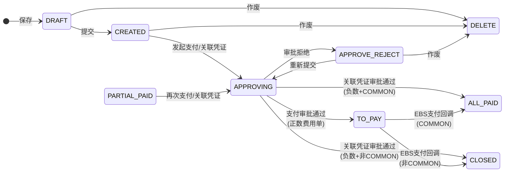

**支付流 — 外部操作**：预付单创建关联、预付单核销、对账单 STATEMENT_PAY 在各自审批通过时推进费用单状态

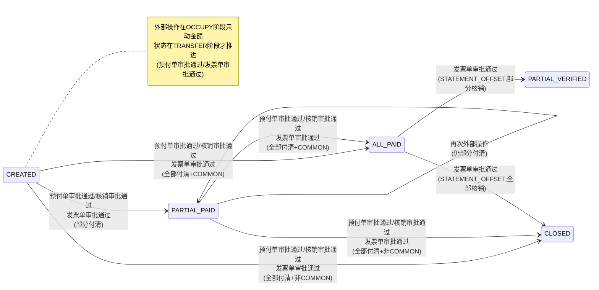

**核销/完结流**：仅 COMMON 类型可进入，含退还、追回、完结三条路径

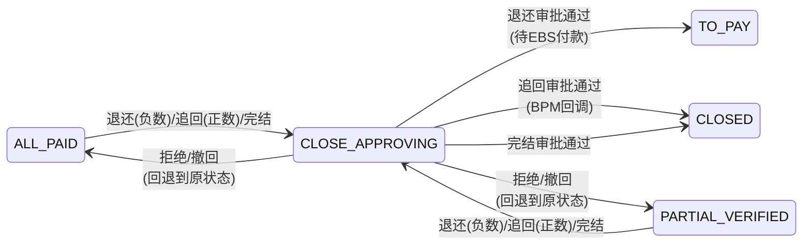

### 状态说明

| 状态 | 中文 | 进入条件 | 允许的操作 |
|------|------|---------|-----------|
| `DRAFT` | 新建 | save() 保存 | 提交、编辑保存、作废 |
| `CREATED` | 已创建 | submit() 提交 | 支付/关联凭证、作废、被预付单占用、被对账单占用 |
| `APPROVING` | 审批中 | 发起支付/关联凭证 | 审批通过/拒绝、撤回 |
| `APPROVE_REJECT` | 审批拒绝 | 审批被拒 | 重新提交、作废 |
| `TO_PAY` | 支付中 | 正数支付审批通过 / 退还审批通过 | 等待 EBS 支付回调 |
| `PARTIAL_PAID` | 部分支付 | 外部操作部分付清 | 再次支付/关联凭证、被预付单占用、被对账单占用 |
| `ALL_PAID` | 已支付 | EBS回调(COMMON) / 关联凭证审批通过(COMMON) / 外部操作全部付清(COMMON) | 退还/追回/完结、被对账单核销占用 |
| `PARTIAL_VERIFIED` | 部分核销 | 对账单 STATEMENT_OFFSET 部分核销 | 再次核销、退还/追回/完结 |
| `CLOSE_APPROVING` | 完结审批中 | 退还/追回/完结发起 | 审批通过/拒绝、撤回 |
| `CLOSED` | 已完结 | 支付完成(非COMMON) / 核销完成 / 完结审批通过 | 终态 |
| `DELETE` | 已作废 | cancel() 作废 | 终态 |

### 支付流路径总览

费用单从 CREATED 到终态的路径由 `amtType`（正/负）和 `payType`（PAY/OFFSET/COMMON）共同决定：

| amtType | payType | 自身操作 | 外部操作可介入 | 支付流终点 | 核销流 |
|---------|---------|---------|-------------|----------|-------|
| 正数 | PAY | 支付 → EBS回调 | 预付单核销、对账单支付 | CLOSED | — |
| 正数 | OFFSET | 支付 → EBS回调 | 预付单核销、对账单支付 | CLOSED | — |
| 正数 | COMMON | 支付 → EBS回调 | 预付单核销、对账单支付 | ALL_PAID | 追回/完结 |
| 负数 | PAY | 关联凭证 → BPM回调 | 预付单创建关联、对账单支付 | CLOSED | — |
| 负数 | OFFSET | 关联凭证 → BPM回调 | 预付单创建关联、对账单支付 | CLOSED | — |
| 负数 | COMMON | 关联凭证 → BPM回调 | 预付单创建关联、对账单支付 | ALL_PAID | 退还/完结 |

## 具体实现

### 创建

* 状态流转：null -> DRAFT -> CREATED

* 业务逻辑-保存

  > 1. 校验采购主体是否一致
  >
  >    > ```
  >    > - 来源=SRM订单：校验费用单采购组织 = 订单采购组织
  >    > - 来源=飞书合同：校验费用单所属公司 = 合同我方公司
  >    > ```
  >
  > 2. 创建或更新
  >
  >    > ```
  >    > - 新增（id==null）：校验费用金额不能为0 → 自动设置金额类型（正/负）→ 设置默认值 → 插入DB
  >    > - 更新（id!=null）：校验费用单存在性 → 校验费用金额不能为0 → 更新DB
  >    > ```
  >
  > 3. 默认值设置
  >
  >    > ```
  >    > - 生成ID、编号（code）
  >    > - 初始状态 = DRAFT（新建）
  >    > - 可支付金额 = 费用金额
  >    > - 支付中/已支付/可核销/核销中/已核销金额 = 0
  >    > - 来源=SRM订单：关联单据号自动填充为订单号
  >    > - 来源=飞书合同：关联单据号自动填充为合同号
  >    > - 来源=SRM订单 + 类型=F011（订单附加费）：自动填充物料一级类目信息
  >    > ```

* 业务逻辑-提交

  > 1. 调用【保存】逻辑
  > 2. 更新：状态=已创建

* BPM 同步：参数校验 -> 对象类型转换 -> 保存逻辑 -> 返回响应

  > 即 系统接收 BPM 同步的费用单需手动提交

### 支付

* 条件：状态=已创建|部分支付 & 正数费用单

* 状态流转：已创建|部分支付 -> 审批中 -> 支付中 -> 已支付|已完结

* 支付页面，申请付款金额=可支付金额：一次性支付完

* 业务逻辑

  > 1. 校验
  >
  >    > ```
  >    > 支付中金额=0、申请付款金额=可支付金额
  >    > ```
  >
  > 2. 更新【费用单表】
  >
  >    > ```
  >    > 状态：审批中
  >    > 可支付金额=0、支付中金额=申请付款金额
  >    > 是否已发起支付=是
  >    > ```
  >
  > 3. 费用单支付审批
  >
  > 4. 费用单支付审批-审批通过
  >
  >    > 1. 校验
  >    >
  >    > 2. 更新【费用单表】
  >    >
  >    >    > ```
  >    >    > 状态：支付中
  >    >    > 是否已发起支付=是
  >    >    > 可支付金额=支付中金额=0、已支付金额=费用金额
  >    >    > 付款类型=支付/抵扣：可核销金额=费用金额
  >    >    > ```
  >    >
  >    > 3. 新增【结算审批通过记录】和【结算外部对接表】，并同步至EBS
  >    >
  >    > 4. EBS回调：BC_SETTLEMENT_OUT_ORDER_EBS_CALLBACK_ACTION
  >    >
  >    >    > ```
  >    >    > ================== 支付回调部分 ==================
  >    >    > 付款类型=支付/抵扣：可核销金额=费用金额
  >    >    > 状态：付款类型=支付/抵扣 ? 已支付 : 已完结
  >    >    > ```
  >
  > 5. 费用单支付审批-审批拒绝
  >
  >    > 1. 校验
  >    >
  >    > 2. 更新【费用单表】
  >    >
  >    >    > ```
  >    >    > 状态：上一次状态=已创建 ? 审批拒绝 : 上一次状态
  >    >    > 是否已发起支付=否、可支付金额=申请付款金额、支付中金额=0
  >    >    > ```

### 关联凭证

* 条件：已创建|部分支付 & 负数费用单 & 未红字开票 & 未关联凭证

* 状态流转：已创建|部分支付 -> 审批中 -> 已支付|已完结

* 支付页面，申请付款金额=可核销金额

  > 没啥意义，后端代码里直接使用可支付金额，一次性支付完

* 业务逻辑

  > 1. 校验
  >
  > 2. 更新【费用单表】
  >
  >    > ```
  >    > 状态：审批中
  >    > 支付中金额=可支付金额、可支付金额=0
  >    > ```
  >
  > 3. 新增【结算外部对接表】，并同步BPM
  >
  > 4. BPM回调：BC_SETTLEMENT_OUT_ORDER_BPM_CALLBACK_ACTION
  >
  >    > ```
  >    > ========================= 费用单关联凭证部分 =========================
  >    > 审批通过：
  >    > 1、校验
  >    > 2、状态：付款类型=支付/抵扣 ? 已支付 : 已完结
  >    > 3、付款类型=支付/抵扣：可核销金额=费用金额
  >    > 4、已支付金额+=支付中金额、支付中金额=0
  >    > 5、其他：是否已发起支付=是
  >    > 
  >    > 审批拒绝：
  >    > 1、校验
  >    > 2、状态：上一次状态=已创建 ? 审批拒绝 : 上一次状态
  >    > 3、可支付金额=支付中金额、支付中金额=0
  >    > 4、其他：是否已发起支付=否
  >    > ```

### 退还

* 条件：已支付|部分核销 & 负数费用单 & COMMON

* 状态流转：已支付|部分核销 -> 完结审批中 -> 支付中 -> 已完结

* 业务逻辑

  > 1. 校验
  >
  > 2. 更新【费用单表】
  >
  >    > ```
  >    > 状态：完结审批中
  >    > 是否已发起退还=是
  >    > 核销中金额+=可核销金额、可核销金额=0
  >    > ```
  >
  > 3. 费用单完结审批
  >
  > 4. 费用单完结审批-审批通过
  >
  >    > 1. 校验
  >    >
  >    > 2. 更新【费用单表】
  >    >
  >    >    > ```
  >    >    > 退还场景：状态-支付中、核销中金额=0、已核销金额+=可核销金额
  >    >    > 完结场景：状态-已完结
  >    >    > ```
  >    >
  >    > 3. 新增【结算审批通过记录】和【结算外部对接表】，并同步至EBS
  >    >
  >    > 4. EBS回调：BC_SETTLEMENT_OUT_ORDER_EBS_CALLBACK_ACTION
  >    >
  >    >    > ```
  >    >    > ================== 退还回调部分 ==================
  >    >    > 状态：已完结
  >    >    > ```
  >
  > 5. 费用单完结审批-审批拒绝
  >
  >    > 1. 校验
  >    >
  >    > 2. 更新【费用单表】
  >    >
  >    >    > ```
  >    >    > 退还场景：状态-上一个状态、可核销金额=核销中金额、核销中金额=0、是否已发起退还=否
  >    >    > 完结场景：状态-上一个状态、是否已发起退还=否
  >    >    > ```

### 追回

* 条件：已支付|部分核销 & 正数费用单 & COMMON

* 状态流转：已支付|部分核销 -> 完结审批中 -> 已完结

* 业务逻辑

  > 1. 校验
  >
  > 2. 更新【费用单表】
  >
  >    > ```
  >    > 状态：完结审批中
  >    > 核销中金额=可核销金额、可核销金额=0
  >    > 是否已发起退还=是
  >    > ```
  >
  > 3. 新增【结算外部对接表】，并同步BPM
  >
  > 4. BPM回调：BC_SETTLEMENT_OUT_ORDER_BPM_CALLBACK_ACTION
  >
  >    > ```
  >    > ========================= 费用单追回部分 =========================
  >    > 审批通过：
  >    > 1、校验
  >    > 2、状态：已完结
  >    > 3、已核销金额+=可核销金额、可核销金额=0
  >    > 4、其他：是否已发起退还=是
  >    > 
  >    > 审批拒绝：
  >    > 1、校验
  >    > 2、状态：上一次状态
  >    > 3、可核销金额=核销中金额、核销中金额=0
  >    > 4、其他：是否已发起退还=否
  >    > ```

### 完结

* 条件：已支付|部分核销 & COMMON

* 状态流转：已支付|部分核销 -> 完结审批中 -> 已完结

* 业务逻辑

  > 1. 校验
  >
  > 2. 更新【费用单表】
  >
  >    > ```
  >    > 状态：完结审批中
  >    > ```
  >
  > 3. 费用单完结审批：退还功能下已有

### 作废

* 条件：新建|已创建|审批拒绝

* 业务逻辑

  > 1. 校验
  > 2. 更新：状态=已作废

### 红字开票

* 条件：已创建|支付中|部分支付|已支付|部分核销|已完结 & 负数费用单 & 未红字开票 & 未关联凭证

* 业务逻辑

  > 1. 校验
  >
  >    > ```
  >    > - 已创建|支付中|部分支付|已支付|部分核销|已完结
  >    > - 负数费用单
  >    > - 不存在进行中或已完成的红字开票
  >    > - 不存在进行中或已完成的关联凭证
  >    > ```
  >
  > 2. 创建结算外部对接记录 → 同步BPM审批
  >
  >    > ```
  >    > BPM审批通过：红票开票状态=SUCCESS
  >    > BPM审批拒绝：红票开票状态=FAIL
  >    > ```

### 其他单据

* 预付单

  > * 创建节点：负数费用单 & 已创建|部分支付
  > * 核销费用单：正数费用单 & 已创建|部分支付
  >
  > > 总结：均是支付流

* 对账单

  > * 创建节点：(已创建|部分支付) | (COMMON & 已支付|部分核销)
  >
  > > 总结：
  > >
  > > * 已创建|部分支付：支付流
  > > * 已支付|部分核销：核销流
  > > * 对账流程不会变更费用单状态，只有在发票审批通过后才会变更

* 发票单：仅展示对应对账单使用的费用单

  > 发票单 -> 关联对账单 -> 对账单 -> 关联费用单

# 预付单

## 业务场景

* 预付单关联费用单：无论是预付单创建时关联负数费用单，还是后续核销正数费用单，都是费用单的支付流（前者等价于关联凭证，后者等价于支付）

## 数据模型

**bc_pre_payment**

| 字段                                                   | 说明                                                         |
| ------------------------------------------------------ | ------------------------------------------------------------ |
| `status`                                               | 预付单状态：DRAFT / APPROVING / PAYING / PAID / PARTIAL_VERIFIED / CLOSE_APPROVING / VERIFY_APPROVING / COMPLETE / APPROVE_REJECT / DELETE |
| `prePaymentType`                                       | 预付单类型：CONTRACT（合同）/ ORDER（订单）/ DELIVERY（送货单）/ ADVANCE（提前付款） |
| `supplier`, `supplierCode`, `supplierBank`             | 供应商、收款账户                                             |
| `currency`, `taxRateId`, `taxRate`                     | 币种、税率                                                   |
| `purGroup`, `purOrg`, `purCom`                         | 采购组/采购组织/所属公司                                     |
| `prePayAmt`, `applyPayAmt`                             | 本次预付金额，申请付款金额（= 预付金额 + 关联负数费用单）    |
| `toVerifyAmt`, `verifyingAmt`, `verifiedAmt`           | 核销：可核销 → 核销中 → 已核销                               |
| `batchNo`                                              | 批次号（0=首次支付；核销时递增 1,2,3…）                      |
| `relateTradeOrder`, `relateDeliveryOrder`, `relateContract` | 关联订单/送货单/合同（按类型必填其一）                  |
| `tradePrepayPercent`, `beforeDeliveryPrepayPercent`    | 订单预付比例 / 发货前预付比例（%）                           |
| `lastStatus`, `closeReason`                            | 上一状态（回退用）、完结原因                                 |
| `syncStatus`, `ebsStatus`, `ebsCode`, `ebsMessage`     | 同步状态 / EBS状态 / EBS单号 / EBS失败原因                   |

**bc_settlement_material_line**


## 操作总览

| 操作           | 触发                                    | 描述                                                         |
| -------------- | --------------------------------------- | ------------------------------------------------------------ |
| 创建           | —                                       | 保存→新建（DRAFT），提交→审批中（APPROVING）                 |
| 撤回           | APPROVING                               | APPROVING → DRAFT                                            |
| 提交审批通过   | APPROVING                               | APPROVING → PAYING，费用单金额转移，同步EBS                  |
| 提交审批拒绝   | APPROVING                               | APPROVING → APPROVE_REJECT，费用单金额回滚                   |
| EBS支付回调    | PAYING                                  | applyPayAmt>0 → PAID；applyPayAmt=0 → COMPLETE               |
| 核销费用单     | PAID\|PARTIAL_VERIFIED                  | → VERIFY_APPROVING，占用费用单金额                            |
| 核销审批通过   | VERIFY_APPROVING                        | 仍有待核销→PARTIAL_VERIFIED；全部核销→COMPLETE；费用单状态推进 |
| 核销拒绝/撤回  | VERIFY_APPROVING                        | → PAID\|PARTIAL_VERIFIED，费用单金额回滚                     |
| 完结           | PAID\|PARTIAL_VERIFIED                  | → CLOSE_APPROVING                                            |
| 完结审批通过   | CLOSE_APPROVING                         | → COMPLETE                                                   |
| 完结拒绝/撤回  | CLOSE_APPROVING                         | → PAID\|PARTIAL_VERIFIED                                     |
| 作废           | DRAFT\|APPROVE_REJECT                   | → DELETE，回滚关联费用单，解除订单/送货单关联                |

## 生命周期

预付单状态机涵盖**支付**和**核销**两条主线，外加**完结**和**作废**两条支线。

### 预付单状态

**支付主线**：保存 → 提交 → 审批 → EBS 支付回调

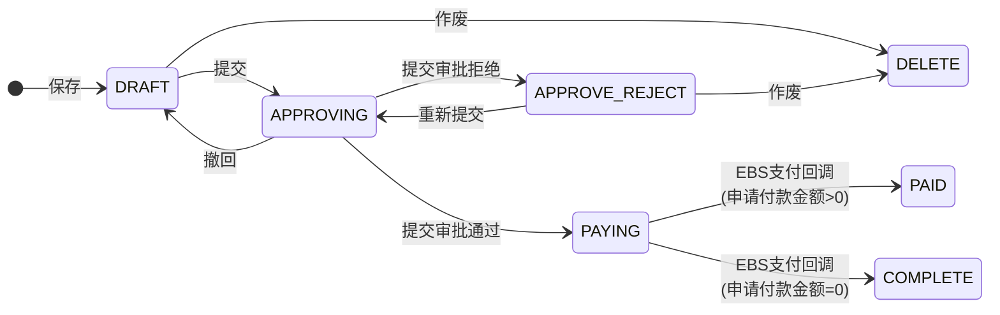

**核销支线**：已支付后，可多次核销正数费用单

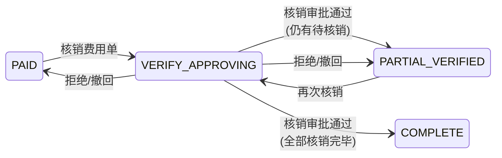

**完结支线**：已支付或部分核销后，可发起完结

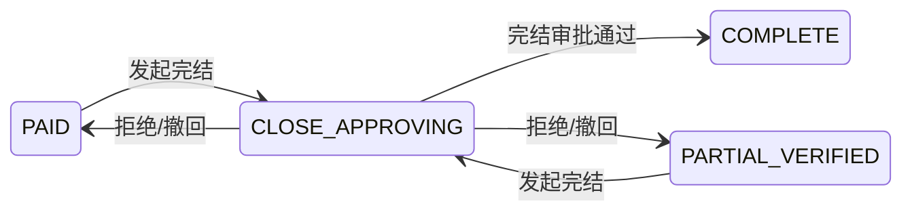

### 状态说明

| 状态 | 中文 | 进入条件 | 允许的操作 |
|------|------|---------|-----------|
| `DRAFT` | 新建 | save() 保存 | 提交、编辑保存、作废 |
| `APPROVING` | 审批中 | submit() 提交 | 审批通过/拒绝、撤回 |
| `APPROVE_REJECT` | 审批拒绝 | 提交审批被拒 | 重新提交、编辑保存、作废 |
| `PAYING` | 支付中 | 提交审批通过 | 等待 EBS 支付回调 |
| `PAID` | 已支付 | EBS 回调 (applyPayAmt>0) | 核销费用单、完结 |
| `PARTIAL_VERIFIED` | 部分核销 | 核销审批通过 (仍有待核销) | 再次核销、完结 |
| `CLOSE_APPROVING` | 完结审批中 | complete() 发起完结 | 完结审批通过/拒绝、撤回 |
| `VERIFY_APPROVING` | 核销审批中 | verify() 发起核销 | 核销审批通过/拒绝、撤回 |
| `COMPLETE` | 已完结 | EBS回调(applyPayAmt=0) / 完结审批通过 / 全部核销 | 终态 |
| `DELETE` | 已作废 | cancel() 作废 | 终态 |

## 具体实现

### 创建

* 状态流转：NULL → DRAFT → APPROVING → PAYING → PAID | COMPLETE

* 页面实现

  > * 费用单
  >
  >   > ```
  >   > 负数 + 已创建|部分支付 + 采购组织&供应商&币种&税率
  >   > 使用费用单的可支付金额：预付单是BC给供应商钱，创建预付单时可选择负数费用单使用其可支付金额抵扣此次预付单需要付的钱
  >   > 负数费用单被使用等价于关联凭证操作
  >   > 基于关联费用单使用费用单
  >   > ```
  >
  > * 金额
  >
  >   > ```
  >   > 本次预付金额 = 物料明细行上的应付金额之和（预付单类型=订单|送货单）or 手动填写（预付单类型=合同|提前付款）
  >   > 申请付款金额 = MAX(本次预付金额 + 关联费用单上的可支付金额（负数）之和, 0)
  >   > ```
  >
  > * 物料明细（bc_settlement_material_line）
  >
  >   > ```
  >   > 数据初始化：
  >   > - 订单：订单行转换为物料明细行
  >   > - 送货单：送货单行转换为物料明细行
  >   > 
  >   > 物料明细行.应付金额 = 订单行含税总金额*订单预付比例 or 送货单行含税总金额*送货单预付比例
  >   > ```

* 业务逻辑-保存：BcPrePaymentAction#save

  > 1. 校验采购主体一致性
  >
  >    > ```
  >    > 类型=订单：采购组织=订单采购组织
  >    > 类型=送货单：采购组织=送货单采购组织
  >    > 类型=合同|提前付款：所属公司=合同我方公司
  >    > ```
  >
  > 2. 场景-新增
  >
  >    > 1. 字段合法性校验
  >    >
  >    > 2. 默认值
  >    >
  >    >    > ```
  >    >    > 状态=新建
  >    >    > 批次号=0
  >    >    > 申请付款金额/可核销金额/核销中金额/已核销金额为NULL，则默认设为0
  >    >    > ```
  >    >
  >    > 3. 防重校验
  >    >
  >    >    > ```
  >    >    > 对于TRADE_ORDER/DELIVERY_ORDER类型，检查关联单据是否已被其他非DELETE的预付单关联
  >    >    > ```
  >    >
  >    > 4. 处理预付单金额逻辑
  >    >
  >    >    > ```
  >    >    > 预付单类型=订单|送货单：
  >    >    > 1、本次预付金额可小于关联的费用单可支付金额（申请付款金额为0）
  >    >    > 2、需要按提交的费用单顺序使用费用单的可支付金额：使用负数费用单抵扣预付单的本次预付金额
  >    >    > 3、未使用的费用单需释放
  >    >    > 
  >    >    > 预付单类型=合同|提前付款：
  >    >    > 1、不支持本次预付金额小于关联的费用单可支付金额（申请付款金额需大于0）
  >    >    > 2、关联的费用单的可支付金额均需使用
  >    >    > 
  >    >    > 关联费用单：使用金额=费用单.可支付金额（可部分使用）、状态=DRAFT
  >    >    > ```
  >    >
  >    > 5. 新增【预付单表】
  >    >
  >    > 6. 新增【关联费用单表】
  >    >
  >    >    > ```
  >    >    > 状态=DRAFT
  >    >    > 关联类型=PREPAYMENT_OFFSET（预付单抵扣）
  >    >    > 批次号=0
  >    >    > ```
  >    >
  >    > 7. 新增【结算物料明细】+ 更新关联订单/送货单的已关联预付单=true
  >    >
  >    >    > ```
  >    >    > 前提：【预付单类型=订单|送货单】场景
  >    >    > ```
  >
  > 3. 场景-更新
  >
  >    > ```
  >    > 逻辑基本同【场景-新增】：需要删除【关联费用单表】和【结算物料明细】，重新创建
  >    > ```

* 业务逻辑-提交：BC_PRE_PAYMENT_COMMIT_FUNC

  > 1. 调用【保存】逻辑
  >
  > 2. 调用提交逻辑：BcPrePaymentAction#submit
  >
  >    > 1. 校验
  >    >
  >    >    > ```
  >    >    > 预付单状态=新建|审批拒绝
  >    >    > 关联费用单：DRAFT + PREPAYMENT_OFFSET
  >    >    > 校验关联费用单的使用金额是否在费用单的可支付金额范围内
  >    >    > ```
  >    >
  >    > 2. 更新【预付单表】：状态=审批中
  >    >
  >    > 3. 更新【关联费用单】和【费用单】
  >    >
  >    >    > ```
  >    >    > 关联费用单：状态=占用中
  >    >    > 费用单：可支付金额-=使用金额、支付中金额+=使用金额
  >    >    > ```
  >
  > 3. 预付单提交审批：PRE_PAY_COMMIT_FLOW
  >
  >    > * 审批通过
  >    >
  >    >   > 1. 校验
  >    >   >
  >    >   >    > ```
  >    >   >    > 预付单状态=审批中
  >    >   >    > ```
  >    >   >
  >    >   > 2. 更新【预付单】：状态=支付中
  >    >   >
  >    >   > 3. 更新【关联费用单】和【费用单】
  >    >   >
  >    >   >    > ```
  >    >   >    > 关联费用单：状态=已生效
  >    >   >    > 
  >    >   >    > 费用单：
  >    >   >    > 1、已支付金额+=使用金额、支付中金额-=使用金额
  >    >   >    > 2、状态 = (可支付金额=支付中金额=0 ? (付款类型=支付/抵扣 ? 已支付 : 已完结) : 部分支付)
  >    >   >    > ```
  >    >   >
  >    >   > 4. 新增【结算审批通过记录】和【结算外部对接表】，并同步至EBS
  >    >   >
  >    >   > 5. EBS回调：BC_SETTLEMENT_OUT_ORDER_EBS_CALLBACK_ACTION
  >    >   >
  >    >   >    > ```
  >    >   >    > ================== 预付单支付部分 ==================
  >    >   >    > 申请付款金额=0 ? 状态=已完结 : 状态=已支付&可核销金额=申请付款金额
  >    >   >    > ```
  >    >
  >    > * 审批拒绝
  >    >
  >    >   > 1. 校验
  >    >   >
  >    >   > 2. 更新【预付单表】：状态=审批拒绝
  >    >   >
  >    >   > 3. 回滚费用单金额
  >    >   >
  >    >   >    > ```
  >    >   >    > 费用单：可支付金额+=使用金额、支付中金额-=使用金额
  >    >   >    > ```

### 完结

* 仅支持【已支付|部分核销】的预付单

* 业务逻辑

  > 1. 校验
  >
  >    > ```
  >    > 未核销中流程
  >    > ```
  >
  > 2. 更新【预付单表】
  >
  >    > ```
  >    > 状态：完结审批中
  >    > ```
  >
  > 3. 审批：凭证附件=null ? SRM审批 : BPM审批
  >
  >    > * 新增【结算外部对接记录】，并同步至BPM
  >    >
  >    >   > ```
  >    >   > BPM回调：BC_SETTLEMENT_OUT_ORDER_BPM_CALLBACK_ACTION
  >    >   > 
  >    >   > 审批通过：预付单状态=已完结
  >    >   > 审批拒绝：预付单状态=上一次状态
  >    >   > ```
  >    >
  >    > * 预付单完结审批
  >    >
  >    >   > ```
  >    >   > 审批通过：预付单状态=已完结
  >    >   > 审批拒绝：预付单状态=上一次状态
  >    >   > ```

### 核销费用单

* 页面实现

  > * 仅支持【已支付|部分核销】的预付单
  >
  >   > 可多次核销：【关联费用单】上使用批次号标识
  >
  > * 费用单
  >
  >   > ```
  >   > 正数 + 已创建|部分支付 + 采购组织&供应商&币种&税率
  >   > 使用费用单的可支付金额：该节点的预付单，BC已经付给供应商钱，所以可以用于抵扣/使用正数费用单的可支付金额
  >   > 正数费用单被使用等价于支付操作
  >   > 基于关联费用单使用费用单
  >   > ```

* 业务逻辑：BC_PRE_PAY_VERIFY_FUNC

  > 1. 校验
  >
  >    > ```
  >    > 预付单状态=已支付|部分核销
  >    > ```
  >
  > 2. 新增【关联费用单表】、更新【费用单】
  >
  >    > ```
  >    > ===================== 关联费用单 =====================
  >    > 状态=占用中
  >    > 关联类型=PREPAYMENT_PAY（预付单支付）
  >    > 批次号
  >    > 
  >    > ===================== 费用单 =====================
  >    > 可支付金额-=使用金额、支付中金额+=使用金额
  >    > ```
  >
  > 3. 更新【预付单表】
  >
  >    > ```
  >    > 状态：核销审批中
  >    > 可核销金额-=累计使用金额（新关联费用单的使用金额）
  >    > 核销中金额+=累计使用金额
  >    > ```
  >
  > 4. 预付单核销费用单审批
  >
  >    > * 审批通过
  >    >
  >    >   > 1. 校验
  >    >   >
  >    >   > 2. 更新【费用单表】和【关联费用单表】
  >    >   >
  >    >   >    > ```
  >    >   >    > 费用单：
  >    >   >    > 1、已支付金额+=使用金额、支付中金额-=使用金额
  >    >   >    > 2、状态 = (可支付金额=支付中金额=0 ? (付款类型=支付/抵扣 ? 已支付 : 已完结 ) : 部分支付)
  >    >   >    > 3、可支付金额=支付中金额=0 && 付款类型=支付/抵扣：可核销金额=已支付金额
  >    >   >    > 
  >    >   >    > 关联费用单：状态=USED
  >    >   >    > ```
  >    >   >
  >    >   > 3. 更新【预付单表】
  >    >   >
  >    >   >    > ```
  >    >   >    > 状态 = (可核销金额=核销中金额=0 ? 已完结 : 部分核销)
  >    >   >    > 核销中金额-=累计使用金额（新关联费用单的使用金额）
  >    >   >    > 已核销金额+=累计使用金额
  >    >   >    > ```
  >    >   >
  >    >   > 4. 新增【结算外部对接记录】，同步至EBS
  >    >   >
  >    >   >    > ```
  >    >   >    > 无回调
  >    >   >    > ```
  >    >
  >    > * 审批拒绝
  >    >
  >    >   > 1. 校验
  >    >   >
  >    >   > 2. 更新【费用单表】、删除【关联费用单】
  >    >   >
  >    >   >    > ```
  >    >   >    > 费用单：可支付金额+=使用金额、支付中金额-=使用金额
  >    >   >    > 
  >    >   >    > 关联费用单：需根据批次号删除
  >    >   >    > ```
  >    >   >    
  >    >   >3. 更新【预付单表】
  >    >   > 
  >    >   >   > ```
  >    >   >    > 状态：上一个状态
  >    >   >    > 可核销金额+=累计使用金额（新关联费用单的使用金额）
  >    >   >    > 核销中金额-=累计使用金额
  >    >   >    > ```

### 作废

* 仅支持【新建|审批拒绝】的预付单

* 业务逻辑

  > ```
  > 1、校验
  > 2、更新预付单：状态=已作废
  > 3、更新关联费用单表：状态=已作废
  > 4、更新关联的订单/送货单：已关联预付单=false
  > ```
  >

### 批次号机制

- 保存时初始 `batchNo = 0`，标识首次支付批次的关联费用单
- 每次核销 `batchNo` 递增 (1, 2, 3…)，同一批次核销的关联费用单共享相同批次号
- 核销审批拒绝/撤回时，按批次号精确删除本批次创建的关联费用单

# 对账单

## 业务场景

* 基于【结算项】创建
* 预付单使用的费用单，不会用于后续对账：预付单使用费用单，相关金额就已经在预付单上了，不会再直接用于对账
* 对账流程，对于使用的预付单和费用单，只调整金额，状态不变：发票单审批通过后，才会更新状态

## 数据模型

**bc_statement_order**

| 字段                                                       | 说明                                                         |
| ---------------------------------------------------------- | ------------------------------------------------------------ |
| `statementStatus`                                          | 对账单状态：DRAFT / APPROVING / TO_SIGN / SIGNED / APPROVE_REJECT / TO_EDIT / PURCHASER_EDIT / DELETE |
| `createSource`                                             | 发起方：PURCHASER（采购商）/ SUPPLIER（供应商）              |
| `supplier`, `currency`, `taxRateId`, `taxRate`             | 供应商、币种、税率                                           |
| `purGroup`, `purOrg`, `purCom`                             | 采购组/采购组织/所属公司                                     |
| `allQty`                                                   | 对账数量合计（结算项出入库数量）                             |
| `statementIntaxAmt`, `statementExtaxAmt`, `statmentTaxAmt` | 对账总金额（结算项之和）：含税/未税/税额                     |
| `payIntaxAmt`, `payExtaxAmt`, `payTaxAmt`                  | 应付总金额（结算项 + 费用单 ± 预付单）：含税/未税/税额       |
| `prePaymentVerifyAmt`                                      | 预付单本次核销金额总和                                       |
| `signingStatus`, `signType`, `signedAttachment`            | 签署状态（ING/SIGNED/REJECTED/REVOKE）、签署方式、签署文件   |
| `relateExpenseFlag`, `relatePrePaymentFlag`                | 是否关联费用单 / 是否关联预付单                              |
| `invoiceOrder`                                             | 关联发票单ID（发票单审批通过后回写）                         |
| `repairOrderTag`, `submitUser`, `approveRemark`            | 返修标记 / 提交人 / 审批意见                                 |

## 操作总览

| 操作             | 触发                                                 | 描述                                                         |
| ---------------- | ---------------------------------------------------- | ------------------------------------------------------------ |
| 创建             | 已创建的结算项                                       | 聚合结算项生成对账单，DRAFT                                  |
| 保存             | DRAFT\|TO_EDIT\|PURCHASER_EDIT\|APPROVE_REJECT       | DRAFT，更新关联结算项/预付单/费用单                          |
| 提交（采购商）   | DRAFT + 采购商发起                                   | DRAFT → APPROVING，占用结算项/预付单/费用单金额              |
| 提交（供应商）   | DRAFT + 供应商发起                                   | DRAFT → TO_EDIT（待采购商确认），占用结算项/预付单/费用单金额 |
| 采购商确认       | TO_EDIT                                              | TO_EDIT → APPROVING                                          |
| 采购商拒绝       | TO_EDIT                                              | → TO_EDIT（金额回滚）                                        |
| 采购商编辑       | TO_EDIT                                              | TO_EDIT → PURCHASER_EDIT                                     |
| 审批通过         | APPROVING                                            | APPROVING → TO_SIGN，结算项→STATEMENTED，发起签署            |
| 审批拒绝         | APPROVING                                            | APPROVING → APPROVE_REJECT，回滚结算项/预付单/费用单金额     |
| 签署回调         | TO_SIGN                                              | TO_SIGN → SIGNED                                             |
| 撤回             | TO_SIGN\|SIGNED                                      | → DELETE，回滚金额+撤回签署                                  |
| 作废             | DRAFT\|TO_EDIT\|PURCHASER_EDIT\|APPROVE_REJECT       | → DELETE                                                     |

对账单状态机涵盖**对账**和**签署**两条主线，外加**撤回**和**作废**两条支线。供应商发起的对账单额外经过**采购商确认**节点。

### 对账单状态

**采购商发起 — 支付主线**：保存 → 提交 → 审批 → 签署 → 完成

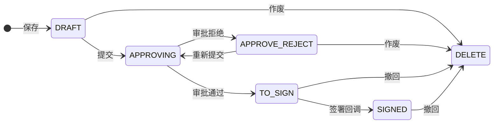

**供应商发起 — 含采购商确认节点**

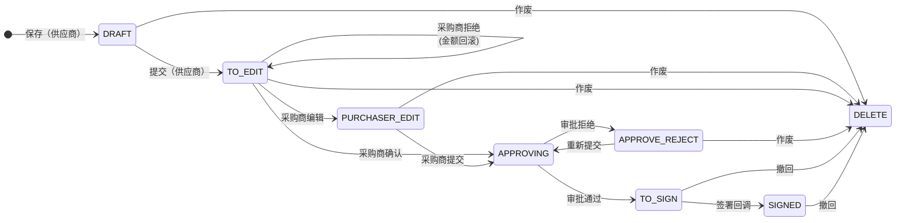

**撤回支线**：待签署或已签署状态下可撤回，在作废基础上额外回滚金额和签署状态

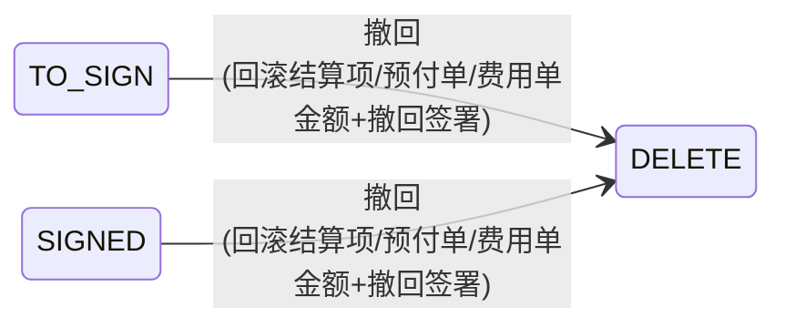

### 状态说明

| 状态 | 中文 | 进入条件 | 允许的操作 |
|------|------|---------|-----------|
| `DRAFT` | 新建 | save() 保存 | 提交、编辑保存、作废 |
| `APPROVING` | 审批中 | 采购商提交 / 供应商提交后采购商确认 | 审批通过/拒绝 |
| `TO_SIGN` | 待签署 | 审批通过 | 等待签署回调、撤回 |
| `SIGNED` | 已签署 | 签署回调成功 | 终态（可撤回至已作废） |
| `APPROVE_REJECT` | 审批拒绝 | 审批被拒 | 重新提交、编辑保存、作废 |
| `TO_EDIT` | 待修改 | 供应商提交后等待采购商确认 / 采购商拒绝 | 采购商确认/拒绝/编辑、供应商作废 |
| `PURCHASER_EDIT` | 采购修改中 | 采购商对供应商对账单发起编辑 | 采购商提交、作废 |
| `DELETE` | 已作废 | cancel() 作废 / 撤回 | 终态 |

## 具体实现

### 创建

* 状态流转：NULL -> 新建 -> 审批中 -> 待签署

* 页面实现

  > * 字段设值
  >
  >   > ```
  >   > 对账数量 = SUM(结算项出入库数量)
  >   > 
  >   > 对账含税金额 = SUM(结算项含税金额)
  >   > 对账未税金额 = SUM(结算项未税金额)
  >   > 对账税额 = 对账含税金额 - 对账未税金额
  >   > 
  >   > 开票含税金额 = 对账含税金额
  >   > 开票未税金额 = 对账未税金额
  >   > 开票税额 = 对账税额
  >   > 
  >   > 应付含税金额 = 开票含税金额 + 支付流费用单使用金额 - 核销流费用单使用金额 - 预付单使用金额
  >   > 应付未税金额 = 应付含税金额 /1+税率/100
  >   > 应付税额 = 应付含税金额 - 应付未税金额
  >   > ```
  >
  > * 初始化数据：基于结算项封装对账单（BC_STATEMENT_BATCH_PREVIEW_SERVICE）
  >
  >   > 1. 校验结算项一致性：采购组织、供应商、币种、税率
  >   >
  >   > 2. 校验结算项状态：已创建
  >   >
  >   > 3. 组装对账单模型：基本信息+关联结算项+关联预付单+关联费用单
  >   >
  >   >    > 1. 初始化基本信息
  >   >    >
  >   >    > 2. 通过选择的结算项构建【关联结算项表】：结算项和对账单通过【关联结算项表】建立关联关系
  >   >    >
  >   >    > 3. 查询符合条件的预付单：用于核销抵扣
  >   >    >
  >   >    >    > ```
  >   >    >    > 采购组织&供应商&税率ID&币种
  >   >    >    > 已支付|部分核销
  >   >    >    > 预付单类型=合同|提前付款
  >   >    >    > 预付单类型=订单|送货单 && 所选结算项的订单ID或送货单ID相同
  >   >    >    > 过滤掉可核销金额为0的预付单
  >   >    >    > ```
  >   >    >
  >   >    > 4. 查询预付单的【结算物料明细】
  >   >    >
  >   >    > 5. 通过【预付单表】及其【结算物料明细】构建【关联预付单表】
  >   >    >
  >   >    >    > ```
  >   >    >    > 1、初始化基本信息：预付单表+结算物料明细
  >   >    >    > 2、设置使用金额（useAmt）
  >   >    >    > - 预付单类型=合同|提前付款：useAmt=预付单可核销金额
  >   >    >    > - 预付单类型=订单|送货单：
  >   >    >    > 	查找所选结算项中被该预付单的结算物料明细影响的结算项：入库结算项+订单ID|送货单行ID
  >   >    >    > 	use = min(预付单可核销金额, 各结算项预付金额之和)：结算项预付金额=订单含税单价*出入库数量*预付比例
  >   >    >    > ```
  >   >    >
  >   >    > 6. 查询符合条件的费用单，并转为【关联费用单】：跟页面上的费用单查询条件不一致
  >   >    >
  >   >    >    > ```
  >   >    >    > 采购组织&供应商&税率ID&币种
  >   >    >    > 已创建|部分支付
  >   >    >    > 付款类型=抵扣
  >   >    >    > 可核销金额|可支付金额 != 0
  >   >    >    > ```
  >
  > * 结算项查询：已创建 + 采购组织&供应商&币种&税率 + 红字开票状态
  >
  >   > 红字开票中的结算项 和 红字开票成功/失败/未开票的结算项 需分批对账
  >
  > * 预付单查询：已支付|部分核销 + 采购组织&供应商&币种&税率
  >
  > * 费用单查询：(已创建|部分支付 | COMMON+已支付|部分核销) + 采购组织&供应商&币种&税率
  >
  >   > 跟初始化数据中费用单查询条件不一致

* 保存

  > 1. 校验
  >
  >    > ```
  >    > 校验结算项红字开票状态：红字开票中的结算项不可和其他红字开票状态的结算项一起对账
  >    > 校验结算项一致性：采购组织、供应商、币种、税率
  >    > 校验结算项状态：已创建
  >    > 
  >    > 对账单.对账数量合计 = sum(结算项.出入库数量)
  >    > 对账单.对账含税金额 = sum(结算项.含税总金额)
  >    > 对账单.对账未税金额 = sum(结算项.未税总金额)
  >    > 对账单.应付含税金额 = sum(结算项.含税总金额) + 【对账单支付】关联的费用单使用金额 - 【对账单核销】关联的费用单使用金额 + 关联的预付单使用金额
  >    > ```
  > 2. 保存【对账单表】
  >
  >    > ```
  >    > 状态：新建
  >    > ```
  >
  > 3. 校验预付单和费用单的使用金额
  >
  >    > ```
  >    > 预付单：使用金额 需小于等于 可核销金额
  >    > 
  >    > 费用单：
  >    > 1、已创建|部分支付 -> 关联类型=STATEMENT_PAY（对账单支付）
  >    > 	正数：使用金额 需小于等于 可支付金额
  >    > 	负数：使用金额 需大于等于 可支付金额
  >    > 2、已支付|部分核销 -> 关联类型=STATEMENT_OFFSET（对账单核销）
  >    > 	正数：使用金额 需小于等于 可核销金额
  >    > 	负数：使用金额 需大于等于 可核销金额
  >    > ```
  >
  > 4. 新增【关联结算项表】
  >
  >    > ```
  >    > 先删除旧的关联关系：对账单ID
  >    > 
  >    > 状态：DRAFT
  >    > 含税单价（对账时）：调价含税单价 优先 订单含税单价
  >    > 未税单价（对账时）：调价未税单价 优先 订单未税单价
  >    > 含税金额（对账时）：含税总金额
  >    > 未税金额（对账时）：未税总金额
  >    > 税额（对账时）：税额
  >    > 结算项ID、对账单ID
  >    > ```
  > 5. 新增【关联预付单表】
  >
  >    > ```
  >    > 先删除旧的关联关系：对账单ID
  >    > 
  >    > 状态：DRAFT
  >    > 预付单ID、对账单ID
  >    > ```
  > 6. 新增【关联费用单表】
  >
  >    > ```
  >    > 先删除旧的关联关系：对账单ID
  >    > 
  >    > 状态：DRAFT
  >    > 批次号：0
  >    > 费用单ID、对账单ID
  
* 提交

  > 1. 执行【保存】逻辑
  >
  > 2. 更新【对账单表】
  >
  >    > ```
  >    > 记录提交人
  >    > 状态=审批中
  >    > ```
  >
  > 3. 更新【结算项表】
  >
  >    > ```
  >    > 结算项状态=已发起
  >    > 对账状态=对账中
  >    > 对账单ID
  >    > 对账含税单价：调价含税单价 优先 订单含税单价
  >    > 对账未税单价：调价未税单价 优先 订单未税单价
  >    > ```
  >
  > 4. 处理预付单关系
  >
  >    > ```
  >    > 关联预付单表：状态=占用、提交人
  >    > 预付单表：可核销金额-=使用金额、核销中金额+=使用金额
  >    > ```
  >
  > 5. 处理关联费用单关系
  >
  >    > ```
  >    > 关联费用单表：状态=占用、提交人
  >    > 费用单表：
  >    > 	已创建|部分支付：可支付金额-=使用金额、支付中金额+=使用金额
  >    > 	已支付|部分核销：可核销金额-=使用金额、核销中金额+=使用金额
  >    > ```
  >
  > 6. 对账单提交审批
  >
  >    > * 审批通过
  >    >
  >    >   > 1. 校验
  >    >   >
  >    >   > 2. 更新【对账单表】
  >    >   >
  >    >   >    > ```
  >    >   >    > 状态=待签署
  >    >   >    > ```
  >    >   >
  >    >   > 3. 处理结算项
  >    >   >
  >    >   >    > ```
  >    >   >    > 对账状态=已对账
  >    >   >    > ```
  >    >   >
  >    >   > 4. 发起对账单签署
  >    >   >
  >    >   >    > ```
  >    >   >    > 签署回调：BC_STATEMENT_ORDER_SIGN_CALLBACK_ACTION
  >    >   >    > 
  >    >   >    > 1、校验
  >    >   >    > 2、更新【对账单表】：状态=已签署
  >    >   >    > ```
  >    >
  >    > * 审批拒绝
  >    >
  >    >   > 1. 校验
  >    >   >
  >    >   > 2. 更新【对账单】
  >    >   >
  >    >   >    > ```
  >    >   >    > 状态=审批拒绝
  >    >   >    > ```
  >    >   >
  >    >   > 3. 处理结算项
  >    >   >
  >    >   >    > ```
  >    >   >    > 结算项表：结算项状态=已创建、对账状态=对账单ID=对账含税单价=对账未税单价=null
  >    >   >    > 关联结算项表：状态=草稿
  >    >   >    > ```
  >    >   >
  >    >   > 4. 处理预付单
  >    >   >
  >    >   >    > ```
  >    >   >    > 预付单表：可核销金额+=使用金额、核销中金额-=使用金额
  >    >   >    > 关联预付单表：状态=草稿
  >    >   >    > ```
  >    >   >
  >    >   > 5. 处理费用单
  >    >   >
  >    >   >    > ```
  >    >   >    > 费用单表：
  >    >   >    > 	已创建|部分支付：可支付金额+=使用金额、支付中金额-=使用金额
  >    >   >    > 	已支付|部分核销：可核销金额+=使用金额、核销中金额-=使用金额
  >    >   >    > 关联费用单表：状态=草稿
  >    >   >    > ```

* 采购商确认/拒绝/编辑

  > * 确认
  >
  >   > 1. 新增【对账单确认记录表】
  >   > 2. 更新【对账单表】：记录提交人、状态=审批中
  >   > 3. 对账单提交审批
  >
  > * 拒绝
  >
  >   > 1. 新增【对账单确认记录表】
  >   >
  >   > 2. 更新【对账单表】：状态=待修改
  >   >
  >   > 3. 处理结算项
  >   >
  >   >    > ```
  >   >    > 结算项表：结算项状态=已创建、对账状态=对账单ID=对账含税单价=对账未税单价=null
  >   >    > 关联结算项表：状态=草稿
  >   >    > ```
  >   >
  >   > 4. 处理预付单
  >   >
  >   >    > ```
  >   >    > 预付单表：可核销金额+=使用金额、核销中金额-=使用金额
  >   >    > 关联预付单表：状态=草稿
  >   >    > ```
  >   >
  >   > 5. 处理费用单
  >   >
  >   >    > ```
  >   >    > 费用单表：
  >   >    > 	已创建|部分支付：可支付金额+=使用金额、支付中金额-=使用金额
  >   >    > 	已支付|部分核销：可核销金额+=使用金额、核销中金额-=使用金额
  >   >    > 关联费用单表：状态=草稿
  >   >    > ```
  >
  > * 编辑：同采购商发起的对账单

### 作废

```
采购商：新建+采购方、审批拒绝
供应商：新建+供应商、待修改|采购修改中

对账单表：状态=已作废
关联结算项表：状态=已作废
关联预付单表：状态=已作废
关联费用单表：状态=已作废
```

### 撤回

```
待签署|已签署

在【作废】逻辑的基础上，回滚金额和签署
结算项表：结算项状态=已创建、对账状态=对账单ID=对账含税单价=对账未税单价=null
关联结算项表：状态=草稿
预付单表：可核销金额+=使用金额、核销中金额-=使用金额
关联预付单表：状态=草稿
费用单表：
	已创建|部分支付：可支付金额+=使用金额、支付中金额-=使用金额
	已支付|部分核销：可核销金额+=使用金额、核销中金额-=使用金额
关联费用单表：状态=草稿
已签署：撤回签署
```

# 发票单

## 业务场景

* 基于【对账单】创建

## 数据模型

**bc_invoice_order**

| 字段                                                      | 说明                                                         |
| --------------------------------------------------------- | ------------------------------------------------------------ |
| `invoiceOrdeStatus`                                       | 发票单状态：DRAFT / CREATED / TO_VERIFY / REJECTED / APPROVING / TO_PAY / PAID / DELETE |
| `supplier`, `supplierCode`, `supplierBank`                | 供应商、收款账户                                             |
| `currency`, `taxRateId`, `taxRate`                        | 币种、税率                                                   |
| `purGroup`, `purOrg`, `purCom`                            | 采购组/采购组织/所属公司                                     |
| `allQty`                                                  | 开票数量合计                                                 |
| `statementIntaxAmt`, `statementExtaxAmt`, `statmentTaxAmt` | 对账含税/未税/税额（来自对账单快照）                       |
| `invoiceIntaxAmt`, `invoiceExtaxAmt`, `invoiceTaxAmt`     | 开票含税/未税/税额（= 对账金额 ± 调差）                     |
| `invoiceDiffIntaxAmt`, `invoiceDiffExtaxAmt`, `invoiceDiffTaxAmt` | 调差：含税/未税/税额差额                              |
| `invoiceAmtTotal`, `invoiceTaxAmtTotal`                   | 发票金额汇总 / 税额汇总（来自 bc_invoice_record OCR 结果）   |
| `payIntaxAmt`, `payExtaxAmt`, `payTaxAmt`                 | 应付含税/未税/税额                                           |
| `relateExpenseFlag`, `relatePrePaymentFlag`               | 是否关联费用单 / 是否关联预付单                              |
| `approvalPassAt`, `approvalPassBy`, `rejectedCause`       | 审批通过时间 / 审批人 / 驳回原因                             |
| `ebsStatus`, `ebsCode`, `ebsMessage`, `entryStatus`       | EBS同步状态/单号/失败原因，发票入账状态                      |

## 操作总览

| 操作           | 触发                                                | 描述                                                         |
| -------------- | --------------------------------------------------- | ------------------------------------------------------------ |
| 创建           | 已签署的对账单                                      | 聚合对账单生成发票单                                         |
| 提交           | DRAFT                                               | DRAFT → CREATED，对账单→INVOICING，结算项→INVOICING          |
| 撤回           | CREATED                                             | CREATED → DRAFT，对账单→SIGNED，结算项开票状态清空           |
| 供应商上传发票 | CREATED\|REJECTED                                   | CREATED\|REJECTED → TO_VERIFY                                |
| 采购商上传发票 | CREATED\|TO_VERIFY\|REJECTED                        | 校验金额 → APPROVING                                         |
| 采购商驳回     | TO_VERIFY                                           | TO_VERIFY → REJECTED                                         |
| 调差           | 关联结算项有税额/含税金额调整                       | 更新关联结算项税额+含税金额，重新计算发票单开票金额          |
| 审批通过       | APPROVING                                           | APPROVING → TO_PAY，对账单→INVOICED，结算项→INVOICED+PAYING，转移金额 |
| 审批拒绝       | APPROVING                                           | APPROVING → TO_VERIFY                                        |
| 审批撤回       | APPROVING                                           | APPROVING → CREATED，回滚关联关系                            |
| 支付回调       | TO_PAY                                              | TO_PAY → PAID，结算项→PAID                                   |
| 作废           | DRAFT\|CREATED\|TO_VERIFY\|REJECTED                 | → DELETE，回滚对账单+结算项                                  |

## 生命周期

发票单状态机涵盖**开票**和**支付**两条主线，外加**撤回**、**审批撤回**和**作废**三条支线。供应商参与时额外经过**供应商上传→采购商确认**节点，与采购商直传形成两条并行的上传路径。

### 发票单状态

**采购商发起 — 主流程**：保存 → 提交 → 上传发票 → 审批 → EBS 支付回调

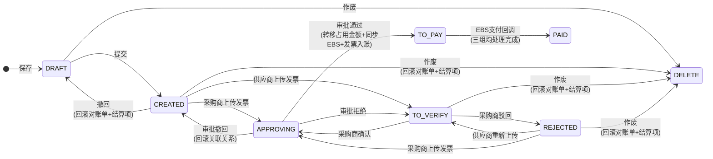

**供应商上传→采购商确认支线**：供应商上传发票后由采购商校验确认或驳回

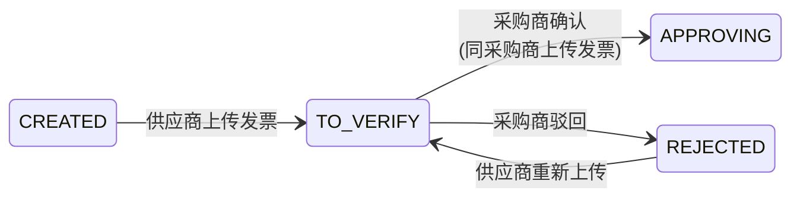

**撤回支线**

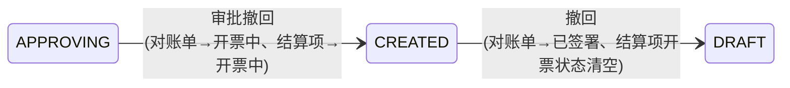

### 状态说明

| 状态 | 中文 | 进入条件 | 允许的操作 |
|------|------|---------|-----------|
| `DRAFT` | 新建 | save() 保存 | 提交、编辑保存、作废 |
| `CREATED` | 已创建 | submit() 提交 | 上传发票、撤回、作废 |
| `TO_VERIFY` | 待校验 | 供应商上传发票 / 审批拒绝 | 采购商确认/驳回/上传、供应商重新上传、作废 |
| `REJECTED` | 已驳回 | 采购商驳回供应商发票 | 供应商重新上传、采购商上传、作废 |
| `APPROVING` | 审批中 | 采购商上传发票确认 | 审批通过/拒绝/撤回 |
| `TO_PAY` | 待支付 | 审批通过 | 等待 EBS 支付回调 |
| `PAID` | 已支付 | EBS 支付回调（三组均完成） | 终态 |
| `DELETE` | 已作废 | cancel() 作废 | 终态 |

### 审批通过时的联动影响

发票单审批通过是结算模块**最重要的业务节点**，触发以下连锁更新：

| 目标 | 操作 | 新状态 |
|------|------|--------|
| 发票单 | 状态更新 | `TO_PAY` |
| 对账单 | 状态+关联发票单ID | `INVOICED` |
| 结算项 | 开票状态+付款状态 | `INVOICED` + `PAYING` |
| 关联结算项表 | 状态 | `USED` |
| 预付单 | 核销中→已核销，状态推进 | `COMPLETE` / `PARTIAL_VERIFIED` |
| 费用单（CREATED/PARTIAL_PAID） | 支付中→已支付，状态推进 | `ALL_PAID` / `CLOSED` / `PARTIAL_PAID` |
| 费用单（ALL_PAID/PARTIAL_VERIFIED） | 核销中→已核销，状态推进 | `CLOSED` / `PARTIAL_VERIFIED` |
| 关联费用单表 | 状态 | `USED` |
| 关联预付单表 | 状态 | `USED` |
| EBS | 分三组同步（-01入库/-02出库销售/-03出库非销售） | — |
| 发票平台 | 异步入账 | — |

## 具体实现

### 创建

* 页面实现

  > * 初始化数据
  >
  >   > 1. 校验
  >   >
  >   >    > ```
  >   >    > 校验采购组织、供应商、币种、税率一致性
  >   >    > 对账单状态=已签署
  >   >    > ```
  >   >
  >   > 2. 组装发票单
  >   >
  >   >    > ```
  >   >    > 对账含税金额、对账未税金额、对账税额：SUM(对账单的对账金额)
  >   >    > 开票含税金额、开票未税金额、开票税额：SUM(对账单的开票金额)
  >   >    > 应付含税金额、应付未税金额、应付税额：SUM(对账单的应付金额)
  >   >    > 开票数量合计：SUM(对账单的对账数量)
  >   >    > 
  >   >    > 【关联对账单表】
  >   >    > ```

* 保存

  > 1. 校验
  >
  >    > ```
  >    > 付款记录申请付款金额之和=应付含税金额
  >    > ```
  >
  > 2. 保存【发票单表】
  >
  >    > ```
  >    > 状态=新建
  >    > ```
  >
  > 3. 新增【关联对账单表】：先删除旧数据
  >
  > 4. 新增【发票单付款记录表】：先删除旧数据

* 提交

  > 1. 执行【保存】逻辑
  >
  > 2. 更新【发票单表】
  >
  >    > ```	
  >    > 状态=已创建
  >    > ```
  >
  > 3. 更新【对账单表】
  >
  >    > ```
  >    > 发票单ID、对账单状态=开票中
  >    > ```
  >
  > 4. 根据对账单更新【结算项表】：发票单ID、开票状态=开票中
  >
  > 5. 根据对账单更新【关联结算项表】：发票单ID

### 上传发票

* 发票附件 -> 开票记录

  > 通过多线程并发调用发票OCR识别和校验接口，然后转为【发票单开票记录表】

* 调差

  > ```
  > 前提：发票单的开票含税金额&开票未税金额&对账税额 需和 发票单开票记录表对应金额总和 相同才可开票
  > 入参模型及使用字段：关联结算项表.含税金额（发票单调差）、关联结算项表.税额（发票单调差）
  > ```
  >
  > 1. 计算旧金额
  >
  >    > ```
  >    > 旧的含税金额=关联结算项表.含税金额|含税金额（对账时），前者优先级高
  >    > 旧的未含税金额=关联结算项表.未含税金额|未含税金额（对账时），前者优先级高
  >    > 旧的税额=关联结算项表.税额|税额（对账时），前者优先级高
  >    > ```
  >
  > 2. 计算新金额
  >
  >    > ```
  >    > 新的含税金额=入参中的关联结算项表.含税金额（发票单调差）
  >    > 新的税额=入参中的关联结算项表.税额（发票单调差）
  >    > 新的未含税金额=新的含税金额-新的税额
  >    > ```
  >
  > 3. 更新【关联结算项】
  >
  >    > ```
  >    > 含税金额=新的含税金额
  >    > 未含税金额=新的未含税金额
  >    > 税额=新的税额
  >    > ```
  >
  > 4. 计算新旧金额的差额，根据差额重新计算发票单的开票含税金额&开票未税金额&对账税额

* 供应商-上传发票

  > 1. 更新【发票单表】
  >
  >    > ```
  >    > 发票单状态=待校验
  >    > ```
  >
  > 2. 新增【发票单开票记录表】：先删除旧数据
  >
  > 3. 采购商确认
  >
  >    > * 同意：同采购商上传发票
  >    >
  >    > * 驳回：发票单状态=已驳回

* 采购商-上传发票

  > * 保存
  >
  >   > 1. 校验
  >   >
  >   >    > ```
  >   >    > 发票单开票记录的发票金额=发票单的开票含税金额：采购蓝票作加法、销售蓝票作减法
  >   >    > 发票单开票记录的税额=发票单的开票税额：采购蓝票作加法、销售蓝票作减法
  >   >    > ```
  >   >
  >   > 2. 新增【发票单付款记录表】：先删除旧数据
  >   >
  >   > 3. 更新【发票单表】
  >   >
  >   >    > ```
  >   >    > 发票金额汇总、发票税额汇总
  >   >    > 发票含税差额、发票未税差额
  >   >    > ```
  >
  > * 确认
  >
  >   > 1. 校验
  >   >
  >   >    > ```
  >   >    > 结算项累计不含税金额（关联结算项表.不含税金额/未税金额（对账时））=发票单.开票未税金额
  >   >    > 发票单开票记录的发票金额=发票单的开票含税金额：采购蓝票作加法、销售蓝票作减法
  >   >    > 发票单开票记录的税额=发票单的开票税额：采购蓝票作加法、销售蓝票作减法
  >   >    > ```
  >   >
  >   > 2. 新增【发票单开票记录表】：先删除旧数据
  >   >
  >   > 3. 更新【发票单表】
  >   >
  >   >    > ```
  >   >    > 发票单状态=审批中
  >   >    > 发票金额汇总、发票税额汇总
  >   >    > 发票含税差额、发票未税差额
  >   >    > ```
  >   >
  >   > 4. 发起【发票单审批】

### 发票单审批

* 通过

  > 1. 更新各表
  >
  >    > ```
  >    > 更新【发票单表】：发票单状态=待支付
  >    > 更新【对账单表】：对账单状态=已开票、发票单ID
  >    > 更新【结算项表】：开票状态=已开票、付款状态=付款中
  >    > 更新【关联结算项表】：发票单ID
  >    > ```
  >
  > 2. 处理金额
  >
  >    > ```
  >    > 关联结算项表：状态=使用
  >    > 
  >    > 关联预付单表：状态=使用
  >    > 预付单：
  >    > 	核销中金额-=使用金额、已核销金额+=使用金额
  >    > 	状态=已完结|部分核销：根据可核销金额和核销中金额判断
  >    > 
  >    > 关联费用单表：状态=使用
  >    > 费用单：
  >    > 	已创建|部分支付：
  >    > 		支付中金额-=使用金额、已支付金额+=使用金额
  >    > 		状态=已支付|已完结|部分核销
  >    > 	已支付|部分核销：
  >    > 		核销中金额-=使用金额、已核销金额+=使用金额
  >    > 		状态=已完结|部分核销
  >    > ```
  >
  > 3. 创建发票单审批通过记录
  >
  > 4. 创建结算外部对接记录并发起EBS同步
  >
  >    > ```
  >    > 根据结算项分组调用：
  >    > 1、入库结算项：-01&发票单付款申请&EBS付款申请
  >    > 2、出库&销售发票结算项：-02&发票单付款申请&EBS付款申请
  >    > 3、出库&非销售发票结算项：-03&发票单付款申请&EBS付款申请
  >    > ```
  >
  > 5. 发票入账
  >
  >    > ```
  >    > 创建结算外部对接记录调用发票OCR接口
  >    > 更新【发票单表.发票入账状态】
  >    > ```
  >    >
  >    > 

* 拒绝：发票单状态=待校验

### 作废

```
1、校验
2、更新【发票单表】：状态-已作废
3、回滚其他数据：【对账单表】、【结算项表】、【关联结算项表】
```

### 详情

```
创建发票单的编辑页中存在结算项、预付单、费用单的信息，这些信息仅供展示：核心是根据【发票单关联的对账单】查询【对账单关联的结算项&预付单&费用单】

结算项的查询：BC_RELATE_SETTLEMENT_ITEM_PAGING_DATA_SERVICE
1、入参：发票单ID（非首次编辑）、对账单ID（首次编辑-单个对账单）、对账单ID集合（首次编辑-多个对账单）
2、如果入参存在发票单ID，则根据【关联对账单表】查询发票单所有的对账单
3、根据【关联结算项表】查询对账单的结算项

预付单的查询：BC_RELATE_PRE_PAYMENT_PAGING_DATA_SERVICE
1、入参：发票单ID（非首次编辑）、对账单ID（首次编辑-单个对账单）、对账单ID集合（首次编辑-多个对账单）
2、如果入参存在发票单ID，则根据【关联对账单表】查询发票单所有的对账单
3、根据【关联预付单表】查询对账单的预付单

费用单的查询：BC_RELATE_EXPENSE_PAGING_DATA_SERVICE
1、入参：发票单ID（非首次编辑）、对账单ID（首次编辑-单个对账单）、对账单ID集合（首次编辑-多个对账单）
2、如果入参存在发票单ID，则根据【关联对账单表】查询发票单所有的对账单
3、根据【关联费用单表】查询对账单的费用单
```

# 外部对接

## 业务场景

* 结算模块不直接以单据维度对接外部系统，而是使用**统一的对接记录表** `bc_settlement_out_order` 集中管理所有外部对接，支持状态追踪、重试和补偿

  > | 字段           | 说明                                              |
  > | -------------- | ------------------------------------------------- |
  > | `businessId`   | 关联的业务单据 ID（费用单/预付单/发票单等的主键） |
  > | `businessCode` | 关联的业务单据编码（如费用单号）                  |
  > | `businessType` | **业务场景**                                      |
  > | `orderType`    | **单据类型**                                      |
  > | `outType`      | **外部对接类型**（对接的目标系统）                |
  > | `outId`        | 外部系统返回的唯一 ID（如 BPM 工作流实例 ID）     |
  > | `outCode`      | 外部系统编码                                      |
  > | `status`       | **状态**                                          |
  > | `callbackJson` | 外部系统回调内容（JSON）                          |
  >
  > * businessType（业务场景 - 什么业务操作触发了外部对接）
  >
  >   > ```
  >   > EXPENSE_PAY：费用单关联凭证审批（BPM）
  >   > EXPENSE_RETURN：费用单追回审批（BPM）
  >   > EXPENSE_RED：费用单红票审批（BPM）
  >   > EXPENSE_INVOICE：费用单发票入账（发票平台）
  >   > PRE_PAYMENT_COMPLETE：预付单完结审批（BPM）
  >   > RED_INVOICE：红字发票审批（BPM）
  >   > EXPENSE_OUT_PAY：费用单付款申请（EBS）
  >   > PRE_PAY_OUT_PAY：预付单付款申请（EBS）
  >   > PRE_VERIFY_OUT_PAY：预付单核销付款申请（EBS）
  >   > INVOICE_OUT_PAY：发票单付款申请（EBS）
  >   > INVOICE_ENTRY：发票单发票平台入账（发票平台）
  >   > ```
  >
  > * orderType（业务单据类型 - 什么类型的单据发起了对接）
  >
  >   > ```
  >   > EXPENSE：费用单
  >   > PRE_PAYMENT：预付单
  >   > RED_INVOICE：红字发票单
  >   > INVOICE：发票单
  >   > ```
  >
  > * outType（外部对接目标 - 对接哪个外部系统）
  >
  >   > ```
  >   > BPM_FLOW：BPM审批流
  >   > EBS_PAY：EBS付款申请
  >   > INVOICE_PLATFORM：发票平台（OCR识别/查验/入账）
  >   > ```
  >
  > * status
  >
  >   > ```
  >   > SENDING：发送中（初始状态，刚创建记录）
  >   > APPROVING：处理中（已成功发送到外部系统，等待回调）
  >   > CALLBACK_ING：回调中
  >   > HANDLED：处理完成
  
* 对接的外部系统：EBS、BPM、发票平台


## EBS 对接

### erp-sett -> EBS

| 场景       | 触发时机       | 同步方法                                                     |
| ---------- | -------------- | ------------------------------------------------------------ |
| 费用单支付 | 支付审批通过后 | `BcThirdPartyClientService#syncExpenseOrderToEbs()`          |
| 费用单退还 | 完结审批通过后 | `BcThirdPartyClientService#syncExpenseOrderToEbs()`          |
| 预付单支付 | 提交审批通过后 | `BcThirdPartyClientService#syncPrePaymentToEbs()`            |
| 预付单核销 | 核销审批通过后 | `BcThirdPartyClientService#syncPrePaymentToEbs()`：无回调    |
| 发票单付款 | 发票审批通过后 | `BcThirdPartyClientService#syncInvoiceOrderToEbs()`：分三组（-01、-02、-03） |

### EBS -> erp-sett

* 调用链：`tsrm-pds.EbsSyncController.payResultSync()` → `ErpSettlementFacade.ebsCallback()` → `BC_SETTLEMENT_OUT_ORDER_EBS_CALLBACK_ACTION` → `BcSettlementOutOrderCallbackService.handleEbsCallback()`

* 回调处理

  > 1. 更新对接记录表：状态=回调中、outId、callbackJson
  >
  > 2. 处理 EBS 附件
  >
  > 3. 根据场景处理：更新EBS关联凭证
  >
  >    > * 费用单
  >    >
  >    >   > | 场景                | 新状态 | 附加操作              |
  >    >   > | ------------------- | ------ | --------------------- |
  >    >   > | 退还                | 已完结 |                       |
  >    >   > | 正常支付 + COMMON   | 已支付 | 可核销金额 = 费用金额 |
  >    >   > | 正常支付 + 非COMMON | 已完结 |                       |
  >    >
  >    > * 预付单付款申请
  >    >
  >    >   > | 场景             | 新状态 | 说明                              |
  >    >   > | ---------------- | ------ | --------------------------------- |
  >    >   > | 申请支付金额 = 0 | 已完结 | 无需实际付款，直接完结            |
  >    >   > | 申请支付金额 > 0 | 已支付 | 已付款，可核销金额 = 申请支付金额 |
  >    >
  >    > * 发票单
  >    >
  >    >   > 发票单会拆成三组（-01/-02/-03）同步 EBS，需**三组均处理完成**才触发：
  >    >   > * `isAllCompleteCallbackInvoiceOrder()` 检查三组对接记录状态是否均为 `HANDLED`
  >    >   > * 满足条件后调用 `payCallback()`：发票单状态=已支付，结算项付款状态=已支付
  >    >   > * 发票单同步 EBS 状态判断：三组状态均为 `APPROVING|CALLBACK_ING|HANDLED` 时，`ebsStatus=SYNC_SUCCESS`
  >
  > 4. 更新对接记录表：状态=处理完成

## BPM 对接

### erp-sett -> BPM

| 场景                     | 触发时机         | 同步方法                                                     | businessType           |
| ------------------------ | ---------------- | ------------------------------------------------------------ | ---------------------- |
| 负数费用单关联凭证       | 关联凭证提交后   | `createOutOrderRecordWithBpm()` → `syncExpenseOrderVoucherToBpm()` | `EXPENSE_PAY`          |
| 正数费用单追回           | 追回提交后       | `createOutOrderRecordWithBpm()` → `syncExpenseOrderVoucherToBpm()` | `EXPENSE_RETURN`       |
| 负数费用单红字发票       | 红字发票提交后   | `createOutOrderRecordWithBpm()` → `syncExpenseOrderVoucherToBpm()` | `EXPENSE_RED`          |
| 预付单完结（有凭证附件） | 预付单完结提交后 | `createOutOrderRecordWithBpm()` → `syncPrePaymentCompleteToBpm()` | `PRE_PAYMENT_COMPLETE` |
| 红字发票审批             | 红字发票单提交后 | `createOutOrderRecordWithBpm()` → `syncRedInvoiceOrderToBpm()` | `RED_INVOICE`          |

### BPM -> erp-sett

* 调用链：`tsrm-pds.BpmSyncController.approveResultSync()` → `ErpSettlementFacade.bpmCallback()` → `BC_SETTLEMENT_OUT_ORDER_BPM_CALLBACK_ACTION` → `BcSettlementOutOrderCallbackService.handleBpmCallback()`

* 回调处理

  > 1. 更新对接记录表：状态=回调中、outId、callbackJson
  >
  > 2. 处理 BPM 附件：attachId 逗号分隔 → `GenBcAttachFileCfRepo` 查询附件 URL → 序列化为 JSON 数组作为收据附件
  >
  > 3. 根据场景处理：BPM 审批结果 01=通过 / 02=拒绝
  >
  >    > * 费用单
  >    >
  >    >   > * 关联凭证（orderType=EXPENSE，businessType=EXPENSE_PAY）
  >    >   >
  >    >   >   > | 审批结果 | 处理方法                 | 状态变更                                  | 金额变更                         | 其他                                                         |
  >    >   >   > | -------- | ------------------------ | ----------------------------------------- | -------------------------------- | ------------------------------------------------------------ |
  >    >   >   > | 01-通过  | `approveUpdateVoucher()` | COMMON → 已支付；非COMMON → 已完结        | 支付中金额清零，累加至已支付金额 | COMMON 类型设置可核销金额=费用金额；isPay=true；关联凭证状态=SUCCESS |
  >    >   >   > | 02-拒绝  | `rejectUpdateVoucher()`  | lastStatus=已创建 ? 审批拒绝 : lastStatus | 可支付金额恢复，支付中金额清零   | isPay=false；关联凭证状态=FAIL                               |
  >    >   >
  >    >   > * 追回（orderType=EXPENSE，businessType=EXPENSE_RETURN）
  >    >   >
  >    >   >   > | 审批结果 | 处理方法          | 状态变更        | 金额变更                 | 其他           |
  >    >   >   > | -------- | ----------------- | --------------- | ------------------------ | -------------- |
  >    >   >   > | 01-通过  | `approveRecall()` | 已完结          | 核销中金额 -> 已核销金额 | isReturn=true  |
  >    >   >   > | 02-拒绝  | `rejectRecall()`  | 恢复 lastStatus | 核销中金额 -> 可核销金额 | isReturn=false |
  >    >   >
  >    >   > * 红票（orderType=EXPENSE，businessType=EXPENSE_RED）
  >    >   >
  >    >   >   > | 审批结果 | 处理方法                       | 状态变更 | 其他                 |
  >    >   >   > | -------- | ------------------------------ | -------- | -------------------- |
  >    >   >   > | 01-通过  | `redInvoiceExpenseOrderPass()` | —        | 红字开票状态=SUCCESS |
  >    >   >   > | 02-拒绝  | `redInvoiceExpenseOrderFail()` | —        | 红字开票状态=FAIL    |
  >    >
  >    > * 预付单
  >    >
  >    >   > * 完结（orderType=PRE_PAYMENT, businessType=PRE_PAYMENT_COMPLETE）
  >    >   >
  >    >   >   > | 审批结果 | 处理方法                                       | 状态变更   | 其他         |
  >    >   >   > | -------- | ---------------------------------------------- | ---------- | ------------ |
  >    >   >   > | 01-通过  | `approveCloseComplete(businessId, attachment)` | 已完结     | 记录收据附件 |
  >    >   >   > | 02-拒绝  | `rejectCloseComplete(businessId)`              | 恢复原状态 | —            |
  >    >
  >    > * 红字发票单
  >    >
  >    >   > * 审批（orderType=RED_INVOICE）
  >    >   >
  >    >   >   > | 审批结果 | 处理方法                                 | 说明                           |
  >    >   >   > | -------- | ---------------------------------------- | ------------------------------ |
  >    >   >   > | 01-通过  | `BcRedInvoiceOrderAppService.callback()` | 结算项.红字发票单状态=开票成功 |
  >    >   >   > | 02-拒绝  | `BcRedInvoiceOrderAppService.callback()` | 结算项.红字发票单状态=开票失败 |
  >
  > 4. 更新对接记录表：状态=处理完成（HANDLED）

## 发票平台对接

* 发票平台对接与 EBS、BPM 不同，无需审批和等待回调，erp-sett 主动调用发票平台 API 完成 OCR 识别、发票查验、发票入账 三个步骤，每次调用直接获取结果（同步调用）

* 关联数据表：bc_invoice_record（发票开票记录）、bc_invoice_order_pay（发票付款记录）

* 发票上传 & OCR 识别 & 查验

  > ```
  > 用户上传发票附件（图片/PDF）
  > → batchUploadBill() 多线程并发处理
  > → BcThirdPartyClientService.entryInvoiceOrderToInvoice()
  > → 步骤1: 调用 invoiceService.recognizeInvoice() — OCR识别发票信息
  > → 步骤2: 调用 invoiceService.verifyInvoice() — 发票查验（真伪+合规）
  > → 结合步骤12封装BcInvoiceRecordDTO（bc_invoice_record）集合，返回给页面（让用户进行下一步）
  > ```
  >
  > 补充：上述是发票单上传发票逻辑，费用单上传发票基本一致，只是直接操作 bc_invoice_record，无需返回给页面
  
* 发票入账

  > ```
  > 发票单审批通过：
  > → approvePassInvoiceOrder()
  > → CompletableFuture.runAsync() — 异步执行，不阻塞主流程
  > → bcSettlementOutOrderAppService.createOutOrderRecord(businessType=INVOICE_ENTRY, outType=INVOICE_PLATFORM)
  > → BcThirdPartyClientService.entryInvoiceToInvoice()
  > → 调用 invoiceService.entryInvoice() — 发票入账
  > 
  > 费用单：
  > → uploadExpenseInvoiceInfo()
  > → bcSettlementOutOrderAppService.createOutOrderRecord(businessType=EXPENSE_INVOICE, outType=INVOICE_PLATFORM)
  > → BcThirdPartyClientService.entryExpenseToInvoice()
  > → 调用 invoiceService.entryInvoice() — 发票入账
  > ```

# 调价机制

## 业务场景

* 价格调整机制确保结算项在生成后、对账前能反映最新的价格协议

  > 实际上，调价函生失效调价会影响所有状态下的结算项：属于业务设计错误，对账后不应该调价

* 结算模块与 `tsrm-price`（价格模块）协作，通过**同步调用**和**MQ消息**两种方式触发价格调整

* 核心概念

  > - 调价函：`tsrm-price` 模块管理的价格协议文档，生效/失效时通过 MQ 通知结算模块
  > - 优先级：特定订单、特定批次号、三种通用日期
  > - 调价日志：每次调价写入 `sett_price_adjust_log` 表，便于审计追溯

## 调价入口

* 入库结算项创建时调价

  > ```
  > BcSettlementItemAction.inboundCreate()
  > → BcSettlementItemAppService.createBcSettlementItem()
  > → BcSettlementPriceService.batchHandleAdjustPrice()
  > ```

* 调价函 MQ 消息

  > ```
  > tsrm-price 发送 MQ (topic: GID_T_SRM, tag: BC_ADJUST_VALID)
  > → BcSettlementAdjustPriceListener.adjustPrice()
  > ```

## 调价优先级

* **查询优先级**：`BcSettlementPriceService.findPriceResult()`

  > 注意：相同优先级，则选择最近生效的调价函
  >
  > | 优先级          | 查询 Key                                              | 说明             |
  > | --------------- | ----------------------------------------------------- | ---------------- |
  > | Level 3（最高） | `supplier/company/material/businessType/batchCode`    | 特定批次号的价格 |
  > | Level 2         | `supplier/company/material/businessType/tradeOrderId` | 特定订单的价格   |
  > | Level 1         | `supplier/company/material/businessType`              | 通用日期的价格   |

* **降级保护**：高优先级价格不会被低优先级覆盖

* **调价范围**：仅处理订单类型为**大货订单**或**超收补单**的结算项

## MQ 调价

注意：特定订单和特定批次号会影响所有符合条件的调价函，而三种日期仅影响未调价或上一次调价类型相同的结算项

| 类型              | 行为                 |
| ----------------- | -------------------- |
| `VALID`（生效）   | 使用新价格更新结算项 |
| `INVALID`（失效） | 回退至订单原始价格   |

| 生效类型                          | 查询条件                                                     |
| --------------------------------- | ------------------------------------------------------------ |
| `RELATE_TRADE`（特定订单）        | 供应商 + 采购公司 + 币种 + 物料 + 订单ID                     |
| `RELATE_BATCH`（特定批次号）      | 供应商 + 采购公司 + 币种 + 物料 + 批次号                     |
| `BY_TRADE_DATE`（按订单下单日期） | 先查符合条件的采购订单 → 再查结算项：结算项对应的采购订单下单日期在有效期内 |
| `BY_STOCK_DATE`（按入库日期）     | 结算项入库日期在有效期内（仅入库方向）                       |
| `BY_SHIPPING_DATE`（按发货日期）  | 结算项发货日期在有效期内                                     |

| Topic       | Tag               | 消费方                            | 触发时机        |
| ----------- | ----------------- | --------------------------------- | --------------- |
| `GID_T_SRM` | `BC_ADJUST_VALID` | `BcSettlementAdjustPriceListener` | 调价函生效/失效 |

## 结算项价格字段

| 字段                 | 说明                       |
| -------------------- | -------------------------- |
| `tradeOrderInTaxPrc` | 下单时含税单价（原始价格） |
| `tradeOrderExTaxPrc` | 下单时未税单价（原始价格） |
| `adjustInTaxPrc`     | 调价后含税单价             |
| `adjustExTaxPrc`     | 调价后未税单价             |
| `statementInTaxPrc`  | 对账时含税单价             |
| `statementExTaxPrc`  | 对账时未税单价             |
