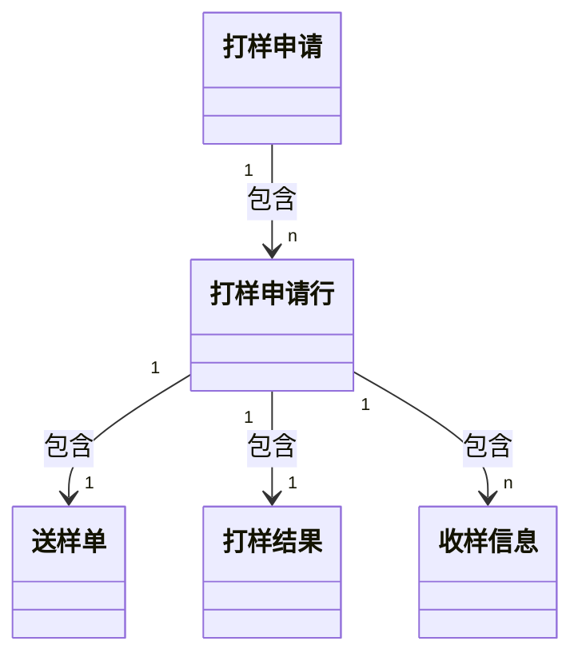

# 打样

## 业务需求

```
核心：采购商向各供应商索要样品
参与角色：采购商-研发、采购商-采购、供应商、采购商-特权（研发+采购）

线上打样：
【采购商-研发】发起打样申请（内含若干个打样申请行）
【采购商-研发】负责人审批：同意则下一步，否则回退
【采购商-采购】选择供应商：各打样申请行需分配给供应商，并生成对应的收样信息&送样单&打样结果
【供应商】响应送样单，发起响应审批：响应信息包括报价、交期等
【采购商-采购】审批：同意则下一步，否则回退
【供应商】送样：送样信息包括物流、预计到达日期
【采购商-研发】收样
【采购商-研发】录入结果
【采购商-采购】费用确认

线下打样：历史单据的记录（没有供应商相关流程，只需记录基本的打样申请信息）
【采购商-研发】发起打样申请
【采购商-研发】负责人审批：直接生成打样结果，无收样信息和送样单
【采购商-研发】录入结果

补充：
1、对于收样信息，一个打样申请行/送样单可有若干个收样信息，但供应商送样时却只有一个送样信息，怎么通过一个送样信息给多个收样信息“发货”
```

## 模型设计

```
========================= 数据表设计 =========================
打样申请：记录打样流程的基础信息，内含若干个打样申请行
打样申请行：记录打样物料的相关信息（需求、供应商、收样信息），一个打样申请行可对应一个送样单、一个打样结果、若干个收样信息
送样单：基于【打样申请+打样申请行】提取出来的信息，以及额外增加用于采购商和供应商完成物料打样流程的信息（主要是送样信息）
打样结果：验收信息（验收数量、验收结果、验收人、验收部门、验收时间）
收样信息：收样信息（收样供应商、收样信息、收样数量）

补充：
1、打样申请行是多级结构，即打样申请行可以存在子行，所以需要设计成自关联，并增加层级相关字段
2、打样申请行、送样单、打样结果三者可合成一个整体模型，但因为业务需求的区分，设计成了三个模型
3、在第2点的基础上，基本没有冗余字段，各模型展示关联模型的字段比较麻烦，且可能存在循环引用（细看【打样申请】的查询详情功能）

========================= 状态流转设计 =========================
打样申请状态：草稿、已提交、待确认供应商、待录入打样结果、已完成、已作废
送样单：待供应商确认、待采购商确认、待送样、送样中、已收样待确认费用、已完成、已取消
```



## 功能实现

* 打样申请

  > * 保存
  >
  >   > ```
  >   > 新增 or 更新：
  >   > 1、新增：新增【打样申请】及【打样申请行】
  >   > 2、更新：更新【打样申请】，更新/新增/删除【打样申请行】
  >   > ```
  >
  > * 提交
  >
  >   > ```
  >   > 1、执行【保存】逻辑
  >   > 2、执行【查询详情】逻辑：用于审批流入参（审批流展示）
  >   > 3、调用审批流：通过/拒绝操作都是更新【打样申请】状态
  >   > 
  >   > 补充-线下打样申请的审批通过和线上打样申请不同，前者需生成对应打样结果，且状态也不同（跳过一部分流程）
  >   > ```
  >
  > * 查询详情
  >
  >   > ```
  >   > 1、查询【打样申请】详情：补充非打样功能外其他关联模型的信息
  >   > 2、根据【打样申请】查询【打样申请行】&【送样单】&【打样结果】&【收样信息】详情：补充非打样功能外其他关联模型的信息
  >   > 3、补充打样功能中相关模型之间的关联关系：【打样申请行】关联【送样单】和【打样结果】、【打样结果】关联【打样申请行】和【打样结果】
  >   > 4、构建【打样申请行】的层级结构：分离子行和孙行 -> 子行关联孙行
  >   > 
  >   > 补充：
  >   > 1、第3步关联时需使用深拷贝，否则会循环依赖
  >   > ```
  >
  > * 选择供应商
  >
  >   > ```
  >   > 1、更新【打样申请】和【打样申请行】：打样信息（打样供应商）和收样信息（收样供应商、收样信息、收样数量），即【找谁要、给谁发】
  >   > 2、生成送样单、打样结果、收样信息
  >   > ```
  >
  > * 录入结果
  >
  >   > ```
  >   > 1、更新【打样结果】：验收信息（验收人、验收时间……）
  >   > 2、判断【打样申请】是否完结：所有【打样结果】的状态是否均为完结态
  >   > 
  >   > 补充-线下打样申请需更新【打样申请行】以及计算【打样申请】的总花费
  >   > ```
  >
  > * 转办
  >
  >   > ```
  >   > 核心业务逻辑：权限转移（采购经理）
  >   > 代码逻辑：更新【打样申请】下【打样申请行】的采购经理，并将转办追加记录在另一个字段（v1->v2->...）
  >   > ```
  >
  > * 复制
  >
  >   > ```
  >   > 1、执行【查询详情】逻辑
  >   > 2、组装数据：【打样申请】、【打样申请行】
  >   > ```
  >
  > * 删除
  >
  >   > ```
  >   > 仅草稿态支持，该状态只存在【打样申请】和【打样申请行】数据，且后者只能基于前者查看，所以删除前者即可
  >   > ```
  >
  > * 作废
  >
  >   > ```
  >   > 1、查询【打样申请行】，若有存在审批中的数据，不支持作废
  >   > 2、更新【打样申请】：状态变更为【已作废】
  >   > 3、更新【打样申请行】：状态变更为【已取消】
  >   > ```
  >
  > * 补充-线下打样流程
  >
  >   > ```
  >   > 相同逻辑：保存、删除、作废、复制
  >   > 提交：状态不同、直接生成打样结果
  >   > 录入结果：更新【打样申请行】、计算【打样申请】的总花费
  >   > ```

* 送样单

  > * 响应
  >
  >   > ```
  >   > 1、更新【送样单】、【打样申请行】：预估成本、承诺送达时间
  >   > 2、执行【查询详情】逻辑：用于审批流入参（审批流展示）
  >   > 3、送样单响应审批：通过/拒绝操作都是更新【送样单】状态
  >   > ```
  >
  > * 送样
  >
  >   > ```
  >   > 更新【送样单】、【打样申请行】：送样信息（送样人、送样方式、送样数量）
  >   > ```
  >
  > * 收样
  >
  >   > ```
  >   > 更新【送样单】、【打样申请行】
  >   > 判断【打样申请】下所有【打样申请行】/【送样单】是否完结，以便录入结果：使用一个布尔字段记录，后取消
  >   > ```
  >
  > * 确认费用
  >
  >   > ```
  >   > 更新【送样单】、【打样申请行】：实际花费
  >   > ```
  >
  > * 查看详情：核心思想同【打样申请】的查看详情
  >
  >   > ```
  >   > 1、查询【送样单】详情：补充非打样功能外其他关联模型的信息
  >   > 2、查询并补充【打样申请】、【打样申请行】详情：补充非打样功能外其他关联模型的信息
  >   > ```
  >
  > * 取消
  >
  >   > ```
  >   > 1、校验：除【待供应商确认】和【带送样】外状态不支持、【审批中】不支持
  >   > 2、更新【送样单】：状态变更为【已取消】
  >   > 3、判断【打样申请】下所有【打样申请行】/【送样单】是否完结，以便录入结果：使用一个布尔字段记录，后取消
  >   > ```

## 补充

```
====================== 数据隔离权限 ======================
对于打样相关单据，采购商方面仅单据的申请人和采购经理可见，供应商方面仅可见各自的单据，但存在特权角色可查看所有单据
采购商端：判断登录人是否特权角色 -> 查询数据时将单据的申请人&采购经理和当前登录人作为条件
供应商端：判断登录人是否特权角色 -> 查询数据时将单据的供应商和当前登录人所属公司作为条件

====================== 菜单&按钮权限 ======================
基于Trantor的角色权限，给指定的角色赋权：菜单、按钮
```