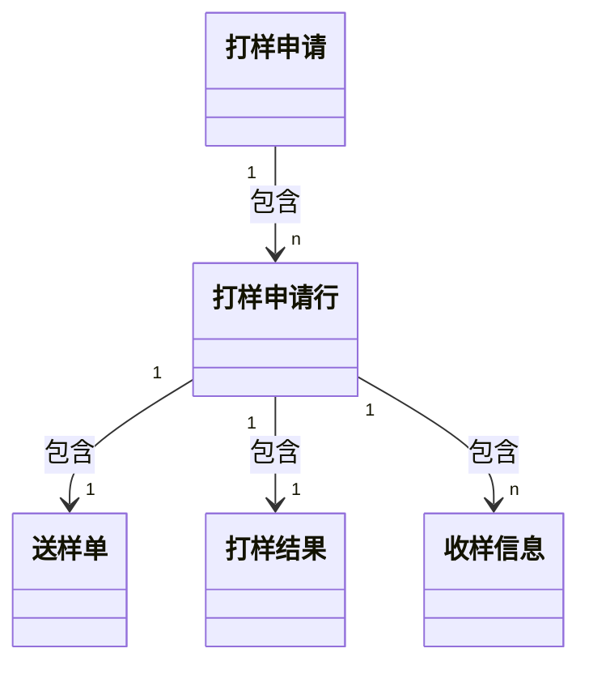
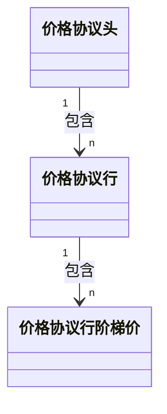

# 总结

## 清道夫

```
T0：根据【功能按钮】【模型字段-状态/类型】推出业务流程，知道业务单据有几种路径，各路径中的状态变更，各状态节点之间进行了什么操作
```

模块化理解，然后化零为整：各功能模块先拆开分析，后续再整合分析
不要忽略PRD，最开始应该通过PRD站在PD的角度思考，然后再以开发人员的角度思考

1. 参与角色、参与模型、业务实际应用场景

   > > 注意：不要看代码！不然会发散！
   >
   > * 参与模型：相关单据
   >
   > * 业务实际应用场景：【整体主要流程】和【各模块主要流程】的实际意义
   >
   >   > 主要流程是为了清楚业务流程的走向，不用细致到具体操作：比如 A->B1->B2->B3->D、A->C1->C2->D 这两条流程都是 A->D，直接简化成 A->B->D 和 A->C->D

2. 各模块具体流程、整合各模块具体流程

   > 注意：不要看代码！不然会发散！

3. 结合按钮/功能具体实现分析业务流程

   > 注意：开始需要分析代码
   >
   > 目的：各按钮/功能的具体逻辑以及在业务流程中的作用

# 打样

## 业务需求

```
核心：采购商向各供应商索要样品
参与角色：采购商-研发、采购商-采购、供应商、采购商-特权（研发+采购）

线上打样：
【采购商-研发】发起打样申请（内含若干个打样申请行）
【采购商-研发】负责人审批：同意则下一步，否则回退
【采购商-采购】选择供应商：各打样申请行需分配给供应商，并生成对应的收样信息&送样单&打样结果
【供应商】响应送样单，发起响应审批：响应信息包括报价、交期等
【采购商-采购】审批：同意则下一步，否则回退
【供应商】送样：送样信息包括物流、预计到达日期
【采购商-研发】收样
【采购商-研发】录入结果
【采购商-采购】费用确认

线下打样：历史单据的记录（没有供应商相关流程，只需记录基本的打样申请信息）
【采购商-研发】发起打样申请
【采购商-研发】负责人审批：直接生成打样结果，无收样信息和送样单
【采购商-研发】录入结果

补充：
1、对于收样信息，一个打样申请行/送样单可有若干个收样信息，但供应商送样时却只有一个送样信息，怎么通过一个送样信息给多个收样信息“发货”
```

## 模型设计

```
========================= 数据表设计 =========================
打样申请：记录打样流程的基础信息，内含若干个打样申请行
打样申请行：记录打样物料的相关信息（需求、供应商、收样信息），一个打样申请行可对应一个送样单、一个打样结果、若干个收样信息
送样单：基于【打样申请+打样申请行】提取出来的信息，以及额外增加用于采购商和供应商完成物料打样流程的信息（主要是送样信息）
打样结果：验收信息（验收数量、验收结果、验收人、验收部门、验收时间）
收样信息：收样信息（收样供应商、收样信息、收样数量）

补充：
1、打样申请行是多级结构，即打样申请行可以存在子行，所以需要设计成自关联，并增加层级相关字段
2、打样申请行、送样单、打样结果三者可合成一个整体模型，但因为业务需求的区分，设计成了三个模型
3、在第2点的基础上，基本没有冗余字段，各模型展示关联模型的字段比较麻烦，且可能存在循环引用（细看【打样申请】的查询详情功能）

========================= 状态流转设计 =========================
打样申请状态：草稿、已提交、待确认供应商、待录入打样结果、已完成、已作废
送样单：待供应商确认、待采购商确认、待送样、送样中、已收样待确认费用、已完成、已取消
```



## 功能实现

* 打样申请

  > * 保存
  >
  >   > ```
  >   > 新增 or 更新：
  >   > 1、新增：新增【打样申请】及【打样申请行】
  >   > 2、更新：更新【打样申请】，更新/新增/删除【打样申请行】
  >   > ```
  >
  > * 提交
  >
  >   > ```
  >   > 1、执行【保存】逻辑
  >   > 2、执行【查询详情】逻辑：用于审批流入参（审批流展示）
  >   > 3、调用审批流：通过/拒绝操作都是更新【打样申请】状态
  >   > 
  >   > 补充-线下打样申请的审批通过和线上打样申请不同，前者需生成对应打样结果，且状态也不同（跳过一部分流程）
  >   > ```
  >
  > * 查询详情
  >
  >   > ```
  >   > 1、查询【打样申请】详情：补充非打样功能外其他关联模型的信息
  >   > 2、根据【打样申请】查询【打样申请行】&【送样单】&【打样结果】&【收样信息】详情：补充非打样功能外其他关联模型的信息
  >   > 3、补充打样功能中相关模型之间的关联关系：【打样申请行】关联【送样单】和【打样结果】、【打样结果】关联【打样申请行】和【打样结果】
  >   > 4、构建【打样申请行】的层级结构：分离子行和孙行 -> 子行关联孙行
  >   > 
  >   > 补充：
  >   > 1、第3步关联时需使用深拷贝，否则会循环依赖
  >   > ```
  >
  > * 选择供应商
  >
  >   > ```
  >   > 1、更新【打样申请】和【打样申请行】：打样信息（打样供应商）和收样信息（收样供应商、收样信息、收样数量），即【找谁要、给谁发】
  >   > 2、生成送样单、打样结果、收样信息
  >   > ```
  >
  > * 录入结果
  >
  >   > ```
  >   > 1、更新【打样结果】：验收信息（验收人、验收时间……）
  >   > 2、判断【打样申请】是否完结：所有【打样结果】的状态是否均为完结态
  >   > 
  >   > 补充-线下打样申请需更新【打样申请行】以及计算【打样申请】的总花费
  >   > ```
  >
  > * 转办
  >
  >   > ```
  >   > 核心业务逻辑：权限转移（采购经理）
  >   > 代码逻辑：更新【打样申请】下【打样申请行】的采购经理，并将转办追加记录在另一个字段（v1->v2->...）
  >   > ```
  >
  > * 复制
  >
  >   > ```
  >   > 1、执行【查询详情】逻辑
  >   > 2、组装数据：【打样申请】、【打样申请行】
  >   > ```
  >
  > * 删除
  >
  >   > ```
  >   > 仅草稿态支持，该状态只存在【打样申请】和【打样申请行】数据，且后者只能基于前者查看，所以删除前者即可
  >   > ```
  >
  > * 作废
  >
  >   > ```
  >   > 1、查询【打样申请行】，若有存在审批中的数据，不支持作废
  >   > 2、更新【打样申请】：状态变更为【已作废】
  >   > 3、更新【打样申请行】：状态变更为【已取消】
  >   > ```
  >
  > * 补充-线下打样流程
  >
  >   > ```
  >   > 相同逻辑：保存、删除、作废、复制
  >   > 提交：状态不同、直接生成打样结果
  >   > 录入结果：更新【打样申请行】、计算【打样申请】的总花费
  >   > ```

* 送样单

  > * 响应
  >
  >   > ```
  >   > 1、更新【送样单】、【打样申请行】：预估成本、承诺送达时间
  >   > 2、执行【查询详情】逻辑：用于审批流入参（审批流展示）
  >   > 3、送样单响应审批：通过/拒绝操作都是更新【送样单】状态
  >   > ```
  >
  > * 送样
  >
  >   > ```
  >   > 更新【送样单】、【打样申请行】：送样信息（送样人、送样方式、送样数量）
  >   > ```
  >
  > * 收样
  >
  >   > ```
  >   > 更新【送样单】、【打样申请行】
  >   > 判断【打样申请】下所有【打样申请行】/【送样单】是否完结，以便录入结果：使用一个布尔字段记录，后取消
  >   > ```
  >
  > * 确认费用
  >
  >   > ```
  >   > 更新【送样单】、【打样申请行】：实际花费
  >   > ```
  >
  > * 查看详情：核心思想同【打样申请】的查看详情
  >
  >   > ```
  >   > 1、查询【送样单】详情：补充非打样功能外其他关联模型的信息
  >   > 2、查询并补充【打样申请】、【打样申请行】详情：补充非打样功能外其他关联模型的信息
  >   > ```
  >
  > * 取消
  >
  >   > ```
  >   > 1、校验：除【待供应商确认】和【带送样】外状态不支持、【审批中】不支持
  >   > 2、更新【送样单】：状态变更为【已取消】
  >   > 3、判断【打样申请】下所有【打样申请行】/【送样单】是否完结，以便录入结果：使用一个布尔字段记录，后取消
  >   > ```

## 补充

```
====================== 数据隔离权限 ======================
对于打样相关单据，采购商方面仅单据的申请人和采购经理可见，供应商方面仅可见各自的单据，但存在特权角色可查看所有单据
采购商端：判断登录人是否特权角色 -> 查询数据时将单据的申请人&采购经理和当前登录人作为条件
供应商端：判断登录人是否特权角色 -> 查询数据时将单据的供应商和当前登录人所属公司作为条件

====================== 菜单&按钮权限 ======================
基于Trantor的角色权限，给指定的角色赋权：菜单、按钮
```

# 价格协议

## 业务需求

* 基本概念

  > * 申请单：某个供应商+物料的组合价格协议
  >
  > * 调价函：
  >
  > * 价格库：价格协议
  >
  > * 补充
  >
  >   > * 申请单和调价函虽然都会生成价格协议，但二者存在差别
  
* 特殊业务需求

  > * 生效类型=按特定订单/按特定批次号 or 生效类型=三种日期
  >
  >   > ```
  >   > isEffective：按特定订单/按特定批次号的价格协议是 false（不能看作正常的价格协议）
  >   > 
  >   > 按特定订单/按特定批次号的价格协议：不会被“新价格协议”失效，因为使用（调价）时选择最新生效的
  >   > ```

## 模型设计

* 价格单据头信息：con_pri_aggrement_head_tr

  > ```
  > ================================== 枚举 ==================================
  > 单据类型：申请单、调价函
  > 价格来源：手工创建、询报价
  > 单据状态：新建、已作废、审批中、审批通过、审批拒绝、已失效
  > 签署方式：线上、线下
  > 签署状态：待发起、待签署、签署中、已签署、已拒绝、已撤回
  > 生效类型：按特定订单、按特定批次号、按订单下单日期、按入库日期、按发货日期
  > 协议状态：已生效、已失效、待生效、草稿
  > ================================== 其他 ==================================
  > 生效日期、失效日期、签署生效日期
  > 采购组、采购组织、采购公司、供应商：组织维度
  > ```
  
* 价格单据物料行信息：con_pri_agreement_item_tr

  > ```
  > ================================== 枚举 ==================================
  > 单据类型：申请单、调价函
  > 价格类型：一口价、阶梯价
  > 状态：已生效、已失效、待生效、草稿、已作废
  > 失效原因：协议到期、手动失效、调价函失效
  > 业务类型：采购、返修、折价回收
  > 生效类型：按特定订单、按特定批次号、按订单下单日期、按入库日期、按发货日期
  > ================================== 其他 ==================================
  > 物料、类目
  > 含税单价、未税基准价格、税
  > 采购含税单价、折扣率（%）、涨幅比（%）、调整后价格、调整前价格
  > 有效期开始、有效期结束、生效日期、失效日期
  > 采购组、采购组织、采购公司、供应商：组织维度
  > 复制于协议行id：指向旧的价格协议行
  > 
  > ================================== 特殊-快速索引 ==================================
  > 补充：【生效类型=特定订单/特定批次号】的价格协议（调价函）使用特定的索引进行查询，其他价格协议使用通用的索引查询
  > 价格库查询快速索引（通用）：/供应商ID/适用采购公司ID/物料ID/业务类型
  > 调价函特定订单索引（仅适用于【生效类型=特定订单】的调价函）：/供应商ID/适用采购公司ID/物料ID/业务类型/订单ID
  > 调价函特定批次号索引（仅适用于【生效类型=特定批次号】的调价函）：/供应商ID/适用采购公司ID/物料ID/业务类型/批次号
  > ```

* 采购价格协议行的阶梯价格：con_pri_agt_tired_link_tr

  > ```
  > 起始数量、截止数量、阶梯价格（未税）、阶梯价格（含税）
  > ```



## 功能实现

### 基本功能

* 保存/提交 -> 签署

  > * 保存/提交：价格申请单和调价函相同
  >
  >   > * 保存
  >   >
  >   >   > 1. 校验
  >   >   >
  >   >   >    > ```
  >   >   >    > 提交时的严格校验-申请单：
  >   >   >    > 1、物料的采购主体=价格协议的适用公司
  >   >   >    > 2、供应商和适用采购组织之间有没有相关物料类目的合作关系
  >   >   >    > 3、价格协议行避免重复：物料+业务类型
  >   >   >    > 4、判断是否冲突：根据【价格库查询快速索引】查询是否存在【已生效/待生效/草稿】的价格协议行，再根据日期判断是否重叠，避免存在相同日期下存在两个生效的价格协议行
  >   >   >    > 5、同上，判断是否存在【审批中】的价格协议行，但不进行报错，直接忽略
  >   >   >    > 
  >   >   >    > 提交时的严格校验-调价函：
  >   >   >    > 1、生效类型=特定订单/特定批次号：判断是否存在相同条件下生失效时间重叠的调价函
  >   >   >    > 2、生效类型=三种日期：校验指向的旧价格协议是否存在及状态是否符合、判断是否存在相同条件下生失效时间重叠的调价函
  >   >   >    > ```
  >   >   >
  >   >   > 2. 新增/更新【价格协议头】
  >   >   >
  >   >   >    > ```
  >   >   >    > 状态：草稿
  >   >   >    > ```
  >   >   >
  >   >   > 3. 新增/更新【价格协议行】
  >   >   >
  >   >   >    > ```
  >   >   >    > 删除旧【价格协议行】：根据行号判断是否在此次提交的数据中，不在则删除
  >   >   >    > 填充信息：部分头信息、状态-草稿
  >   >   >    > 调价函生成查询Key
  >   >   >    > 新增【价格协议行阶梯价】：先删再增
  >   >   >    > 新增【价格协议行适用库存组织】：先删再增
  >   >   >    > ```
  >   >   >
  >   >   > 4. 新增/更新【付款规则明细】：TODO-MQ消息
  >   >
  >   > * 提交
  >   >
  >   >   > 1. 同【保存】（通过一个标识字段特殊处理）
  >   >   >
  >   >   >    > ```
  >   >   >    > 【价格协议头】：状态-审批中
  >   >   >    > ```
  >   >   >
  >   >   > 2. 审批流：价格申请审批、调价函审批
  >   >   >
  >   >   >    > 两个审批流的审批节点方法均相同
  >   >   >
  >   >   > 3. 审批通过
  >   >   >
  >   >   >    > ```
  >   >   >    > 1、启用价格协议
  >   >   >    > 	【价格协议头】：待生效、待签署、审批通过
  >   >   >    > 	【价格协议行】：草稿
  >   >   >    > 2、调用签署任务：创建法大大签署任务
  >   >   >    > ```
  >   >   >
  >   >   > 4. 审批拒绝
  >   >   >
  >   >   >    > ```
  >   >   >    > 【价格协议头】：草稿、审批拒绝
  >   >   >    > ```
  >
  > * 签署回调
  >
  >   > > ```
  >   > > TSRM_PRICE_SING_SUCCESS_ACTION：Mock接口
  >   > > TSRM_PRICE_SING_CALLBACk_ACTION：真正的接口
  >   > > TSRM_PRICE_START_SIGN_ACTION：重新签署
  >   > > ```
  >   >
  >   > * 价格申请单
  >   >
  >   >   > 1. 更新【价格协议头】
  >   >   >
  >   >   >    > ```
  >   >   >    > 签署状态-已签署/已拒绝/已撤回
  >   >   >    > 状态-已生效/待生效/草稿
  >   >   >    > 签署日期
  >   >   >    > ```
  >   >   >
  >   >   > 2. 更新【价格协议行】
  >   >   >
  >   >   >    > ```
  >   >   >    > 状态-已生效/待生效/草稿
  >   >   >    > 生效日期
  >   >   >    > ```
  >   >   >    
  >   >   > 3. 消息通知
  >   >
  >   > * 调价函
  >   >
  >   >   > 1. 失效旧的【价格协议行】
  >   >   >
  >   >   >    > ``` 
  >   >   >    > 依据：【价格协议行】的fromAgtItem
  >   >   >    > 仅处理【生效类型=按订单下单日期|按入库日期|按发货日期】
  >   >   >    > ```
  >   >   >
  >   >   > 2. 更新【价格协议头】
  >   >   >
  >   >   >    > ```
  >   >   >    > 签署状态-已签署/已拒绝/已撤回
  >   >   >    > 状态-已生效/待生效/草稿
  >   >   >    > 签署日期
  >   >   >    > ```
  >   >   >
  >   >   > 3. 更新【价格协议行】
  >   >   >
  >   >   >    > ```
  >   >   >    > 签署状态-已签署/已拒绝/已撤回
  >   >   >    > 状态-已生效/待生效/草稿
  >   >   >    > 生效日期
  >   >   >    > 价格
  >   >   >    > 查询键
  >   >   >    > ```
  >   >   >
  >   >   > 4. 发送 MQ 消息通知结算模块：影响结算项价格重新计算
  >   >   >
  >   >   > 5. 消息通知

* 定时任务

  > * 失效定时任务：PRICE_AGT_EE_TASK_JOB
  >
  >   > 1. 查询失效的【价格协议行】
  >   > 2. 更新【价格协议行】
  >   > 3. 根据行数量和失效行数量判断是否需要更新【价格协议头】
  >   > 4. 以【价格协议行】为维度发送失效的MQ消息
  >
  > * 生效定时任务：PRICE_AGT_ENABLE_TASK_JOB
  >
  >   > 1. 查询生效的【价格协议行】
  >   > 2. 更新【价格协议行】
  >   > 3. 失效旧的【价格协议行】
  >   > 4. 更新【价格协议头】
  >   > 5. 以【价格协议头】为维度发送调价函生效的MQ消息给结算模块

* 其他

  > * 作废：仅支持单据状态=新建/审批拒绝的数据，只会更新头行状态为已作废
  > * 删除：仅支持协议状态=草稿的数据，删除头行
  > * 取消：未签署完成的数据，回退至新建状态

### 采购履约

* 订单下单查询价格协议：TSRM_PRICE_MATCH_PRC_FOR_ORDER_ACTION

  > > 批量查询接口（多线程实现）：TSRM_BATCH_PRICE_MATCH_PRC_FOR_ORDER_ACTION
  >
  > 1. 校验入参
  >
  > 2. 查询【价格协议行】
  >
  >    > ```
  >    > 条件：
  >    > 1、物料&供应商&采购公司&业务类型
  >    > 2、当前时间在 [生效日期,失效日期] 之间
  >    > 3、已生效状态、isEffective=true
  >    > ```
  >
  > 3. 校验查询结果
  >
  >    > ```
  >    > 数量有且为1
  >    > ```
  >
  > 4. 封装查询结果
  >
  >    > ```
  >    > 价格、阶梯价信息
  >    > ```
  >
  > 5. 一品多供场景（一个产品多个供应商）
  >
  >    > ```
  >    > 同样的查询条件，排除当前供应商，查询是否存在其他供应商提供的价格更低
  >    > ```

* 送货单入库生成结算项查询价格协议：TSRM_PRICE_QUERY_ALL_DATA_ACTION

  > ```
  > ================================== 补充 ==================================
  > 原逻辑 or 新逻辑：查询三种日期相关的价格协议时，使用当前时间还是三种日期
  > 1、新逻辑的查询入参中会携带【结算项ID和三种日期】：携带则调新逻辑，不携带则调原逻辑
  > 2、新逻辑查询结果进入Map时，key在价格库查询快速索引的基础上加上结算项ID：后续流程都需要靠这个逻辑使用（第二步的【选择优先级最高的价格协议】以及调用方的使用）
  > ```
  >
  > 1. 查询价格协议
  >
  >    > ```
  >    > 批次号查询：
  >    > 1、查询条件：调价函特定批次号索引、已生效的调价函、当前时间在[有效期开始,失效日期]之间
  >    > 2、优先级：若查询结果不止一条，则按【最近生效->最快生效->默认第一个】优先级选择（最快生效不可能-查询条件要求已生效）
  >    > 
  >    > 特定订单查询：
  >    > 1、查询条件：调价函特定订单索引、已生效的调价函、当前时间在[有效期开始,失效日期]之间
  >    > 2、优先级：同【批次号查询】
  >    > 
  >    > 三种日期查询-原逻辑（不含结算项ID）：
  >    > 1、查询条件：价格库查询快速索引、已生效的调价函、当前时间在[有效期开始,失效日期]之间、生效类型=三种日期
  >    > 2、优先级：同【批次号查询】
  >    > 
  >    > 三种日期查询-新逻辑（含结算项ID）：
  >    > 1、查询条件：价格库查询快速索引、已生效的调价函、下单日期/入库日期/发货日期在在[有效期开始,失效日期]之间
  >    > 2、优先级：同【批次号查询】
  >    > ```
  >
  > 2. 选择优先级最高的价格协议
  >
  >    > ```
  >    > 优先级：批次号|特定订单 > 三种日期
  >    > 
  >    > 1、优先从【批次号|特定订单】的查询结果中选择：二者均存在则选最新生效、仅存在一个则直接返回
  >    > 2、选择【三种日期】的价格协议：根据查询入参是否携带结算项ID，从原逻辑/新逻辑的查询结果选择
  >    > ```

* 总结

  > * 订单下单时，查询的价格协议不限于申请单和调价函，只要过滤【批次号|特定订单】即可，此时系统能保证只有一个对应的价格协议；而送货单入库生成结算项时，查询的价格协议仅限于调价函，且支持【批次号|特定订单】，此时进行的其实是“调价环节”，因为下单和生成结算项之间存在时间差，可能会有新的调价函（价格协议）生效
  >
  >   > 【批次号|特定订单】：特殊的调价函，生成的价格协议不用于正常的价格查询，只用于“调价环节”

### 结算

* 结算模块处理调价MQ消息：调价函生效/失效影响结算项

  > ```
  > 手动发送MQ消息：PRICE_ADJUST_SETTLEMENT_ACTION
  > 监听MQ消息：erp-sett下的BcSettlementAdjustPriceListener
  > ```
  >
  > 1. 查询需要调价的结算项
  >
  >    > ```
  >    > 生效类型=按指定订单：根据【供应商、采购公司、币种、物料、订单】查询
  >    > 生效类型=按批次号：根据【供应商、采购公司、币种、物料、批次号】查询
  >    > 
  >    > 生效类型=按订单下单日期：
  >    > 1、根据【供应商、采购公司、币种、物料、订单下单日期、价格协议行生失效日期】查询
  >    > 2、先查采购订单，再结合采购订单查结算项
  >    > 生效类型=按入库日期：根据【供应商、采购公司、币种、物料、结算项入库日期、价格协议行生失效日期】查询
  >    > 生效类型=按发货日期：根据【供应商、采购公司、币种、物料、结算项发货日期、价格协议行生失效日期】查询
  >    > ```
  >
  > 2. 过滤结算项
  >
  >    > ```
  >    > 1、生效类型：
  >    > 生效类型=按指定订单|按批次号：不过滤
  >    > 生效类型=按订单下单日期|按入库日期|按发货日期：过滤掉上一次调价类型和此次调价类型不一样的结算项
  >    > 2、订单类型：仅处理【订单类型=大货订单|超收补单】
  >    > ```
  >
  > 3. 调价
  >
  >    > ```
  >    > 生效调价：使用新价格
  >    > 失效调价：回退至下单时价格
  >    > ```

# 采购履约：TODO

```
采购订单：
交货计划：

退货订单：
送货单：供应商向BC发货，基于采购订单或交货计划创建
BC逆向送货单：BC向供应商发货（退货），基于退货订单创建

采购履约单据概念：
1、采购订单（bc_pur_po_head_tr）、退货订单（bc_reverse_pur_po_head_tr）：
2、送货单、逆向送货单：
3、

```

# 结算

## 注意

```
就这样吧，细节不追究了，跟屎一样的业务和代码
主流程就是：基于采购履约创建结算项->根据结算项生成对账单（关联费用单/预付单）->对账单开票生成发票单
```


```
泳道图：TODO，主要是参与对象（供应商/采购商）


费用单
支付功能：部分支付的费用单是怎么产生的？
退还、追回：钱从可核销金额->已核销金额，所以算核销？


支付：已创建|部分支付->已支付|已完结
	付款类型=支付，直接完结，否则可用于其他流程（已支付）
关联凭证：已创建|部分支付->已支付|已完结
	同【支付】，金额类型不同
追回：
退还：
完结：
预付单核销费用单：负数+已创建|部分支付 ->已支付|已完结|部分支付
对账单核销费用单-发票单审批通过：负数&抵扣+已创建|部分支付 -> 已支付|已完结|部分核销

根据状态流转图统计多少种场景
已创建->已完结：
已创建->已支付->已完结：
已创建->部分支付->已完结：
已创建->部分支付->已支付->已完结：
已创建->部分支付->部分核销->已完结：
已创建->部分核销->已完结：


预付单-YF202602070001创建时关联负数费用单：EP202602070001-抵扣、EP202602070002-支付/抵扣

本次预付金额+费用单可支付金额（负数）之和=申请付款金额
关联费用单表：使用金额=费用单金额，存在正负数

金额使用正负决定方向


采购组织&供应商&税率ID&币种
已创建|部分支付
付款类型=抵扣
可核销金额或可支付金额 != 0
```

## 业务需求

* 结算模块的上游是采购履约模块：采购履约单据 -> 结算项

* 参与角色 & 参与模型

  > * 参与角色
  >
  >   > * 采购商/白贝壳/BC：采购部门、结算部门、财务部门
  >   > * 供应商
  >
  > * 参与模型
  >
  >   > * 费用单：BC和供应商之间的费用明细
  >   >
  >   >   > 可以是BC给供应商钱（正数），也可以是供应商给BC钱（负数）
  >   >
  >   > * 预付单：先付款后履约场景，BC提前向供应商支付的费用凭证
  >   >
  >   > * 结算项：采购履约下交易产生的具体款项条目
  >   >
  >   > * 对账单：汇总指定结算项的核对凭证，用于双方账目确认
  >   >
  >   > * 发票单：税务凭证
  
* 核心主流程：采购履约单据 -> 结算项 -> 对账单 -> 发票单

  > 1. 采购履约相关单据生成结算项
  > 2. 基于结算项生成对账单（可关联费用单和预付单）
  > 3. 基于对账单生成发票单

## 费用单

### 模型设计

* 费用单表：bc_expense_order

  > ```
  > 费用单状态：已作废、新建、已创建、审批中、审批拒绝、支付中、部分支付、已支付、部分核销、完结审批中、已完结
  > 
  > 金额类型
  > 1、枚举值：正数、负数
  > 2、由费用金额的正负决定，正数是BC向供应商支付，负数是供应商向BC支付
  > 
  > 付款类型：
  > 1、枚举值：支付、抵扣、支付/抵扣
  > 2、付款类型=支付，费用金额需为正数；付款类型=抵扣，费用金额需为负数；付款类型=支付/抵扣，费用金额无限制
  > 
  > 费用金额：费用单金额
  > 申请付款金额：用于页面提交支付金额
  > 可支付金额、支付中金额、已支付金额：支付流程
  > 可核销金额、核销中金额、已核销金额：核销流程
  > 
  > 费用类型：库内返工费、备料款、返修费、加工费、制版费、打样费、模具费、罚款、质保金、返利、订单附加费（上机/小缸费）、代发配件/运费、提前付款贴现、试产费、报废
  > 
  > 费用单来源：BPM流程、手工创建、飞书合同、SRM订单
  > 关联订单、关联合同：基于上游单据创建
  > 
  > 是否已发起支付：支付中|支付完成
  > 是否已发起退还：退还标识&追回标识
  > ```
  
* 关联费用单表：bc_relate_expense

  > ```
  > // TODO
  > 预付单关联费用单时，新建
  > 
  > 以费用单为基准，关联对账单/预付单/发票单
  > 
  > 费用单、对账单、预付单、发票单
  > 使用金额
  > ```

### 业务逻辑

* 支付：正数费用单的支付 + 负数费用单的关联凭证、预付单核销正负数费用单

  > * 可支付金额 -> 已支付金额
  >
  >   > 如果是【支付|抵扣】，则需设置可核销金额（除已支付|部分核销的预付单核销正数费用单外）：可追回/退还

* 退还：正数费用单的追回 + 负数费用单的退还

  > * 追回正数费用单中BC支付给供应商的钱、退还负数费用单中供应商支付给BC的钱
  > * 可核销金额 -> 已核销金额

* 支付操作&核销操作

  > * 支付：正数费用单的支付、负数费用单的关联凭证
  >
  > * 核销：正数费用单的追回、负数费用单的退还、
  >
  > * 补充
  >
  >   > * 完结操作：不属于任何一方，完结不会操作金额

### 功能实现

* 创建

  > ```
  > 1、状态流转：null->新建->已创建
  > ```
  >
  > * 保存
  >
  >   > 1. 校验
  >   >
  >   >    > ```
  >   >    > 【SRM订单】要求【费用单采购组织=订单采购组织】
  >   >    > 【飞书合同】要求【费用单所属公司=合同我方公司】
  >   >
  >   > 2. 新增/更新【费用单表】
  >   >
  >   >    > ```
  >   >    > 状态：草稿
  >   >    > 可支付金额=费用金额
  >   >    > 支付中金额=已支付金额=可核销金额=核销中金额=已核销金额=0
  >   >    > ```
  >
  > * 提交
  >
  >   > 1. 调用【保存】逻辑
  >   >
  >   > 2. 更新【费用单表】状态
  >   >
  >   >    > ```
  >   >    > 状态：已创建
  >
  > * BPM同步：BC_EXPENSE_ORDER_BMP_SYNC_CREATE_ACTION
  >
  >   > ```
  >   > 参数校验 -> 对象类型转换 -> 保存逻辑 -> 返回响应：系统接收BPM同步的费用单需手动提交
  >   > ```

* 支付（正数费用单的支付）

  > ```
  > 1、仅支持【正数+已创建|部分支付】的费用单：已创建|部分支付->审批中->支付中->已支付|已完结
  > 2、支付页面，申请付款金额=可支付金额：一次性支付完
  > ```
  >
  > 1. 校验
  >
  >    > ```
  >    > 支付中金额=0、申请付款金额=可支付金额
  >    > ```
  >
  > 2. 更新【费用单表】
  >
  >    > ```
  >    > 状态：审批中
  >    > 可支付金额=0、支付中金额=申请付款金额
  >    > 是否已发起支付=是
  >    > ```
  >
  > 3. 费用单支付审批
  >
  > 4. 费用单支付审批-审批通过
  >
  >    > 1. 校验
  >    >
  >    > 2. 更新【费用单表】
  >    >
  >    >    > ```
  >    >    > 状态：支付中
  >    >    > 是否已发起支付=是
  >    >    > 可支付金额=支付中金额=0、已支付金额=费用金额
  >    >    > 付款类型=支付/抵扣：可核销金额=费用金额
  >    >    > ```
  >    >
  >    > 3. 新增【结算审批通过记录】和【结算外部对接表】，并同步至EBS
  >    >
  >    > 4. EBS回调：BC_SETTLEMENT_OUT_ORDER_EBS_CALLBACK_ACTION
  >    >
  >    >    > ```
  >    >    > ================== 支付回调部分 ==================
  >    >    > 付款类型=支付/抵扣：可核销金额=费用金额
  >    >    > 状态：付款类型=支付/抵扣 ? 已支付 : 已完结
  >    >    > ```
  >
  > 5. 费用单支付审批-审批拒绝
  >
  >    > 1. 校验
  >    >
  >    > 2. 更新【费用单表】
  >    >
  >    >    > ```
  >    >    > 状态：上一次状态=已创建 ? 审批拒绝 : 上一次状态
  >    >    > 是否已发起支付=否、可支付金额=申请付款金额、支付中金额=0
  >    >    > ```

* 关联凭证（负数费用单的支付）

  > ```
  > 1、仅支持【负数+已创建|部分支付】的费用单：已创建|部分支付->审批中->已支付|已完结
  > 2、支付页面，申请付款金额=可核销金额：没啥意义，后端代码里直接使用可支付金额，一次性支付完
  > ```
  >
  > 1. 校验
  >
  > 2. 更新【费用单表】
  >
  >    > ```
  >    > 状态：审批中
  >    > 支付中金额=可支付金额、可支付金额=0
  >    > ```
  >
  > 3. 新增【结算外部对接表】，并同步BPM
  >
  > 4. BPM回调：BC_SETTLEMENT_OUT_ORDER_BPM_CALLBACK_ACTION
  >
  >    > ```
  >    > ========================= 费用单关联凭证部分 =========================
  >    > 审批通过：
  >    > 1、校验
  >    > 2、状态：付款类型=支付/抵扣 ? 已支付 : 已完结
  >    > 3、付款类型=支付/抵扣：可核销金额=费用金额
  >    > 4、已支付金额+=支付中金额、支付中金额=0
  >    > 5、其他：是否已发起支付=是
  >    > 
  >    > 审批拒绝：
  >    > 1、校验
  >    > 2、状态：上一次状态=已创建 ? 审批拒绝 : 上一次状态
  >    > 3、可支付金额=支付中金额、支付中金额=0
  >    > 4、其他：是否已发起支付=否
  >    > ```

* 退还

  > ```
  > 1、仅支持【负数+已支付|部分核销+支付/抵扣】的费用单：已支付|部分核销->完结审批中->支付中->已完结
  > ```
  > 
  >1. 校验
  > 
  >2. 更新【费用单表】
  > 
  >   > ```
  >    > 状态：完结审批中
  >    > 是否已发起退还=是
  >    > 核销中金额+=可核销金额、可核销金额=0
  >    > ```
  > 
  >3. 费用单完结审批
  > 
  >4. 费用单完结审批-审批通过
  > 
  >   > 1. 校验
  >    >
  >    > 2. 更新【费用单表】
  >    >
  >    >    > ```
  >    >    > 退还场景：状态-支付中、核销中金额=0、已核销金额+=可核销金额
  >    >    > 完结场景：状态-已完结
  >    >    > ```
  >    >
  >    > 3. 新增【结算审批通过记录】和【结算外部对接表】，并同步至EBS
  >    >
  >    > 4. EBS回调：BC_SETTLEMENT_OUT_ORDER_EBS_CALLBACK_ACTION
  >    >
  >    >    > ```
  >    >    > ================== 退还回调部分 ==================
  >    >    > 状态：已完结
  >    >    > ```
  > 
  >5. 费用单完结审批-审批拒绝
  > 
  >   > 1. 校验
  >    >
  >    > 2. 更新【费用单表】
  >    >
  >    >    > ```
  >    >    > 退还场景：状态-上一个状态、可核销金额=核销中金额、核销中金额=0、是否已发起退还=否
  >    >    > 完结场景：状态-上一个状态、是否已发起退还=否
  >    >    > ```
  
* 追回

  > ```
  > 1、仅支持【正数+已支付|部分核销+支付/抵扣】的费用单：已支付|部分核销->完结审批中->已完结
  > ```
  > 
  >1. 校验
  > 
  >2. 更新【费用单表】
  > 
  >   > ```
  >    > 状态：完结审批中
  >    > 核销中金额=可核销金额、可核销金额=0
  >    > 是否已发起退还=是
  > 
  >3. 新增【结算外部对接表】，并同步BPM
  > 
  >4. BPM回调：BC_SETTLEMENT_OUT_ORDER_BPM_CALLBACK_ACTION
  > 
  >   > ```
  >    > ========================= 费用单追回部分 =========================
  >    > 审批通过：
  >    > 1、校验
  >    > 2、状态：已完结
  >    > 3、已核销金额+=可核销金额、可核销金额=0
  >    > 4、其他：是否已发起退还=是
  >    > 
  >    > 审批拒绝：
  >    > 1、校验
  >    > 2、状态：上一次状态
  >    > 3、可核销金额=核销中金额、核销中金额=0
  >    > 4、其他：是否已发起退还=否
  >    > ```
  
* 完结

  > ```
  > 1、仅支持【已支付|部分核销+支付/抵扣】的费用单：已支付|部分核销->完结审批中->已完结
  > ```
  > 
  > 1. 校验
  >
  > 2. 更新【费用单表】
  >
  >   > ```
  >    > 状态：完结审批中
  >    > ```
  > 
  > 3. 费用单完结审批：退还功能下已有
  
* 其他单据使用

  > * 预付单核销
  >
  >   > * 创建时核销负数费用单、已支付|部分核销时核销正数费用单
  >   >
  >   >   > 核销费用单：已创建|部分支付
  >   >
  >   > * 使用金额：可支付金额-已支付金额
  >   >
  >   >   > 对于创建时核销的负数费用单，如果是【支付|抵扣】，则需设置可核销金额，可用于后续核销：已支付|部分核销时核销正数费用单无需设置
  >
  > * 对账单核销&发票单开票
  >
  >   > 
  
* 其他

  > * 作废
  >
  >   > ```
  >   > 仅支持【新建|已创建|审批拒绝】的费用单
  >   > 
  >   > 1、校验
  >   > 2、更新：状态-已作废
  >   > ```

## 预付单

### 模型设计

* 预付单表：bc_pre_payment

  > ```
  > 预付单状态：新建、已作废、审批中、审批拒绝、支付中、已支付、完结审批中、核销审批中、部分核销、已完结
  > 
  > 预付单类型：合同、订单、送货单、提前付款
  > 
  > 申请付款金额、订单含税总金额、本次预付金额
  > 可核销金额、核销中金额、已核销金额
  > 关联合同、关联订单、关联送货单
  > 
  > 关联费用单
  > 
  > 
  > 采购员、采购组、采购组织、所属公司、供应商：维度
  > ```

* 关联预付单表：bc_relate_pre_payment

  > 以预付单为基准，关联对账单/发票单

* 结算物料明细

### 业务逻辑

* 业务流程

  > 1. 创建
  >
  >    > 1. 填写
  >    > 2. 审批
  >    > 3. EBS审批
  >
  > 2. 核销
  >
  >    > * 手动完结：关联凭证、审批
  >    > * 核销费用单：审批
  >    > * 对账单使用：对账单流程
  >
  > ```
  > 整体流程：创建 + 核销
  > 
  > 创建流程：采购商端保存
  > 1、可基于订单/送货单创建：订单/送货单仅可创建一个对应的预付单
  > 2、仅存在正数：BC给供应商付钱
  > 3、仅可关联负数费用单：BC给供应商付钱时，可以用负数费用单抵扣，且费用单可部分支付
  > 
  > 核销流程：
  > 1、手动完结：预付单完结 ——【完结】
  > 2、核销费用单：预付单是BC给供应商钱，而负数费用单是供应商给BC钱，所以预付单可以核销负数费用单 ——【核销费用单】
  > 3、对账单使用：TODO
  > ```

### 功能实现

* 创建

  > * 页面
  >
  >   > ```
  >   > 费用单选择：负数 + 已创建|部分支付 + 采购组织&供应商&币种&税率
  >   > 
  >   > 本次预付金额 = 物料明细行上的应付金额之和（预付单类型=订单|送货单）or 手动填写（预付单类型=合同|提前付款）
  >   > 申请付款金额 = 本次预付金额 + 关联费用单上的可支付金额（负数）之和
  >   > 
  >   > 补充：
  >   > 1、预付单是BC给供应商钱，创建预付单时可选择负数费用单进行核销，核销其可支付金额（供应商->BC的钱）
  >   > 2、本次预付金额和申请付款金额最小为0：即使关联费用单的可支付金额之和 > 本次预付金额
  >   > ```
  >
  > * 保存
  >
  >   > 1. 校验
  >   >
  >   >    > ```
  >   >    > 类型=订单：采购组织=订单采购组织
  >   >    > 类型=送货单：采购组织=送货单采购组织
  >   >    > 类型=合同|提前付款：所属公司=合同我方公司
  >   >    > ```
  >   >
  >   > 2. 场景-新增
  >   >
  >   >    > 1. 校验
  >   >    >
  >   >    > 2. 默认值
  >   >    >
  >   >    >    > ```
  >   >    >    > 状态：新建
  >   >    >    > ```
  >   >    >
  >   >    > 3. 处理预付单金额逻辑
  >   >    >
  >   >    >    > ```
  >   >    >    > 预付单类型=订单|送货单：该场景下，本次预付金额可小于关联的费用单可支付金额（申请付款金额为0），所以需要按提交的关联费用单顺序使用费用单的可支付金额
  >   >    >    > 预付单类型=合同|提前付款：该场景下，不支持本次预付金额小于关联的费用单可支付金额（申请付款金额需大于0），所以关联的费用单的可支付金额均需使用
  >   >    >    > ```
  >   >    >
  >   >    > 4. 新增【预付单表】
  >   >    >
  >   >    > 5. 新增【关联费用单表】
  >   >    >
  >   >    >    > ```
  >   >    >    > 状态：创建中
  >   >    >    > 关联类型：PREPAYMENT_OFFSET（预付单抵扣）
  >   >    >    > ```
  >   >    >
  >   >    > 6. 新增【结算物料明细】+ 更新关联的订单/送货单
  >   >    >
  >   >    >    > ```
  >   >    >    > 前提：【预付单类型=订单|送货单】场景
  >   >    >    > 
  >   >    >    > 结算物料明细的信息通过页面的字段联动设置：订单/送货单查询订单行/送货单行
  >   >    >    > 1、订单：BC_SETT_PREPAY_RELATE_MATERIAL_LINE_FUNC
  >   >    >    > 2、送货单：BC_SETT_PP_SELECT_DO_RELATE_DI_FUNC
  >   >    >    > 
  >   >    >    > 订单/送货单：已关联预付单=true
  >   >    >    > ```
  >   >
  >   > 3. 场景-更新
  >   >
  >   >    > ```
  >   >    > 逻辑基本同【场景-新增】：需要删除【关联费用单表】和【结算物料明细】，重新创建
  >   >    > ```
  >
  > * 提交
  >
  >   > 1. 调用保存逻辑
  >   >
  >   > 2. 调用提交逻辑
  >   >
  >   >    > 1. 校验
  >   >    >
  >   >    > 2. 更新【预付单表】：状态=审批中
  >   >    >
  >   >    > 3. 更新【关联费用单】和【费用单】
  >   >    >
  >   >    >    > ```
  >   >    >    > 关联费用单：状态=占用中
  >   >    >    > 
  >   >    >    > 费用单：可支付金额-=使用金额、支付中金额+=使用金额
  >   >    >    > ```
  >   >
  >   > 3. 预付单提交审批
  >   >
  >   >    > * 审批通过
  >   >    >
  >   >    >   > 1. 校验
  >   >    >   >
  >   >    >   > 2. 更新【预付单】：状态=支付中
  >   >    >   >
  >   >    >   > 3. 更新【关联费用单】和【费用单】
  >   >    >   >
  >   >    >   >    > ```
  >   >    >   >    > 关联费用单：状态=已生效
  >   >    >   >    > 
  >   >    >   >    > 费用单：
  >   >    >   >    > 1、已支付金额+=使用金额、支付中金额-=使用金额
  >   >    >   >    > 2、状态 = (可支付金额=支付中金额=0 ? (付款类型=支付/抵扣 ? 已支付 : 已完结 ) : 部分支付)
  >   >    >   >    > ```
  >   >    >   >
  >   >    >   > 4. 新增【结算审批通过记录】和【结算外部对接表】，并同步至EBS
  >   >    >   >
  >   >    >   > 5. EBS回调：BC_SETTLEMENT_OUT_ORDER_EBS_CALLBACK_ACTION
  >   >    >   >
  >   >    >   >    > ```
  >   >    >   >    > ================== 预付单支付部分 ==================
  >   >    >   >    > 申请付款金额=0 ? 状态=已完结 : 状态=已支付&可核销金额=申请付款金额
  >   >    >
  >   >    > * 审批拒绝
  >   >    >
  >   >    >   > 1. 校验
  >   >    >   >
  >   >    >   > 2. 更新【预付单表】：状态=审批拒绝
  >   >    >   >
  >   >    >   > 3. 回滚费用单金额
  >   >    >   >
  >   >    >   >    > ```
  >   >    >   >    > 费用单：可支付金额+=使用金额、支付中金额-=使用金额
  >   >    >   >    > ```

* 完结

  > ```
  > 业务补充：
  > 1、仅支持【已支付|部分核销】的预付单
  > ```
  >
  > 1. 校验
  >
  > 2. 更新【预付单表】
  >
  >    > ```
  >    > 状态：完结审批中
  >    > ```
  >
  > 3. 审批：凭证附件=null ? SRM审批 : BPM审批
  >
  >    > * 新增【结算外部对接记录】，并同步至BPM
  >    >
  >    >   > ```
  >    >   > BPM回调：BC_SETTLEMENT_OUT_ORDER_BPM_CALLBACK_ACTION
  >    >   > 
  >    >   > 审批通过：预付单状态=已完结
  >    >   > 审批拒绝：预付单状态=上一次状态
  >    >   > ```
  >    >
  >    > * 预付单完结审批
  >    >
  >    >   > ```
  >    >   > 审批通过：预付单状态=已完结
  >    >   > 审批拒绝：预付单状态=上一次状态
  >    >   > ```

* 核销费用单：核心同预付单新建时的关联

  > ```
  > 业务补充：
  > 1、仅支持【已支付|部分核销】的预付单
  > 2、可核销多次，所以在【关联费用单】上使用批次号标识
  > ```
  >
  > 1. 校验
  >
  > 2. 新增【关联费用单表】、更新【费用单】
  >
  >    > ```
  >    > ===================== 关联费用单 =====================
  >    > 状态：占用中
  >    > 关联类型：PREPAYMENT_PAY（预付单支付）
  >    > 
  >    > ===================== 费用单 =====================
  >    > 可支付金额-=使用金额、支付中金额+=使用金额
  >    > ```
  >
  > 3. 更新【预付单表】
  >
  >    > ```
  >    > 状态：核销审批中
  >    > 可核销金额-=累计使用金额（新关联费用单的使用金额）
  >    > 核销中金额+=累计使用金额
  >    > ```
  >
  > 4. 预付单核销费用单审批
  >
  >    > * 审批通过
  >    >
  >    >   > 1. 校验
  >    >   >
  >    >   > 2. 更新【费用单表】和【关联费用单表】
  >    >   >
  >    >   >    > ```
  >    >   >    > 费用单：
  >    >   >    > 1、已核销金额+=使用金额、核销中金额-=使用金额
  >    >   >    > 2、状态 = (可支付金额=支付中金额=0 ? (付款类型=支付/抵扣 ? 已支付 : 已完结 ) : 部分支付)
  >    >   >    > 3、可支付金额=支付中金额=0 && 付款类型=支付/抵扣：可核销金额=已支付金额
  >    >   >    > 
  >    >   >    > 关联费用单：状态=已生效
  >    >   >    > ```
  >    >   >
  >    >   > 3. 更新【预付单表】
  >    >   >
  >    >   >    > ```
  >    >   >    > 状态 = (可核销金额=核销中金额=0 ? 已完结 : 部分核销)
  >    >   >    > 核销中金额-=累计使用金额（新关联费用单的使用金额）
  >    >   >    > 已核销金额+=累计使用金额
  >    >   >    > ```
  >    >   >
  >    >   > 4. 新增【结算外部对接记录】，同步至EBS
  >    >   >
  >    >   >    > ```
  >    >   >    > 无回调
  >    >   >    > ```
  >    >
  >    > * 审批拒绝
  >    >
  >    >   > 1. 校验
  >    >   >
  >    >   > 2. 更新【费用单表】、删除【关联费用单】
  >    >   >
  >    >   >    > ```
  >    >   >    > 费用单：
  >    >   >    > 1、可核销金额+=使用金额、核销中金额-=使用金额
  >    >   >    > 
  >    >   >    > 关联费用单：需根据批次号删除
  >    >   >    > ```
  >    >   >
  >    >   > 3. 更新【预付单表】
  >    >   >
  >    >   >    > ```
  >    >   >    > 状态：上一个状态
  >    >   >    > 可核销金额+=累计使用金额（新关联费用单的使用金额）
  >    >   >    > 核销中金额-=累计使用金额
  >    >   >    > ```

* 其他

  > * 作废
  >
  >   > ```
  >   > 仅支持【新建|审批拒绝】
  >   > 
  >   > 1、校验
  >   > 2、更新预付单：状态-已作废
  >   > 3、更新关联费用单表：状态-已作废
  >   > 4、更新关联的订单/送货单：已关联预付单-false
  >   > ```

## 结算项

### 模型设计

* 结算项表：bc_settlement_item

  > ```
  > ================================== 枚举 ==================================
  > 结算项状态：已创建、已发起、已关闭
  > 结算项类型：入库、出库
  > 对账状态：对账中、已对账
  > 开票状态：开票中、已开票
  > 付款状态：付款中、已支付
  > ================================== 其他 ==================================
  > 采购组、采购组织、采购公司、供应商、物料：组织&物料
  > 仓库、发货日期、出入库日期、出入库数量
  > 订单含税单价、订单未税单价、调价含税单价、调价未税单价、含税总金额、未税总金额、税额、对账含税单价、对账未税单价
  > 关联订单、订单行、关联送货单、送货单行、关联退货单、出入库单ID、出入库单号：上游单据
  > 关联对账单、关联发票单：结算模块其他单据
  > ```

* 红字开票单：bc_red_invoice_order

  > ```
  > 红字开票单：用于冲销或更正已开蓝字发票的负数开票单据，是退货、退款、开票更正等场景下唯一合规的账务处理方式
  > 具体使用：针对若干个结算项进行红字开票，生成一个红字开票单，但二者不直接关联，而是通过【关联结算项表】
  > ```

* 关联结算项表：bc_relate_settlement_item

  > ```
  > 关联结算项表：以结算项为基准，关联红字发票单	待定-对账单/发票单
  > ```

### 业务逻辑

* 创建方式

  > ```
  > 1、送货单入库：送货单是供应商向BC发货
  > 2、逆向送货单出库：逆向送货单是BC向供应商发货（退货）
  > 3、退货订单直接生成
  > ```
  
* 红字开票

  > ```
  > 仅支持出库类型结算项创建
  > 生成红字开票单，用于后续开票抵消？
  > ```

* 销售发票

  > ```
  > 仅“结算项类型=出库”and“结算项状态=已创建”and“红字开票状态= - or 开票失败”时，支持修改是否销售发票
  > 更新【结算项表.是否销售发票】字段，后续开票逻辑使用？
  > ```

### 功能实现

* 创建

  > > 创建后，结算项状态=已创建
  >
  > * 送货单入库：BC_SETTLEMENT_ITEM_INBOUND_CREATE_ACTION
  >
  >   > ```
  >   > 1、送货单->结算项
  >   > 	1、以送货单的入库单集合为主，结合送货单及送货单行生成结算项
  >   > 	2、补充订单和合同信息
  >   > 	3、补充税率、重新计算金额、设置仓库信息
  >   > 2、结算项落库：校验、默认值、落库
  >   > 3、调整结算项价格
  >   > 	1、调price模块接口查询价格
  >   > 	2、更新结算项价格
  >   > ```
  >
  > * 逆向送货单出库：BC_SETTLEMENT_ITEM_OUTBOUND_CREATE_ACTION
  >
  >   > ```
  >   > 1、基于逆向送货单创建结算项
  >   > 	1、以逆向送货单的出库单集合为主，结合逆向送货单及逆向送货单行生成结算项
  >   > 	2、补充退货订单、税率、重新计算金额、设置仓库信息
  >   > 2、结算项落库：校验、默认值、落库
  >   > ```
  >
  > * 退货订单：BC_SETTLEMENT_ITEM_RETURN_CREATE_ACTION
  >
  >   > ```
  >   > 1、基于退货订单创建结算项
  >   > 	1、结合退货订单及退货订单行生成结算项
  >   > 	2、补充计量单位、税率
  >   > 2、结算项落库：校验、默认值、落库
  >   > ```

* 关闭&重新打开

  > ```
  > ================ 关闭 ================
  > 按钮显示条件：已创建
  > 1、校验
  > 2、更新【结算项表】：状态-已关闭
  > 
  > ================ 重新打开 ================
  > 按钮显示条件：已关闭
  > 1、校验
  > 2、更新【结算项表】：状态-已创建
  > ```

* 红字开票

  > ```
  > ================ 触发：BC_RED_INVOICE_ORDER_CREATE_ACTION ================
  > 1、校验
  > 2、查询【结算项表】详情
  > 3、组装并新增【红字开票单】和【关联结算项表】
  > 4、更新【结算项表】红字开票状态-红字开票中
  > 5、新增【结算外部对接记录表】，并同步至BPM
  > 
  > ================ BPM回调：BC_RED_INVOICE_ORDER_CALLBACK_ACTION ================
  > 根据返回结果更新【结算项表】的红字开票状态
  > ```

* 销售发票

  > ```
  > ================ 触发：settlement_item_trigger_sale_inovice ================
  > 1、查询【结算项表】详情
  > 2、校验
  > 3、更新【结算项表】是否销售发票-true
  > 
  > ================ 取消：settlement_item_cancel_sale_inovice_copy ================
  > 1、查询【结算项表】详情
  > 2、校验
  > 3、更新【结算项表】是否销售发票-false
  > ```

## 对账单

### 模型设计

* 对账单表：bc_statement_order

  > ```
  > 对账单状态：新建、已作废、待修改、待确认、采购修改中、审批中、审批拒绝、待签署、已签署、开票中、已开票
  > 
  > 发起方：采购方、供应商
  > 
  > 签署方式：线上、线下
  > 
  > 对账含税金额、对账未税金额、对账税额
  > 开票含税金额、开票未税金额、开票税额
  > 应付含税金额、应付未税金额、应付税额
  > 
  > 关联发票单：对账单:发票单=N:1
  > 关联费用单、关联预付单、关联结算项：对账单和费用单/预付单/结算项
  >```
  > 

* 关联对账单表：bc_relate_statement_order

  > 以对账单为基准，关联发票单

* 

### 业务逻辑

* 业务流程

  > ```
  > 
  > ```
  > 

### 功能实现

* 创建

  > ```
  > 业务补充：
  > 1、基于【结算项表】创建
  > 2、主体流程：保存/提交->[采购商确认（确认/拒绝/采购商修改）]->审批->发起签署->签署完成
  > 	2.1、供应商创建的对账单多了【采购商确认】节点
  > 	2.2、采购商和供应商的保存/提交逻辑系统，只是供应商提交后的状态是待确认
  > ```
  >
  > * 选择结算项对账的校验
  >
  >   > ```
  >   > 一致性：采购组织、供应商、币种、税率
  >   > 结算项状态为已创建
  >   > ```
  >
  > * 创建初始化
  >
  >   > 1. 校验结算项一致性：采购组织、供应商、币种、税率
  >   >
  >   > 2. 校验结算项状态：已创建
  >   >
  >   > 3. 组装对账单模型
  >   >
  >   >    > 1. 初始化基本信息
  >   >    >
  >   >    > 2. 通过选择的结算项构建【关联结算项表】
  >   >    >
  >   >    > 3. 查询符合条件的预付单
  >   >    >
  >   >    >    > ```
  >   >    >    > 采购组织&供应商&税率ID&币种
  >   >    >    > 已支付|部分核销
  >   >    >    > 预付单类型=合同|提前付款
  >   >    >    > 预付单类型=订单|送货单 && 所选结算项的订单ID或送货单ID
  >   >    >    > 
  >   >    >    > 过滤掉可核销金额为0的预付单
  >   >    >    > ```
  >   >    >
  >   >    > 4. 查询预付单的【结算物料明细】
  >   >    >
  >   >    > 5. 通过【预付单表】及其【结算物料明细】构建【关联预付单表】
  >   >    >
  >   >    >    > ```
  >   >    >    > 初始化基本信息：预付单表+结算物料明细
  >   >    >    > 
  >   >    >    > 设置使用金额（useAmt）- 预付单类型=合同|提前付款：useAmt=预付单可核销金额
  >   >    >    > 
  >   >    >    > 设置使用金额（useAmt）- 预付单类型=订单|送货单：
  >   >    >    > 1、查找 所选结算项 中被 该预付单的结算物料明细 影响的结算项：入库结算项、订单ID|送货单行ID
  >   >    >    > 2、use = min(预付单可核销金额, 各结算项预付金额之和)：结算项预付金额=订单含税单价*出入库数量*预付比例
  >   >    >    > 
  >   >    >    > 通过订单行ID或送货单行ID匹配预付单物料明细
  >   >    >    > 使用匹配到的预付比例（订单预付比例或送货单预付比例）
  >   >    >    > 计算：
  >   >    >    > 累加所有匹配结算项的使用金额
  >   >    >    > 保留两位小数
  >   >    >    > 最终 useAmt = min(计算值, 预付单可核销金额)
  >   >    >    > ```
  >   >    >
  >   >    > 6. 查询符合条件的费用单，并转为【关联费用单】
  >   >    >
  >   >    >    > ```
  >   >    >    > 采购组织&供应商&税率ID&币种
  >   >    >    > 已创建|部分支付
  >   >    >    > 付款类型=抵扣
  >   >    >    > 可核销金额或可支付金额 != 0
  >   >    >    > ```
  >
  > * 保存
  >
  >   > ```
  >   > 页面：
  >   > 1、结算项选择：采购组织&供应商&币种&税率、已创建、红字开票状态
  >   > 2、预付单选择：采购组织&供应商&币种&税率、已支付&部分核销
  >   > 3、费用单选择：采购组织&供应商&币种&税率、已创建&部分支付
  >   > ```
  >   >
  >   > 1. 校验
  >   >
  >   >    > ```
  >   >    > 校验结算项红字开票状态：红字开票中的结算项不可和其他状态的结算项一起对账
  >   >    > 校验结算项一致性：采购组织、供应商、币种、税率
  >   >    > 校验结算项状态：已创建
  >   >    > 
  >   >    > 对账单.对账数量合计 = sum(结算项.出入库数量)
  >   >    > 对账单.对账含税金额 = sum(结算项.含税总金额)
  >   >    > 对账单.对账未税金额 = sum(结算项.未税总金额)
  >   >    > 对账单.应付含税金额 = sum(结算项.含税总金额) +【对账单支付】关联的费用单使用金额 -【对账单核销】关联的费用单使用金额 +关联的预付单使用金额
  >   >    > ```
  >   >
  >   > 2. 保存【对账单表】
  >   >
  >   >    > ```
  >   >    > 状态：新建
  >   >    > ```
  >   >
  >   > 3. 校验预付单和费用单的使用金额
  >   >
  >   >    > ```
  >   >    > 预付单：使用金额 需小于等于 可核销金额
  >   >    > 
  >   >    > 费用单
  >   >    > 1、已创建|部分支付 -> 关联类型=STATEMENT_PAY（对账单支付）
  >   >    > 	正数：使用金额 需小于等于 可支付金额
  >   >    > 	负数：使用金额 需大于等于 可支付金额
  >   >    > 2、已支付|部分核销 -> 关联类型=STATEMENT_OFFSET（对账单核销）
  >   >    > 	正数：使用金额 需小于等于 可核销金额
  >   >    > 	负数：使用金额 需大于等于 可核销金额
  >   >    > ```
  >   >
  >   > 4. 新增【关联结算项表】
  >   >
  >   >    > ```
  >   >    > 先删除旧的关联关系
  >   >    > 结算项ID、对账单ID
  >   >    > 
  >   >    > 状态：草稿
  >   >    > 含税单价（对账时）：调价含税单价 优先 订单含税单价
  >   >    > 未税单价（对账时）：调价未税单价 优先 订单未税单价
  >   >    > 含税金额（对账时）：含税总金额
  >   >    > 未税金额（对账时）：未税总金额
  >   >    > 税额（对账时）：税额
  >   >    > ```
  >   >
  >   > 5. 新增【关联预付单表】
  >   >
  >   >    > ```
  >   >    > 先删除旧的关联关系
  >   >    > 预付单ID、对账单ID
  >   >    > 
  >   >    > 状态：草稿
  >   >    > ```
  >   >
  >   > 6. 新增【关联费用单表】
  >   >
  >   >    > ```
  >   >    > 先删除旧的关联关系
  >   >    > 费用单ID、对账单ID
  >   >    > 
  >   >    > 状态：创建中
  >   >    > 批次号：0
  >   >    > ```
  >
  > * 提交
  >
  >   > 1. 执行【保存】逻辑
  >   >
  >   > 2. 更新【对账单表】
  >   >
  >   >    > ```
  >   >    > 记录提交人、状态=审批中
  >   >    > ```
  >   >
  >   > 3. 更新【结算项表】
  >   >
  >   >    > ```
  >   >    > 结算项状态=已发起
  >   >    > 对账状态=对账中
  >   >    > 对账单ID
  >   >    > 对账含税单价：调价含税单价 优先 订单含税单价
  >   >    > 对账未税单价：调价未税单价 优先 订单未税单价
  >   >    > ```
  >   >
  >   > 4. 处理关联预付单关系
  >   >
  >   >    > ```
  >   >    > 关联预付单表：状态=占用、提交人
  >   >    > 预付单表：可核销金额-=使用金额、核销中金额+=使用金额
  >   >    > ```
  >   >
  >   > 5. 处理关联费用单关系
  >   >
  >   >    > ```
  >   >    > 关联费用单表：状态=占用、提交人
  >   >    > 费用单表：
  >   >    > 	已创建|部分支付：可支付金额-=使用金额、支付中金额+=使用金额
  >   >    > 	已支付|部分核销：可核销金额-=使用金额、核销中金额+=使用金额
  >   >    > ```
  >   >
  >   > 6. 对账单提交审批
  >   >
  >   >    > * 审批通过
  >   >    >
  >   >    >   > 1. 校验
  >   >    >   >
  >   >    >   > 2. 更新【对账单表】
  >   >    >   >
  >   >    >   >    > ```
  >   >    >   >    > 状态=待签署
  >   >    >   >    > ```
  >   >    >   >
  >   >    >   > 3. 处理结算项
  >   >    >   >
  >   >    >   >    > ```
  >   >    >   >    > 对账状态=已对账
  >   >    >   >    > ```
  >   >    >   >
  >   >    >   > 4. 发起对账单签署
  >   >    >   >
  >   >    >   >    > ```
  >   >    >   >    > 签署回调：BC_STATEMENT_ORDER_SIGN_CALLBACK_ACTION
  >   >    >   >    > 
  >   >    >   >    > 1、校验
  >   >    >   >    > 2、更新【对账单表】：状态=已签署
  >   >    >   >    > ```
  >   >    >
  >   >    > * 审批拒绝
  >   >    >
  >   >    >   > 1. 校验
  >   >    >   >
  >   >    >   > 2. 更新【对账单】
  >   >    >   >
  >   >    >   >    > ```
  >   >    >   >    > 状态=审批拒绝
  >   >    >   >    > ```
  >   >    >   >
  >   >    >   > 3. 处理结算项
  >   >    >   >
  >   >    >   >    > ```
  >   >    >   >    > 结算项表：结算项状态=已创建、对账状态=对账单ID=对账含税单价=对账未税单价=null
  >   >    >   >    > 关联结算项表：状态=草稿
  >   >    >   >    > ```
  >   >    >   >
  >   >    >   > 4. 处理预付单
  >   >    >   >
  >   >    >   >    > ```
  >   >    >   >    > 预付单表：可核销金额+=使用金额、核销中金额-=使用金额
  >   >    >   >    > 关联预付单表：状态=草稿
  >   >    >   >    > ```
  >   >    >   >
  >   >    >   > 5. 处理费用单
  >   >    >   >
  >   >    >   >    > ```
  >   >    >   >    > 费用单表：
  >   >    >   >    > 	已创建|部分支付：可支付金额+=使用金额、支付中金额-=使用金额
  >   >    >   >    > 	已支付|部分核销：可核销金额+=使用金额、核销中金额-=使用金额
  >   >    >   >    > 关联费用单表：状态=草稿
  >   >    >   >    > ```
  >   
  > * 采购商确认/拒绝/编辑
  >
  >   > * 确认
  >   >
  >   >   > 1. 新增【对账单确认记录表】
  >   >   > 2. 更新【对账单表】：记录提交人、状态=审批中
  >   >   > 3. 对账单提交审批
  >   >
  >   > * 拒绝
  >   >
  >   >   > 1. 新增【对账单确认记录表】
  >   >   >
  >   >   > 2. 更新【对账单表】：状态=待修改
  >   >   >
  >   >   > 3. 处理结算项
  >   >   >
  >   >   >    > ```
  >   >   >    > 结算项表：结算项状态=已创建、对账状态=对账单ID=对账含税单价=对账未税单价=null
  >   >   >    > 关联结算项表：状态=草稿
  >   >   >    > ```
  >   >   >
  >   >   > 4. 处理预付单
  >   >   >
  >   >   >    > ```
  >   >   >    > 预付单表：可核销金额+=使用金额、核销中金额-=使用金额
  >   >   >    > 关联预付单表：状态=草稿
  >   >   >    > ```
  >   >   >
  >   >   > 5. 处理费用单
  >   >   >
  >   >   >    > ```
  >   >   >    > 费用单表：
  >   >   >    > 	已创建|部分支付：可支付金额+=使用金额、支付中金额-=使用金额
  >   >   >    > 	已支付|部分核销：可核销金额+=使用金额、核销中金额-=使用金额
  >   >   >    > 关联费用单表：状态=草稿
  >   >   >    > ```
  >   >
  >   > * 编辑：同采购商发起的对账单
  
* 其他

  > * 作废
  >
  >   > ```
  >   > 采购商：新建+采购方、审批拒绝
  >   > 供应商：新建+供应商、待修改|采购修改中
  >   > 
  >   > 对账单表：状态=已作废
  >   > 关联结算项表：状态=已作废
  >   > 关联预付单表：状态=已作废
  >   > 关联费用单表：状态=已作废
  >   > ```
  >
  > * 撤回
  >
  >   > ```
  >   > 待签署|已签署
  >   > 
  >   > 在【作废】逻辑的基础上，回滚金额和签署
  >   > 结算项表：结算项状态=已创建、对账状态=对账单ID=对账含税单价=对账未税单价=null
  >   > 关联结算项表：状态=草稿
  >   > 预付单表：可核销金额+=使用金额、核销中金额-=使用金额
  >   > 关联预付单表：状态=草稿
  >   > 费用单表：
  >   > 	已创建|部分支付：可支付金额+=使用金额、支付中金额-=使用金额
  >   > 	已支付|部分核销：可核销金额+=使用金额、核销中金额-=使用金额
  >   > 关联费用单表：状态=草稿
  >   > 已签署：撤回签署
  >   > ```

## 发票单

### 模型设计

* 发票单：

  > ```
  > 发票单状态：新建、已作废、已创建、已驳回、待校验、审批中、支付中、已支付
  > 
  > 对账含税金额、对账未税金额、对账税额
  > 开票含税金额、开票未税金额、开票税额
  > 应付含税金额、应付未税金额、应付税额
  > 发票含税差额、发票未税差额、发票税额差额
  > 开票数量合计、发票金额汇总、发票税额汇总
  > ```

* 发票单开票记录表：bc_invoice_record

  > 开票记录

* 发票单付款记录表：bc_invoice_order_pay

  > 发票单表的子模型（一对多），记录付款信息

### 业务逻辑

* 业务流程

  > ```
  > 1、采购商基于若干个对账单创建一个发票单：保存-新建、提交-已创建
  > 2、采购商/供应商上传发票
  > ```

### 功能实现

* 创建：核心思想同对账单

  > ```
  > 1、基于【对账单】创建
  > ```
  >
  > * 初始化数据
  >
  >   > 1. 校验
  >   >
  >   >    > ```
  >   >    > 校验采购组织、供应商、币种、税率一致性
  >   >    > 对账单状态=已签署
  >   >    > ```
  >   >
  >   > 2. 组装发票单
  >   >
  >   >    > ```
  >   >    > 对账含税金额、对账未税金额、对账税额：对账单取和
  >   >    > 开票含税金额、开票未税金额、开票税额：对账单取和
  >   >    > 应付含税金额、应付未税金额、应付税额：对账单取和
  >   >    > 开票数量合计：对账单取和（对账数量合计）
  >   >    > 
  >   >    > 【关联对账单表】信息
  >   >    > ```
  >
  > * 保存
  >
  >   > 1. 校验
  >   >
  >   >    > ```
  >   >    > 付款记录申请付款金额之和=应付含税金额
  >   >    > ```
  >   >
  >   > 2. 保存【发票单表】
  >   >
  >   >    > ```
  >   >    > 状态=新建
  >   >    > ```
  >   >
  >   > 3. 新增【关联对账单表】：先删除旧数据
  >   >
  >   > 4. 新增【发票单付款记录表】：先删除旧数据
  >
  > * 提交
  >
  >   > 1. 执行【保存】逻辑
  >   >
  >   > 2. 更新【发票单表】
  >   >
  >   >    > ```	
  >   >    > 状态=已创建
  >   >    > ```
  >   >
  >   > 3. 更新【对账单表】
  >   >
  >   >    > ```
  >   >    > 发票单ID、对账单状态=开票中
  >   >    > ```
  >   >
  >   > 4. 根据对账单更新【结算项表】：发票单ID、开票状态=开票中
  >   >
  >   > 5. 根据对账单更新【关联结算项表】：发票单ID

* 上传发票

  > * 发票附件->开票记录
  >
  >   > 通过多线程并发调用发票OCR识别和校验接口，然后转为【发票单开票记录表】
  >   
  > * 调差
  >
  >   > ```
  >   > 前提：发票单的开票含税金额&开票未税金额&对账税额 需和 发票单开票记录表对应金额总和 相同才可开票
  >   > 入参模型及使用字段：关联结算项表.含税金额（发票单调差）、关联结算项表.税额（发票单调差）
  >   > ```
  >   >
  >   > 1. 计算旧金额
  >   >
  >   >    > ```
  >   >    > 旧的含税金额=关联结算项表.含税金额|含税金额（对账时），前者优先级高
  >   >    > 旧的未含税金额=关联结算项表.未含税金额|未含税金额（对账时），前者优先级高
  >   >    > 旧的税额=关联结算项表.税额|税额（对账时），前者优先级高
  >   >    > ```
  >   >
  >   > 2. 计算新金额
  >   >
  >   >    > ```
  >   >    > 新的含税金额=入参中的关联结算项表.含税金额（发票单调差）
  >   >    > 新的税额=入参中的关联结算项表.税额（发票单调差）
  >   >    > 新的未含税金额=新的含税金额-新的税额
  >   >    > ```
  >   >
  >   > 3. 更新【关联结算项】
  >   >
  >   >    > ```
  >   >    > 含税金额=新的含税金额
  >   >    > 未含税金额=新的未含税金额
  >   >    > 税额=新的税额
  >   >    > ```
  >   >
  >   > 4. 计算新旧金额的差额，根据差额重新计算发票单的开票含税金额&开票未税金额&对账税额
  >
  > * 供应商-上传发票
  >
  >   > 1. 更新【发票单表】
  >   >
  >   >    > ```
  >   >    > 发票单状态=待校验
  >   >    > ```
  >   >
  >   > 2. 新增【发票单开票记录表】：先删除旧数据
  >   >
  >   > 3. 采购商确认
  >   >
  >   >    > * 同意：同采购商上传发票
  >   >    >
  >   >    > * 驳回
  >   >    >
  >   >    >   > ```
  >   >    >   > 更新【发票单表】：发票单状态=已驳回
  >   >    >   > ```
  >
  > * 采购商-上传发票
  >
  >   > * 保存
  >   >
  >   >   > 1. 校验
  >   >   >
  >   >   >    > ```
  >   >   >    > 发票单开票记录的发票金额=发票单的开票含税金额：采购蓝票作加法、销售蓝票作减法
  >   >   >    > 发票单开票记录的税额=发票单的开票税额：采购蓝票作加法、销售蓝票作减法
  >   >   >    > ```
  >   >   >
  >   >   > 2. 新增【发票单付款记录表】：先删除旧数据
  >   >   >
  >   >   > 3. 更新【发票单表】
  >   >   >
  >   >   >    > ```
  >   >   >    > 发票金额汇总、发票税额汇总
  >   >   >    > 发票含税差额、发票未税差额
  >   >   >    > ```
  >   >
  >   > * 确认
  >   >
  >   >   > 1. 校验
  >   >   >
  >   >   >    > ```
  >   >   >    > 结算项累计不含税金额（关联结算项表.不含税金额/未税金额（对账时））=发票单.开票未税金额
  >   >   >    > 发票单开票记录的发票金额=发票单的开票含税金额：采购蓝票作加法、销售蓝票作减法
  >   >   >    > 发票单开票记录的税额=发票单的开票税额：采购蓝票作加法、销售蓝票作减法
  >   >   >    > ```
  >   >   >
  >   >   > 2. 新增【发票单开票记录表】：先删除旧数据
  >   >   >
  >   >   > 3. 更新【发票单表】
  >   >   >
  >   >   >    > ```
  >   >   >    > 发票单状态=审批中
  >   >   >    > 发票金额汇总、发票税额汇总
  >   >   >    > 发票含税差额、发票未税差额
  >   >   >    > ```
  >   >   >
  >   >   > 4. 发起【发票单审批】
  >   
  > * 发票单审批
  >
  >   > * 通过
  >   >
  >   >   > 1. 更新各表
  >   >   >
  >   >   >    > ```
  >   >   >    > 更新【发票单表】：发票单状态=待支付
  >   >   >    > 更新【对账单表】：对账单状态=已开票、发票单ID
  >   >   >    > 更新【结算项表】：开票状态=已开票、付款状态=付款中
  >   >   >    > 更新【关联结算项表】：发票单ID
  >   >   >    > ```
  >   >   >
  >   >   > 2. 处理金额
  >   >   >
  >   >   >    > ```
  >   >   >    > 关联结算项表：状态=使用
  >   >   >    > 
  >   >   >    > 关联预付单表：状态=使用
  >   >   >    > 预付单：
  >   >   >    > 	核销中金额-=使用金额、已核销金额+=使用金额
  >   >   >    > 	状态=已完结|部分核销：根据可核销金额和核销中金额判断
  >   >   >    > 
  >   >   >    > 
  >   >   >    > 关联费用单表：状态=使用
  >   >   >    > 费用单：
  >   >   >    > 	已创建|部分支付：
  >   >   >    > 		支付中金额-=使用金额、已支付金额+=使用金额
  >   >   >    > 		状态=已支付|已完结|部分核销
  >   >   >    > 	已支付|部分核销：
  >   >   >    > 		核销中金额-=使用金额、已核销金额+=使用金额
  >   >   >    > 		状态=已完结|部分核销
  >   >   >    > ```
  >   >   >
  >   >   > 3. 创建发票单审批通过记录
  >   >   >
  >   >   > 4. 创建结算外部对接记录并发起EBS同步
  >   >   >
  >   >   >    > ```
  >   >   >    > 根据结算项分组调用：
  >   >   >    > 1、入库结算项：-01&发票单付款申请&EBS付款申请
  >   >   >    > 2、出库&销售发票结算项：-02&发票单付款申请&EBS付款申请
  >   >   >    > 3、出库&非销售发票结算项：-03&发票单付款申请&EBS付款申请
  >   >   >    > ```
  >   >   >
  >   >   > 5. 发票入账
  >   >   >
  >   >   >    > ```
  >   >   >    > 创建结算外部对接记录调用发票OCR接口
  >   >   >    > 更新【发票单表.发票入账状态】
  >   >   >    > ```
  >   >
  >   > * 拒绝
  >   >
  >   >   > ```
  >   >   > 更新【发票单表】：发票单状态=待校验
  >   >   > ```

* 其他

  > * 作废：BC_INVOICE_ORDER_CANCEL_FUNC
  >
  >   > ```
  >   > 1、校验
  >   > 2、更新【发票单表】：状态-已作废
  >   > 3、回滚其他数据：【对账单表】、【结算项表】、【关联结算项表】
  >   > ```
  >   
  > * 详情
  >
  >   > ```
  >   > 创建发票单的编辑页中存在结算项、预付单、费用单的信息，这些信息仅供展示：核心是根据【发票单关联的对账单】查询【对账单关联的结算项&预付单&费用单】
  >   > 
  >   > 结算项的查询：BC_RELATE_SETTLEMENT_ITEM_PAGING_DATA_SERVICE
  >   > 1、入参：发票单ID（非首次编辑）、对账单ID（首次编辑-单个对账单）、对账单ID集合（首次编辑-多个对账单）
  >   > 2、如果入参存在发票单ID，则根据【关联对账单表】查询发票单所有的对账单
  >   > 3、根据【关联结算项表】查询对账单的结算项
  >   > 
  >   > 预付单的查询：BC_RELATE_PRE_PAYMENT_PAGING_DATA_SERVICE
  >   > 1、入参：发票单ID（非首次编辑）、对账单ID（首次编辑-单个对账单）、对账单ID集合（首次编辑-多个对账单）
  >   > 2、如果入参存在发票单ID，则根据【关联对账单表】查询发票单所有的对账单
  >   > 3、根据【关联预付单表】查询对账单的预付单
  >   > 
  >   > 费用单的查询：BC_RELATE_EXPENSE_PAGING_DATA_SERVICE
  >   > 1、入参：发票单ID（非首次编辑）、对账单ID（首次编辑-单个对账单）、对账单ID集合（首次编辑-多个对账单）
  >   > 2、如果入参存在发票单ID，则根据【关联对账单表】查询发票单所有的对账单
  >   > 3、根据【关联费用单表】查询对账单的费用单
  >   > ```

## 结算外部对接

* 结算外部对接表：bc_settlement_out_order

  > 外部对接记录：不以单据维度进行对接，而是以对接记录为维度

* 结算审批通过记录：bc_settlement_approve_pass_record

  > 内部审批通过记录：记录审批通过的员工

# 其他

## 组织维度

* 采购组、采购组织、所属公司、供应商

## 权限管控

* BC-通用数据权限集合：ERP_GEN$BC_COMMON_AUTH_FILTER_FUNC

  > ```
  > 1、查询登录用户
  > 2、查询用户的角色信息
  > 3、判断是否“特权角色”，是则直接返回
  > 4、查询用户的员工信息
  > 5、查询员工关联的采购组织信息、采购组信息、供应商信息（每个供应商都有对应的业务员）
  > 
  > 根据该方法查询登录用户的权限信息，用于实现数据权限：特权角色可查看所有数据，其他情况根据采购组织、采购组、供应商信息进行数据隔离（查询时增加指定条件）
  > ```

* BC-当前供应商（供应商主数据）：TSRM$CURRENT_SUPPLIER_MD

  > ```
  > 1、查询登录用户的供应商账号信息表信息：联表查询出供应商基本信息表的供应商编码（实际上貌似没查）
  > 2、根据供应商编码查询供应商主数据表
  > ```

* 费用单

  > ```
  > 采购商端列表：
  > 1、调用【BC-通用数据权限集合】判断登录用户角色权限
  > 2、如果为“特权角色”，则可查询所有数据
  > 3、其他情况在查询时增加条件：(采购组织 && 供应商) || (创建人 && 供应商) || (BPM流程的费用单)
  > 
  > 供应商端列表：
  > 1、调用【BC-当前供应商（供应商主数据）】查询登录用户的供应商主信息表ID
  > 2、查询费用单：使用供应商主信息表ID作条件
  > ```

## TODO

```
正数费用单：BC给供应商钱
负数费用单：供应商给BC钱
费用单用途：
1、对账单关联
2、单独支付：正数费用单发起对账、负数费用单直接支付、负数费用单用于预付单核销


费用单：
费用金额（expense_amt）：创建时的金额
金额类型（amt_type）：正数（BC给供应商钱）/负数（供应商给BC钱），创建时由【费用金额】决定


预付单：
关联单据编号（relate_order_code）：？？？（合同/订单/送货单）
本次预付金额（pre_pay_amt）：创建时填写的金额
申请付款金额（apply_pay_amt）：本次预付金额+关联费用单的可支付金额（to_pay_amt）
可核销金额（to_verify_amt）、核销中金额（verifying_amt）、已核销金额（verified_amt）


```


## 外部对接：TODO

```
不直接使用各单据，而是使用【结算外部对接表】，既可以记录，又实现了集中处理，提高复用率

tsrm-pds：
ErpSettlementFacade：BMP同步费用单、BPM审批回调、EBS回调


```

* BcSettlementOutOrderAction：结算外部对接表相关Action

  > ```
  > EBS回调-BC_SETTLEMENT_OUT_ORDER_EBS_CALLBACK_ACTION：费用单&预付单&发票单
  > BPM回调-BC_SETTLEMENT_OUT_ORDER_BPM_CALLBACK_ACTION：费用单&预付单&红字发票单
  > BPM回调Mock-BC_SETTLEMENT_OUT_ORDER_BPM_CALLBACK_MOCK_ACTION
  > 
  > 推送EBS-BC_SETTLEMENT_OUT_ORDER_PUSH_EBS_ACTION：费用单&预付单&发票单
  > ```

* 

### BPM

* BPM回调

  > ```
  > 真实接口：BC_SETTLEMENT_OUT_ORDER_BPM_CALLBACK_ACTION
  > Mock接口：BC_SETTLEMENT_OUT_ORDER_BPM_CALLBACK_MOCK_ACTION
  > ```


* 费用单

  > * 
  >
  > * BPM同步费用单至系统
  >
  >   > ```
  >   > 调用流程：
  >   > 1、tsrm-pds 提供的对外接口（BpmSyncController#expenseSync）：注意还存在另一个Mock接口用于自测
  >   > 2、erp-sett 下的 BC_EXPENSE_ORDER_BMP_SYNC_CREATE_ACTION
  >   > ```
  >
  > * 追回同步BPM
  >
  >   > ```
  >   > BpmService#onApproveInstance
  >   > ```

### EBS


* 描述

* 支付回调

  > ```
  > 支付请求同步EBS：
  > 1、费用单支付：支付审批通过后同步EBS
  > 
  > 
  > 
  > EBS支付结果回调（费用单&预付单&发票单）：
  > 1、tsrm-pds 提供的对外接口（EbsSyncController#payResultSync）
  > 2、erp-sett 下的 BC_SETTLEMENT_OUT_ORDER_EBS_CALLBACK_ACTION
  > 3、费用单&预付单&发票单的回调Mock：BC_EXPENSE_ORDER_PAY_CALLBACK_ACTION、BC_PRE_PAYMENT_PAY_CALLBACK_ACTION、BC_INVOICE_ORDER_PAY_CALLBACK_ACTION
  > 
  > 费用单回调核心逻辑：
  > 1、校验
  > 2、更新【费用单表】：
  > 	状态：退还场景-已完结、支付场景&支付/折扣-已支付，否则-已完结
  > 	附件：
  > ```


